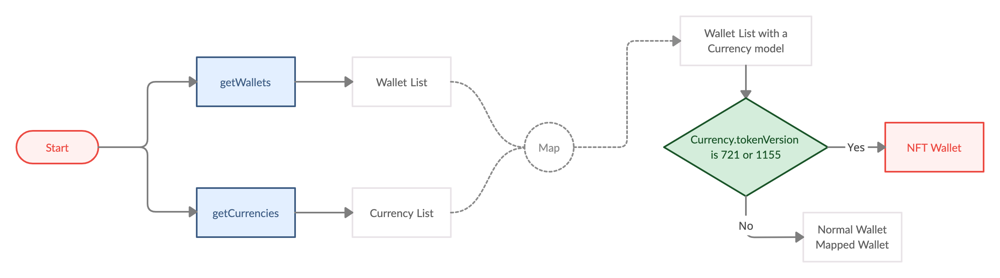

# NFT

- Bookmarks
  - [NFT Wallet](#nft-wallet-creation)
  - [NFT Balance](#balance)
  - [Deposit](#deposit)
  - [Withdraw](#withdraw)
  - [Transaction Detail](#transaction-detail)
  - [Specific Usage](#specific-usage)
    - [Solana NFT Tokens](#solana-nft-tokens)
    - [Withdrawing Solana NFT Tokens](#withdrawing-solana-nft-tokens)

## NFT Wallet Creation

- Suppose you'd like to receive some NFT tokens with Wallet SDK, but there's no that kind of `Currency` in the currency list, you can add NFT currency by calling `addContractCurrency`.  
If that kind of `Currency` already exists, there's no need to add it again.

```ts
/// [NFT] Add a new token & create first wallet
/// @param currency Currency of desired new wallet
/// @param contractAddress Token address for tokens, i.e. an ERC-20 token wallet maps to an Ethereum wallet
/// @param pinSecret PIN secret retrieved via PinCodeInputView
/// @return Promise<AddContractCurrenciesResult>
///
function addContractCurrency(
            currency: number,
            tokenAddress: string,
            pinSecret: number | PinSecretBearer | string
        ): Promise<AddContractCurrenciesResult>;

/// Batch version of addContractCurrency
function addContractCurrencies(
            currency: Array<{number}>,
            tokenAddress: Array<{string}>,
            pinSecret: number | PinSecretBearer | string,
        ): Promise<AddContractCurrenciesResult>;
```

- How to get a contract address?  
You can find it on blockchain explorer.  
Take CryptoKitties for example, you can find its contract address on Etherscan:

  

## NFT Wallet List



- Same way as we mentioned in [Wallet Information](wallets.md#wallet-information)
- Conditions:
  - `Wallet.isPrivate == false` ➜ it is on public chain.
  - `tokenAddress != ''` ➜ it is a mapped wallet (NFT wallet is also mapped wallet).
  - `Currency.tokenVersion == 721 || 1155` ➜ it is an NFT wallet.

## Balance

Refer to [Balance](wallets.md#getbalances)

```ts
type Balance = {

    tokens: Array<string>;; /** Non-Fungible Token IDs for ERC-721*/

    tokenIdAmount: Array<TokenIdAmount> /** Non-Fungible Token ID and amounts for ERC-1155 */

    ...
}
```

- For ERC-721 (NFT), use `tokens`.
- For ERC-1155 (NFT), use `tokenIdAmounts`.
- For Solana, see [Solana NFT Tokens](#solana-nft-tokens).

- In order to present images, call `getMultipleTokenUri` to get token urls.
  
  ```ts
  /// Get NFT Token URI
  /// @param currency Currency of token to query
  /// @param tokenAddresses Array of token address to query
  /// @param tokenIds Array of token address to query
  /// @return Promise<GetMultipleTokenUriResult>
  ///
  function getMultipleTokenUri(
              currency: number,
              tokenAddresses: Array<{string}>,
              tokenIds: Array<{string}>,
          ): Promise<GetMultipleTokenUriResult>;
  ```

### Error Handling

- For ERC-1155:

  ```ts
  /// If ERC-1155 token didn't show in wallet's balance, register token ID manually make them in track
  /// @param walletId walletId Wallet ID
  /// @param tokenIds ERC-1155 token IDs for register
  /// @return Promise<RegisterTokenIdsResult>
  ///
  function registerTokenIds(
              walletId: number,
              tokenIds: Array<{string}>,
          ): Promise<RegisterTokenIdsResult>;
  ```

## Deposit

- Select a wallet address, create a new one if needed.
- Generate QR code.
- Present the QR code for deposit.

## Withdraw

- The steps are similar to normal transactions. Refer to [Withdraw](transaction.md#withdraw)
- When `createTransaction`
  - For [EIP-721](https://eips.ethereum.org/EIPS/eip-721) , set parameter `amount = tokenId`.
  - For [EIP-1155](https://eips.ethereum.org/EIPS/eip-1155) , set parameter `amount = tokenIdAmount` and `extras['token_id'] = tokenId`.
  - For Solana, see [Withdrawing Solana NFT Tokens](#withdrawing-solana-nft-tokens).

## Transaction Detail

- The steps are similar to normal transactions. Refer to [getHistory](transaction.md#gethistory).

## Specific Usage
- There are specific API usages for some scenarios which related to NFT, you can find them in this section.

### Solana NFT Tokens
- For retriving Solana NFT tokens, please use `getSolNftTokens()`.
```js
Wallets.getSolNftTokens(wallet.walletId)
    .then(result => {
      for (let tokenMeta of result.tokens) {
        // ex. tokenAddress: E3LybqvWfLus2KWyrYKYieLVeT6ENpE4znqkMZ9CTrPH, balance: 17, supply: 100, tokenStandard: Unknown
        console.log(
          `tokenAddress: ${tokenMeta.tokenAddress}, 
           balance: ${tokenMeta.balance}, 
           supply:${tokenMeta.supply}, 
           tokenStandard: ${getTokenStandard(tokenMeta.tokenStandard)}`
        );
      }
    })
    .catch(error => {
      console.warn('Wallets.getSolNftTokens failed', error);
    });

function getTokenStandard(value) {
  return Object.keys(Wallets.TokenStandard).find(
    key => Wallets.TokenStandard[key] === value
  );
}
```
### Withdrawing Solana NFT Tokens
- For withdrawing Solana NFT tokens, put the selected `TokenMeta.tokenAddress` in extras `sol_token_id` then pass to `createTransaction()`.
```js
let extras = {
  sol_token_id: selectedToken.tokenAddress
};

try{
  result = await Wallets.createTransaction(
        wallet.walletId,
        receiver,
        amount,
        transactionFee.amount,
        description,
        pinSecret,
        extras
      );
} catch (error){
  console.warn('createTransaction failed', error);
}
```
- For Solana NFT transactions, the `Transaction.tokenId` is the token address, for fungible asset transaction, this field will be empty.
