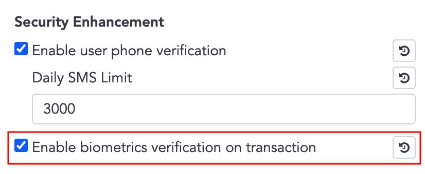

# Security Enhancement
- Security enhancement is optional, after activated, WalletSDK will require further authentication while sign-in and transaction / sign operation.
- Bookmarks
  - [Enable User Phone Verification](#enable-user-phone-verification)
  - [Skipping SMS Verify](#skipping-sms-verify)
  - [Enable Biometrics Verification on Transaction](#enable-biometrics-verification-on-transaction)
  - [APIs which Required Biometrics Verification](#apis-which-required-biometrics-verification)

## Enable User Phone Verification
- On the **admin panel** ➜ **System settings** ➜ **Security Enhancement**, you can activate **Enable user phone verification** which means require phone verification when user sign-in on a new device.

     
### SignInState for Register flow
1. Activated this option on the admin panel.
2. When App invokes Wallets API, ex. `getCurrencies()`, server will check if the user registered the phone and is verified on this device. If not, WalletSDK will invoke `SignInStateListener.onSignInStateChanged()` with `NEED_REGISTER_PHONE` or `NEED_VERIFY_OTP`.  
```javascript
Auth.addListener(Auth.Events.onSignInStateChanged, signInState => {
    if (signInState === Auth.SignInState.NEED_VERIFY_OTP) {
      // Lead user to the register phone page
    } else if (signInState === Auth.SignInState.NEED_REGISTER_PHONE) {
      // Lead user to the verify OTP page
    }
  });
```
#### Register Phone - NEED_REGISTER_PHONE 
3. Receiving `NEED_REGISTER_PHONE` means the user hasn't registered a phone number, leading the user to the register phone page.
4. Invoke `registerPhoneNumber()` to send SMS and get `actionToken`.  
  In the case which need resend SMS, ex. SMS expired, just invoke `registerPhoneNumber()` again.
5. Invoke `verifyOtp()` with user input OTP and `actionToken`.
6. Wallets API can be invoked normally now, you can bring the user back to the main page.
```javascript
// Step 4.
Auth.registerPhoneNumber(
        countryCode, //ex."+886"
        phone, // ex."902345678"
        SMS_COOL_TIME_SEC // SMS expire duration in second, minimum value is 60, ex. 60
    ).then(result => {
        // Keep result.actionToken for verifyOtp()
    }).catch(error => {
        console.warn(error);
    });
// Step 5.
Auth.verifyOtp(
        actionToken, // From result of registerPhoneNumber()
        smsCode // Input by user
    ).then(result => {
        //Step 6. bring user back to the main page
    }).catch(error => {
        console.warn(error);
    });
```
#### Verify OTP while Signing on New Device - NEED_VERIFY_OTP
3. Receiving `NEED_VERIFY_OTP` means the user has registered the phone, but signed in on a new device, leading the user to the verify OTP page.
4. Invoke `getLoginSmsCode()` to send SMS and get `actionToken`.  
  In the case which need resend SMS, ex. SMS expired, just invoke `getLoginSmsCode()` again.
5. Invoke `verifyOtp()` with user input OTP and `actionToken`.
6. Wallets API can be invoked normally now, you can bring the user back to the main page.
```javascript
// Step 4.
Wallets.getLoginSmsCode(
        SMS_COOL_TIME_SEC // SMS expire duration in second, minimum value is 60, ex. 60
  ).then(result => {
        // Keep result.actionToken for verifyOtp()
  }).catch(error => {
        console.warn(error);
  });
// Step 5.
Auth.verifyOtp(
        actionToken, // From result of getLoginSmsCode()
        smsCode // Input by user
    ).then(result => {
        //Step 6. bring user back to the main page
    }).catch(error => {
        console.warn(error);
    });     
```

## Skipping SMS Verify

- Although security enhancement is applied globally, in **User Management**, the administrator still can set a single user to skip SMS / biometrics verification.


   
- By checking `UserState`, you can get to know whether the user is required verify or not.
  -  `enableBiometrics`  
      Mapping to **admin panel** ➜ **System settings** ➜ **Security Enhancement** ➜ **Enable biometrics verification on transaction**.
  -  `skipSmsVerify`  
      Mapping to **admin panel** ➜ **User Management** ➜ click signal user ➜ **Skip SMS verification**.
  -  `accountSkipSmsVerify`  
      Not configurable.

    ```ts
    type UserState = {

        enableBiometrics: boolean; // Is enable biometric authentication

        skipSmsVerify: boolean; // Is skip SMS/Biometrics verify

        accountSkipSmsVerify: boolean; // Is skip SMS for specific case, ex. Apple account

        ...
    }
    ```

- `if (enableBiometrics && !skipSmsVerify)` ➜ need biometrics / SMS verification for transaction and sign operation

- `if (accountSkipSmsVerify == true)` ➜ cannot use SMS for verification, use biometrics verification instead.

    ex. For Apple Sign-In account,  only biometrics verification is available.
## Enable Biometrics Verification on Transaction
- On the **admin panel** ➜ **System settings** ➜ **Security Enhancement**, you can activate **Enable biometrics verification on transaction** which means require biometrics verification (or SMS verification if the device does not support biometrics) while performing transaction or sign operations.  
Related APIs are listed in [APIs which Required Biometrics Verification](#apis-which-required-biometrics-verification).
- If **Enable biometrics verification on transaction** is activated, the system will also activate **Enable user phone verification**.

     
### Setup for Biometrics Verification


- Complete the setup before using [APIs which Required Biometrics Verification](#apis-which-required-biometrics-verification).
1. Check if the user needs biometrics / SMS verification
2. Call `updateDeviceInfo()`, this step is telling server if the device able to use biometrics or not.
    ```javascript
    // Update device's biometrics type, WalletSDK will decide the type
    await Wallets.updateDeviceInfo();

    // Update device's biometrics type with specific type
    // Passing BiometricsType.NONE means you'll use SMS verification instead of biometrics.
    await Wallets.updateDeviceInfoWithType(Wallets.BiometricsType.NONE);
    ```
3. Call `getBiometricsType()` to get supported biometric type
4. `if (BiometryType != BiometricsType.NONE)` ➜ call `registerPubkey`
5. `if (BiometryType == BiometricsType.NONE)` && `accountSkipSmsVerify` ➜ prompt error. ex. The device not supporting biometrics, please contact the system admin.  
  (There's no Apple Sign-In account on Android, you can ignore this step.)
  
    ```javascript
    function checkAndRegisterPubkey(){
        // Step 3.
        Wallets.getBiometricsType().then(({ biometricsType }) => {
          // BiometryType { NONE / FACE / FINGER }
          // Step 2. update device's biometrics type
          Wallets.updateDeviceInfoWithType(biometricsType).then(result => {
                  registerPubKey(biometricsType);
              }).catch(error => {
                  console.warn(error);
                  registerPubKey(biometricsType);
              });
        }).catch(error => {
          console.warn(error);
        });
    }

    // Step 4.
    function registerPubKey(biometricsType){
        if (biometricsType === BiometricsType.NONE){
            return;
        }
        //Register public key for biometrics authentication
        Wallets.registerPubkey()
          .then(result => {
              //Setup completed, you can use APIs which required biometrics verification
          })
          .catch(error => {
              console.warn(error);
          });
    }
    ```
## APIs which Required Biometrics Verification 

- There are two versions (biometrics and SMS) for following transaction  / sign APIs:
  - createTransaction
  - requestSecureToken
  - signRawTx
  - increaseTransactionFee
  - callAbiFunction
  - cancelTransaction
  - callAbiFunctionTransaction
  - signMessage
  - walletConnectSignTypedData
  - walletConnectSignTransaction
  - walletConnectSignMessage
  - cancelWalletConnectTransaction
  - commonSignRawTx
  - setSolTokenAccountTransaction

- SMS version has the suffix 'Sms', ex. createTransactionSms
- Biometrics version has the suffix 'Bio', ex. createTransactionBio

### SMS version usage
1. Invoke `getTransactionSmsCode()` to send SMS and get `actionToken`.
2. Invoke SMS version function with user input OTP, `actionToken`.  
Other parameters are same as usual.
```javascript
// Step 1.
Wallets.getTransactionSmsCode(
    SMS_COOL_TIME_SEC // SMS expire duration in second, minimum value is 60, ex. 60
  ).then(result => {
      //å Keep result.actionToken for next step. ex. calling createTransactionSms()
  }).catch(error => {
      console.warn(error);
  });
// Step 2.  
Wallets.createTransactionSms(
      actionToken,// From result of getTransactionSmsCode()
      smsCode, // Input by user
      mWalletId, toAddress, amount, transactionFee, description, pinSecret, extras)
  .then(result => { ... })
  .catch(error => { ... });
```

### Biometrics version usage
1. Invoke biometrics version funtion with `promptMessage`, `cancelButtonText`.  
Other parameters are same as usual.
```javascript
Wallets.createTransactionBio(
        promptMessage, // ex. 'Authorize transactions with biometrics'
        cancelButtonText, // ex. 'Cancel'
        fromWalletId, toAddress, amount, transactionFee, description, pinSecret, extras)
  .then(result => { ... })
  .catch(error => { ... });
```