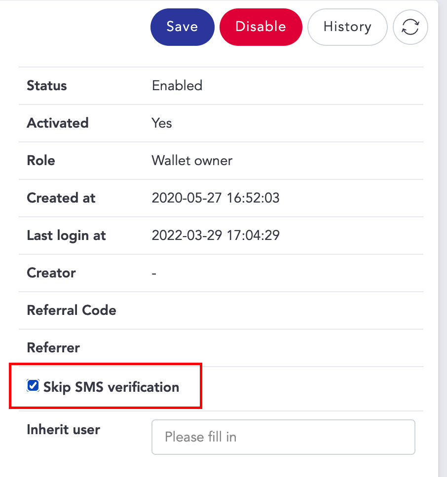
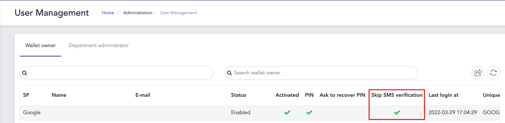

# Biometrics & SMS Verification

- Bookmarks
  - [UserState](#userstate)
  - [Setup](#biometrics--sms-verification-setup)
  - [Functions](#biometrics--sms-verification-for-transaction-and-sign-operation)

## UserState

- Biometrics verification is controlled in the Security Enhancement section on the admin panel.  

  

- Although biometrics verification is applied globally, in User Management, the administrator still can set a single user to skip SMS / biometrics verification.

  

   

    ```ts
    type UserState = {

        enableBiometrics: boolean; // Is enable biometric authentication

        skipSmsVerify: boolean; // Is skip SMS/Biometrics verify

        accountSkipSmsVerify: boolean; // Is skip SMS for specific case, ex. Apple account

        ...
    }
    ```

- `if (enableBiometrics && !skipSmsVerify)` ➜ Need biometrics / SMS verification for transaction and sign operation.

- `if (accountSkipSmsVerify == true)` ➜ Cannot use SMS for verification, use biometrics verification instead.

    e.g. only biometrics verification available for Apple Sign-In account.

## Biometrics / SMS Verification Setup


- Must be set up before performing APIs which are mentioned in the next section.
- Steps:
    1. Check if the user needs biometrics / SMS verification
    2. Call `updateDeviceInfo`, pass nil Wallet SDK will decide the value for you.
        - Pass `BiometricsType.NONE` means you are registering for SMS verification
    3. Call `getBiometricsType` ➜ Supported biometric type
    4. `if (BiometryType != BiometricsType.NONE)` ➜ call `registerPubkey`
    5. `if (BiometryType == BiometricsType.NONE)` && `accountSkipSmsVerify` ➜ Prompt error.  
    ex. The device not supporting biometrics, please contact the system admin.

```ts
/// Get device's biometrics type
/// @return Promise<GetBiometricsTypeResult>
///         resolve: BiometryType { NONE / FACE / FINGER }
///
function getBiometricsType(): Promise<GetBiometricsTypeResult>;

/// Update device's biometrics type, detect type by sdk
/// @param biometricsType: BiometricsType's raw value, pass nil WalletSDK will decide the value for you
/// @return Promise<UpdateDeviceInfoResult>
///
function updateDeviceInfo(
          biometricsType: number
       ): Promise<UpdateDeviceInfoResult>;

/// register public key for biometrics authentication
/// @return Promise<RegisterPubkeyResult>
///
function registerPubkey(): Promise<RegisterPubkeyResult>;
```

## Biometrics / SMS Verification for transaction and sign operation

- There are two versions (biometrics and SMS) for following transaction  / sign APIs:
  - createTransaction
  - requestSecureToken
  - signRawTx
  - increaseTransactionFee
  - callAbiFunction
  - cancelTransaction
  - callAbiFunctionTransaction
  - signMessage
  - walletConnectSignTypedData
  - walletConnectSignTransaction
  - walletConnectSignMessage
  - cancelWalletConnectTransaction

- SMS version has the suffix 'Sms', ex. createTransactionSms
- Biometrics version has the suffix 'Bio', ex. createTransactionBio

### SMS version

- Call `getTransactionSmsCode` to send a SMS to the user

    ```ts
    /// get SMS code for transaction
    /// @param duration: SMS expire duration (second), ex. 60
    /// @return Promise<GetActionTokenResult>
    ///
    function getTransactionSmsCode(
              duration: number
           ): Promise<GetActionTokenResult>;
    ```

- `actionToken` + `OTP code` + `PinSecret / PinCode` ➜ Call SMS version function

### Biometrics version

- `promptMessage` + `PinSecret / PinCode` ➜ Call biometrics version function
