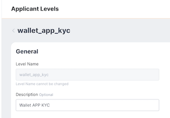
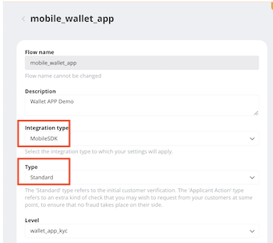

# KYC with Sumsub

> For KYC requirement, Wallet SDK has integrated with [Sumsub](https://sumsub.com/) and provides corresponding API to launch [Sumsub MSDK](https://developers.sumsub.com/msdk/#getting-started).


- Bookmark:
  - [Preparation](#preparation)
  - [Create an Applicant](#create-an-applicant)
  - [Access Token and Launch Sumsub MSDK](#access-token-and-launch-sumsub-msdk)

## Preparation

1. Wallet SDK has implemented some of tasks in [MSDK's backend routines](https://developers.sumsub.com/msdk/#backend-routines) for  you. Please go to the **admin panel** ➜ navigate to **App settings** ➜ add those configurations for the target App:  
    - Sumsub Server URL: can be `https://api.sumsub.com`, for more detail, please see [this](https://developers.sumsub.com/api-reference/#introduction). 
    - Sumsub Token: generate on [Sumsub dashboard](https://cockpit.sumsub.com/checkus?_gl=1*1qzwmb0*_ga*MTY0OTA2OTIzNy4xNjQ2NjM2ODE4*_ga_ZF910PGWRL*MTY1MjE4MzU0OC44MS4xLjE2NTIxODkyMzIuNTI.#/devSpace/appTokens), for more detail, please see [this](https://developers.sumsub.com/api-reference/#app-tokens).
    - Sumsub Secret: as above, **_Sumsub Token_**.
    - Sumsub Level Name: [set up the Level](https://api.sumsub.com/checkus?_gl=1*15coo51*_ga*MTY0OTA2OTIzNy4xNjQ2NjM2ODE4*_ga_ZF910PGWRL*MTY1MjE4MzU0OC44MS4xLjE2NTIxOTAzMzUuNjA.#/sdkIntegrations/levels) and fill the name here.  

        
    - Sumsub Access Token TTL: time to live for the token, in second.
    - Sumsub Flow Name: [set up the Flow](https://api.sumsub.com/checkus?_gl=1*1ccutv*_ga*MTY0OTA2OTIzNy4xNjQ2NjM2ODE4*_ga_ZF910PGWRL*MTY1MjE4MzU0OC44MS4xLjE2NTIxOTA4ODEuNjA.#/sdkIntegrations/flows) and fill the name here.  
⚠️ Please note that must select `MobileSDK` for "Integration type" and select `Standard` for "Type"

        
    * You can use `Auth.checkKycSetting()` to check if `Sumsub Server URL`, `Sumsub Token` and `Sumsub Token` are set properly and display / hide related UI.

        ```ts
        ///
        /// Check if KYC setting is exist:
        ///                <ul>
        ///                 <li>Sumsub server URL</li>
        ///                 <li>Sumsub Token</li>
        ///                 <li>Sumsub Secret</li>
        ///               </ul>
        /// @return Promise<CheckKycSettingResult> result 1: setting exist, 0: setting not exist
        ///
        function checkKycSetting(): Promise<CheckKycSettingResult>;
        ```
3. Install [Sumsub MSDK](https://developers.sumsub.com/msdk/plugins/react-native.html#react-native-module)  
    ⚠️ Please use version `1.19.4` or above.

    ```
    yarn add @sumsub/react-native-mobilesdk-module
    ```
    - [Android](https://developers.sumsub.com/msdk/plugins/react-native.html#android)  
    Make below modify in your `android/build.gradle` file:

        ```gradle
        buildscript {
            dependencies {
                //...
                // make sure use version 4.0.1 or above
                classpath('com.android.tools.build:gradle:4.0.1') 
            }
        }
        allprojects {
            repositories {
                //...
                //Add the following repository 
                maven { url "https://maven.sumsub.com/repository/maven-public/" }
            }
        }
        ```
        Check the version in your `gradle-wrapper.properties` file:  

        ```properties
        # make sure use gradle-6.1.1-all or above
        distributionUrl=https\://services.gradle.org/distributions/gradle-6.1.1-all.zip
        ```
    - [iOS](https://developers.sumsub.com/msdk/plugins/react-native.html#ios)  
        Add as follows at the top of `ios/Podfile`:
        ```
        source 'https://cdn.cocoapods.org/'
        source 'https://github.com/SumSubstance/Specs.git'
        ```
        Then run:
        ```
        pod install
        ```
        Update `Info.plist` to have description for the camera, microphone and the photo library usage
        
        ```
        plutil -insert "NSCameraUsageDescription" -string "Let us take a photo" ios/${PWD##*/}/Info.plist
        plutil -insert "NSMicrophoneUsageDescription" -string "Time to record a video" ios/${PWD##*/}/Info.plist
        plutil -insert "NSPhotoLibraryUsageDescription" -string "Let us pick a photo" ios/${PWD##*/}/Info.plist
        ```
## Create an Applicant
- Use `Auth.createKyc()` to create an applicant on KYC for the current sign-in user.
- Wallet SDK will use user's `Unique token` as `External user ID`, therefore you can utlize those to mapping.
- Please note that a user will be created with `Sumsub Level Name` (see [this](https://developers.sumsub.com/api-reference/#creating-an-applicant)), if change `Sumsub Flow Name` to others which belongs to a different level name, launch MSDK may fail.
- In Sumsub sandbox environment, it seems that applicants being deleted is possible, which also will cause launch MSDK failed.

    ```ts
    ///
    /// Create KYC Applicant
    ///
    /// @param country ISO alpha-3 code of applicant
    /// - https://en.wikipedia.org/wiki/ISO_3166-1_alpha-3
    /// 
    /// @return Promise<CreateKycResult> 
    ///
    function createKyc(
        country: string,
    ): Promise<CreateKycResult>;
    ```
## Access Token and Launch Sumsub MSDK
- Use `Auth.getKycAccessToken()` and use the result to launch MSDK
- User must has called `createKyc` before this step, which means have an applicant on Sumsub dashboard.
- For more detail, see [this](https://developers.sumsub.com/msdk/plugins/react-native.html#setup).

    ```javascript
    Auth.getKycAccessToken()
                .then(r => {
                    launchSNSMobileSDK(
                        r.apiUrl,
                        r.token,
                        r.flowName,
                        locale
                    );
                })
                .catch(error => {});
    
    function launchSNSMobileSDK(apiUrl, accessToken, flowName,local = 'en') {
        let snsMobileSDK = SNSMobileSDK.init(accessToken, () => {
            // this is a token expiration handler, will be called if the provided token is invalid or got expired
            // call your backend to fetch a new access token (this is just an example)
            return Auth.getKycAccessToken().then(r => {
                // return a fresh token from here
                return r.token;
            });
        }).withHandlers({
            // Optional callbacks you can use to get notified of the corresponding events
            onStatusChanged: event => {
                let log = `onStatusChanged: [${event.prevStatus}] => [${event.newStatus}]`;
                console.log(log);
            },
            onLog: event => {
                let log = `onLog: [Idensic] ${event.message}`;
                console.log(log);
            },
        })
        .withDebug(true)
        .withLocale(local)
        .withSupportEmail(SERVICE_EMAIL)
        .build();

        snsMobileSDK
            .launch()
            .then(result => {
                let log = `SumSub SDK State: ${JSON.stringify(result)}`;
                console.log(log);
            })
            .catch(err => {
                let log = `SumSub SDK Error: ${JSON.stringify(err)}`;\
                console.log(log);
            });

    }
    ```