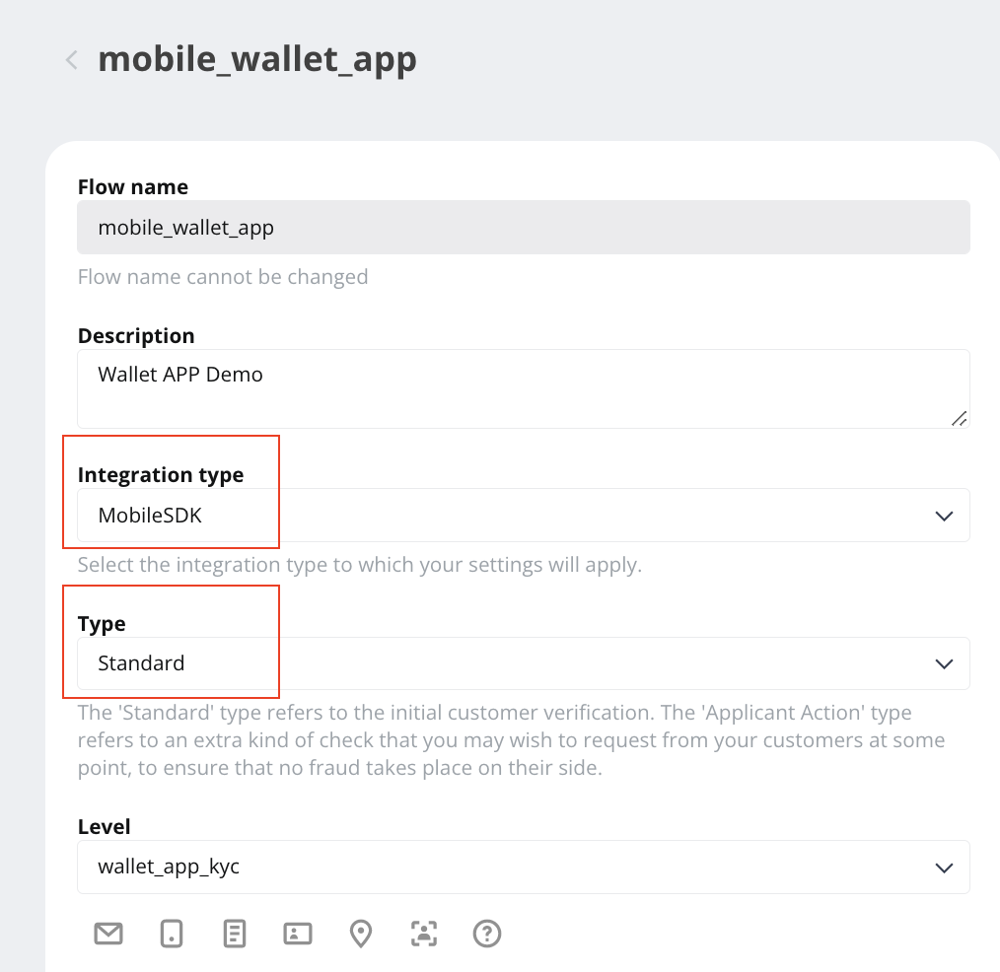

# KYC with Sumsub

> For KYC requirement, Wallet SDK has integrated with [Sumsub](https://sumsub.com/) and provides corresponding API to launch [Sumsub MSDK](https://developers.sumsub.com/msdk/#getting-started).
>
> In later sections, we'll illustrate how to 
get an [access token]()establish wallet client and use those APIs to respond to [session request](https://docs.walletconnect.com/tech-spec#session-request) and JSON-RPC call requests which are defined in [JSON-RPC API Methods](https://docs.walletconnect.com/json-rpc-api-methods/ethereum).  
>
> For further technical specification, see [this](https://docs.walletconnect.org/tech-spec).

- Bookmark:
  - [Preparation](#preparation)
  - [Create an applicant](#json-rpc-call-requests)
  - [Access Token and launch Sumsub MSDK](#cancel-a-transaction)

## Preparation

1. Wallet SDK has implemented some of tasks in [MSDK's backend routines](https://developers.sumsub.com/msdk/#backend-routines) for  you. Please go to the **admin panel** ➜ navigate to **App settings** ➜ add those configurations for the target App:  
    - Sumsub Server URL: can be `https://api.sumsub.com`, for more detail, please see [this](https://developers.sumsub.com/api-reference/#introduction). 
    - Sumsub Token: generate on [Sumsub dashboard](https://cockpit.sumsub.com/checkus?_gl=1*1qzwmb0*_ga*MTY0OTA2OTIzNy4xNjQ2NjM2ODE4*_ga_ZF910PGWRL*MTY1MjE4MzU0OC44MS4xLjE2NTIxODkyMzIuNTI.#/devSpace/appTokens), for more detail, please see [this](https://developers.sumsub.com/api-reference/#app-tokens).
    - Sumsub Secret: as above, **_Sumsub Token_**.
    - Sumsub Level Name: set up the [Level](https://api.sumsub.com/checkus?_gl=1*15coo51*_ga*MTY0OTA2OTIzNy4xNjQ2NjM2ODE4*_ga_ZF910PGWRL*MTY1MjE4MzU0OC44MS4xLjE2NTIxOTAzMzUuNjA.#/sdkIntegrations/levels) and fill the name here.  

        
    - Sumsub Access Token TTL: time to live for the token, in second.
    - Sumsub Flow Name: set up the [Flow](https://api.sumsub.com/checkus?_gl=1*1ccutv*_ga*MTY0OTA2OTIzNy4xNjQ2NjM2ODE4*_ga_ZF910PGWRL*MTY1MjE4MzU0OC44MS4xLjE2NTIxOTA4ODEuNjA.#/sdkIntegrations/flows) and fill the name here.  

        
.
