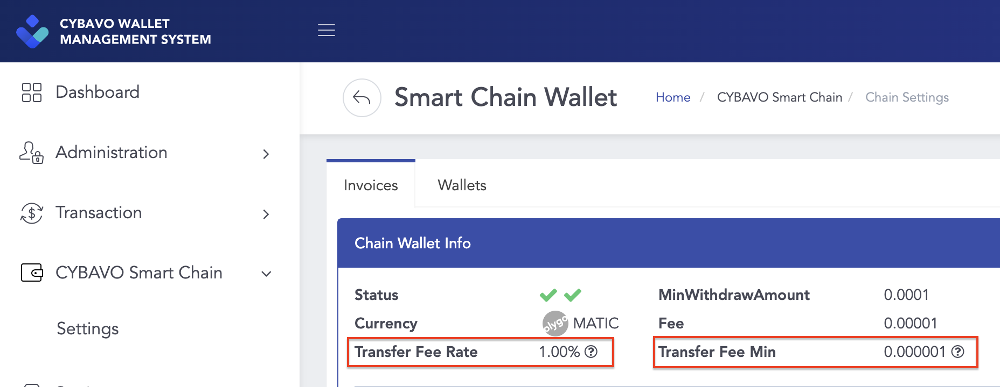
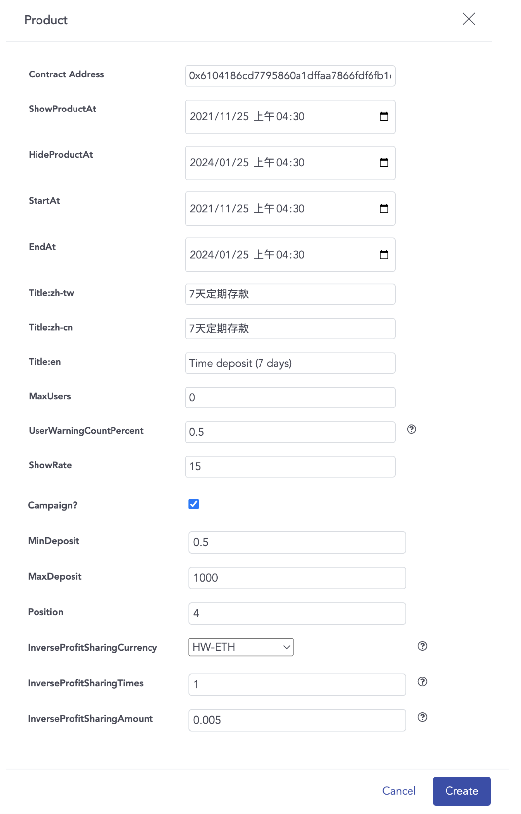
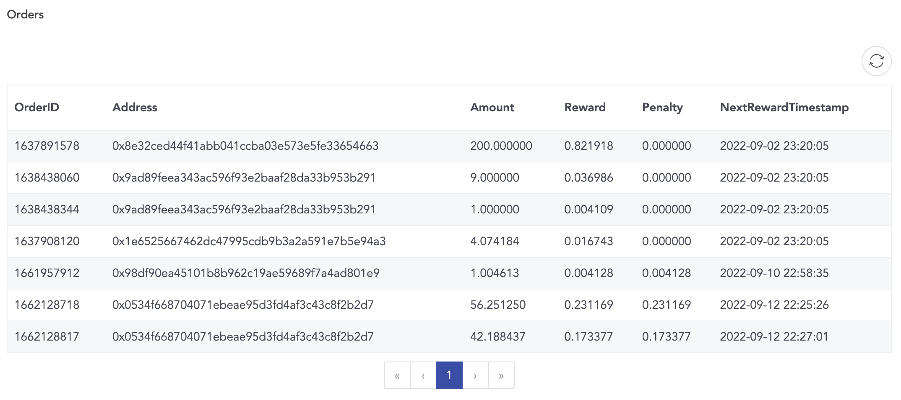

# CYBAVO Private Chain (CPC)

- Scenario for:
  - Financial Products
  - Financial Management Services
  
- Advantages of a private chain:
    1. Free; zero transaction fee for inner transfer
    2. Faster; faster than public chain
    3. Community; referral system is possible

- Easy to implement, sharing APIs with the public chain.

- Bookmarks
  - [Model - Wallet](#wallet)
  - [Model - Currency](#currency)
  - [Model - UserState](#userstate)
  - [Transactions - Deposit to Private Chain](#1-deposit-to-private-chain)
  - [Transactions - Withdraw to Public Chain](#2-withdraw-to-public-chain)
  - [Transactions - Inner Transfer](#3-inner-transfer)
  - [Transaction History](#transaction-history)
  - [CPC Financial Product](#cpc-financial-product)
    - [Financial Product](#financial-product)
    - [Financial History](#financial-history)
    - [Financial Order](#financial-order)
    - [Financial Bonus](#financial-bonus)
    - [Transaction Operations](#transaction-operations)

## Models

### Wallet

```ts
type Wallet = {

    walletId: number; // Wallet ID

    isPrivate: boolean; // Is private chain (CPC)

    mapToPublicCurrency: number; // Public chain's currency

    mapToPublicTokenAddress: string; // Public chain's tokenAddress

    mapToPublicName: string; // Public chain's currency_name

    walletCode: string; // Address(referral code) for transaction in private chain

    depositAddresses: Array<DepositAddress>; // Deposit info, public chain to private chain

    isPrivateDisabled: boolean; // Is disabled private currency
    
    ...
}
```

- `isPrivate` means the wallet is on the private chain
- Thus, it will map to a public currency on the public chain.  
  - Related infos: `mapToPublicCurrency`, `mapToPublicTokenAddress`, `mapToPublicName`
- `depositAddresses` provides the addresses on the public chain. When you deposit currencies / tokens to these addresses, you will receive tokens in the related private chain wallet.
  - Multiple `depositAddresses` means one private chain wallet might provide multiple addresses for depositing.
  - ex: CPSC-USDT on private chain is mapped to USDT-ERC20 and USDT-TRC20 on the public chains, so you will get multiple addresses in this field.
  - `memo` in model `DepositAddress` is necessary when depositing tokens from public chain to private chain.

### Currency

```ts
type Currency = {

    isPrivate: boolean; // Is private chain (CPC)

    mapToPublicType: number; // Public chain's currency type

    mapToPublicTokenAddress: string; // Public chain's token address

    mapToPublicName: string; // Public chain's currency name

    canCreateFinanceWallet: boolean; // Can create finance wallet

    ...
}
```

- `isPrivate` means the currency is on the private chain
- Thus, it will map to a public currency on the public chain.  
  - Related infos: `mapToPublicType`, `mapToPublicTokenAddress`, `mapToPublicName`, `canCreateFinanceWallet`

- How to create a private chain wallet with the currency?
  - Basically, it's the same way as we mentioned in [createWallet](wallets.md#createwallet), the only difference is the filtering condition of currency and wallet.
  - In the chart below, `Available Currencies` should be:  
    `isPrivate == true && (canCreateFinanceWallet == true || !tokenAddress)`
    
  - 

### UserState

```ts
type UserState = {

    userReferralCode: string; // User referral code

    linkUserReferralCode: string; // Link user referral code (referral by this code, only one per user)

    ...
}
```

- Referral Code has two use cases:
    1. Referral system
    2. Substitute readable address for making transactions in the private chain
- `userReferralCode` represent the user's referral code
- `linkUserReferralCode` represent the referrer's referral code
- Call `Auth.registerReferralCode` to register a referrer.
- You can search user by calling `Auth.searchUser()`, the keyword can be `realName` (partial match) or `referralCode` (fully match)
  ```javascript
    try {
      let result = await Auth.searchUser('UserX');
      for (let i = 0; i < result.infos.length; i++) {
        console.log(`#${i}, Name:${result.infos[i].realName}, Code: ${result.infos[i].referralCode}`);
      }
    } catch (error) {
      //keyword length cannot less then 3,
      //otherwise the API will receive ErrKeywordForSearchTooShort
      console.log('search failed', error);
    }
  ```
- You can update `realName` by calling `Auth.updateRealName()`
  ```javascript
  try {
      await Auth.updateRealName('UserY');
      //getUserState after updateRealName
      const { userState } = await Auth.getUserState();
      console.log(`newRealName: ${userState.realName}`);
    } catch (error) {
      //realName length cannot less then 3,
      //otherwise the API will receive ErrKeywordForSearchTooShort
      console.log('updateRealName failed', error);
    }
  ```

## Transactions

- There are 3 types of transactions on the private chain.

### 1. Deposit to Private Chain

- Select a private wallet, create a new one if needed.
- Select a deposit address of the private wallet.
- Present the address and memo of the deposit address for deposit.

### 2. Withdraw to Public Chain

#### getTransactionFee

- Withdrawing to public chain will be charged a fixed transaction fee.  
i.e. `getTransactionFee` will return the same amount of { high, medium, low } level for private chain currency.
- Use `wallet.depositAddress` 's `Currency` and `tokenAddress` as parameters to get the transaction fee for withdraw to public chain.
- The { receive amount = transfer amount - transaction fee }
- The receive amount cannot less than `withdrawMin`

```ts
type GetTransactionFeeResult = {
    
    withdrawMin: string; // Minimum transfer amount for private
    
    ...
}
```

#### Perform Withdraw

- Call `callAbiFunctionTransaction` to perform the transaction with specific parameters:

```javascript
  let depositAddress = wallet.depositAddress[0]; //select a deposit address
  let args = [
      toAddress,
      transferAmount, //ex. '123.123456'
      memo, // optional, ex. '123456'
      `${depositAddress.mapToPublicCurrency}`, //ex. '60'
      depositAddress.mapToPublicTokenAddress,
    ];

  await Wallets.callAbiFunctionTransaction(
          walletId,
          'burn', // name: fixed to 'burn'
          wallet.tokenAddress,
          '', // abiJson: fixed to ''
          args,
          '0', //transactionFee: our backend will take care of this
          pinSecret
        );
```

### 3. Inner Transfer

#### Private Chain Platform Fee
- On the **admin panel** ➜ **CYBAVO Smart Chain** ➜ **Chain Settings**, choose a currency which supports platform fee, click **Manage** button ➜ **Chain Wallet info**, you can found **Transfer Fee Rate** and **Transfer Fee Min**.  

  
- All the transfer operation on private chain will be charged platform fee, including inner transfer and transaction for finance product, not including deposit to private chain and withdraw to public chain. 
- Platform fee calculation:
  1. Platform Fee = Transfer Amount * **Transfer Fee Rate**
  2. If the result of step 1 is less then **Transfer Fee Min**, use **Transfer Fee Min**.
  3. If the currency not supported platform fee, the `platformFee` will be '0'.
- You can use `estimateTransaction()` to get the platfom fee:
```javascript
Wallets.estimateTransaction(
      wallet.currency,
      wallet.tokenAddress,
      amount, // ex. '100'
      '0', // transactionFee: fixed to '0'
      wallet.walletId,
      ''
  ).then(result => {
        //check result.platformFee
  }).catch(error => {
        console.warn(error);
  });
```
#### Create Transaction
- Call `createTransaction` to perform the transaction with specific parameters:

```javascript
let extras = { kind: 'code' }; //means it's a inner transfer transaction
    await Wallets.createTransaction(
      walletId,
      toAddress, //other user's userReferralCode, ex. '8X372G'
      transferAmount, //ex. '123.123456'
      '0', // transactionFee: fixed to '0'
      description,
      pinSecret,
      extras
    );
```

## Transaction History

- Basically, it's the same way as we mentioned in [transaction.md](transaction.md).  
 The only different thing is the parameter `crossChain` of `getHistory`:
  - Pass `crossChain: 1`, it returns transactions of [Deposit to Private Chain](#deposit-to-private-chain) and [Withdraw to Public Chain](#withdraw-to-public-chain)
  - Pass `crossChain: 0`, it returns transactions of [Inner Transfer](#inner-transfer).

## CPC Financial Product
- After deposit to CPC, users can further deposit to financial product for a period of time to get interest, the financial product can be setup on the admin panel.  
- In the following part, we will introduce necessary class and retrive data APIs first, then the operation API.  

### SDK Version Requirement
- ⚠️ Please use following version or later:
  - React Native - `@cybavo/react-native-wallet-service@1.2.255`
  - Android - `com.cybavo.wallet:wallet-sdk-lib:1.2.4463`
  - iOS - `CYBAVOWallet (1.2.451)`
### Financial Product  
- The following image and table shows the mapping of product settings on the admin panel and FinancialProduct fields. 

 


|  Product Setting<br>(Admin Panel)   | FinancialProduct Field  | Note  |
|  ----  | ----  | ----  |
|  Contract Address  | `uuid`  | |
|  StartAt  | `startTimestamp`  | |
|  Title:zh-tw <br>Title:zh-cn<br>Title:zh-en | `title.tw`<br>`title.cn`<br>`title.en`  |- Display one of these as product name according to device locale.|
|  Max Users<br>UserWarningCountPrcent  | `maxUsers`<br>`userPercent`  |- `maxUsers` <= `userCount`, means sold out.<br>- `maxUsers` * `userPercent` >= `userCount`, means available.<br>- `maxUsers` * `userPercent` < `userCount`, means about full.|
|  Show Rate  | `rate`  |- Display it as annual interest rate.<br>-`ratePercent` is `double` version of annual interest rate.|
|  Campaign  | `GetFinancialProductsResult.campaign`  |- If Campaign is checked, this product will also exist in `GetFinancialProductsResult.campaign`.|
|  MinDeposit<br>MaxDeposit  | `minDeposit`<br>`maxDeposit`  |- Display the deposit amount limit range.<br>ex. Min 0.5 HW-ETH - 1000 HW-ETH. |
|  InverseProfitSharingCurrency  | `kind`  |- enum: `FinancialProduct.Kind`<br>- If InverseProfitSharingCurrency is set to **Disable**, `kind` would be `DemandDeposit`(2) ,<br>otherwise, `kind` would be `FixedDeposit`(1).|

 #### Get Financial Product Lists
- You can get financial product list by `FinancialProduct.ListKind`:
 ```js
/** 
* Refers to FinancialProduct.ListKind:
* All(0), UserDeposit(1), DemandDeposit(2), FixedDeposit(3), Campaign(4)
*/
let kind = Wallets.FinancialProduct.ListKind.All;

Wallets.getFinancialProducts([kind])
  .then(result => {
      /**
        Financial product lists are categorized as following:
        result.userDeposits, result.demandDeposits,
        result.fixedDeposits, result.campaign
      */
      for (let product of result.demandDeposits) {
          /**
           ex. Product: Demand Deposits (Hourly Interest), kind: 2, Annualized Rate: 7%
            Amount: 0.522019 HW-XRP, Maturity Interest: 0.000000 7
            Allow withdraw after: 00:01:46, Available
          */
          console.debug(
            `Product: ${product.title.en}, kind: ${product.kind}, Annualized Rate: ${product.rate}%`
          );
          console.debug(
            `Amount: ${product.userDeposit} ${product.publicName}, Maturity Interest: ${product.userReward} ${product.rate}`
          );
          console.debug(
            `Allow withdraw after: ${getUserWaitToWithdrawStr(
              product.userWaitToWithdraw,
              !product.isCanWithdraw && !product.isCanWithdrawReward
            )}, ${getAvailableTag(product)}`
          );
      }
      for (let product of result.fixedDeposits) {
        /**
         ex. Product: Time deposit (7 days), kind: 1, Annualized Rate: 15%
          Amount: 1.000000000000000000 HW-ETH, Maturity Interest: 0.002876710000000000 15
          Start date: 2022-09-09 05:15:07, Value date: , Expiry date: 2022-09-16 05:15:07
        */
          console.debug(
            `Product: ${product.title.en}, kind: ${product.kind}, Annualized Rate: ${product.rate}%`
          );
          console.debug(
            `Amount: ${product.userDeposit} ${product.publicName}, Maturity Interest: ${product.userReward} ${product.rate}`
          );
          console.debug(
            `Start date: ${dateTimeString(
              product.startTimestamp
            )}, Value date: ${dateTimeString(
              product.rewardTimestamp
            )}, Expiry date: ${dateTimeString(product.endTimestamp)}`
          );
      }
  })
  .catch(error => {
      console.warn(error);
  });

/** Get remain time in sec */
const getSecInFuture = deadline => {
    return deadline === 0 ? 0 : deadline - Date.now() / 1000;
};

/** Transfer and get userWaitToWithdraw in formatted string */
const getUserWaitToWithdrawStr = (userWaitToWithdraw, canNotWithdraw) => {
    let secInFuture = getSecInFuture(userWaitToWithdraw);
    if (secInFuture <= 0 || canNotWithdraw) {
      return '';
    }
    return timeString(secInFuture);
};

/** Get string in time format */
const timeString = secs => {
    const pad = n => (n < 10 ? `0${n}` : n);
    const h = Math.floor(secs / 3600);
    const m = Math.floor(secs / 60) - h * 60;
    const s = Math.floor(secs - h * 3600 - m * 60);
    return `${pad(h)}:${pad(m)}:${pad(s)}`;
};

/** Get available tag for financial product */
const getAvailableTag = product => {
    let time = Date.now() / 1000;
    if (product.startTimestamp > time) {
      return 'Not Start';
    }
    if (product.userCount >= product.maxUsers) {
      return 'Sold Out';
    }
    if (product.maxUsers * product.userPercent >= product.userCount) {
      return 'Available';
    } else {
      return 'About Full';
    }
};

/** Get string in date time format */
const dateTimeString = secs => {
    if (secs === 0) {
      return '';
    }
    return moment.unix(secs).format('YYYY-MM-DD HH:mm:ss');
};
 ```
 ### Financial History
- If users have deposited or withdrawn a financial product, related FinancialHistory will be created / removed. 
#### Get Financial History List
- There are 3 kind for FinancialHistory: `Depositing`(1), `Withdraw`(2), `WithdrawReward`(3), the following table shows the change after performed transaction operation.  

|  Transaction Operation   | FinancialProduct.kind  | Changes in GetFinancialHistoryResult  |
|  ----  | ----  | ----  |
|  deposit  | `FixedDeposit`  | - Add one `Depositing` history. |
|  deposit  | `DemandDeposit`  | - Add one `Depositing` history when there's no one for this product.<br>- Or update the existing `Depositing` history.|
|  withdraw<br>earlyWithdraw  | `FixedDeposit`  | - Remove the `Depositing` history.<br>- Add one `Withdraw` history.<br>- Add one `WithdrawReward` history. |
|  withdraw  | `DemandDeposit`  | - Add one `Withdraw` history.<br>- Remove the `Depositing` history if no `userDeposit` and `userReward` left.<br>- Or update the existing `Depositing` history. |
|  withdrawReward  | `DemandDeposit`  | - Add one `WithdrawReward` history.<br>- Remove the `Depositing` history if no `userDeposit` and `userReward` left.<br>- Or update the existing `Depositing` history. |

- You can get financial history list by `FinancialHistory.ListKind` or `FinancialProduct.uuid`. 
 ```js
/**
  * Refers to FinancialHistory.ListKind:
  * Depositing(1), Withdraw(2), WithdrawReward(3)
  */
let kind = Wallets.FinancialHistory.ListKind.Depositing;

// Flag for paging: pass null for the first page or nextPage, prevPage of GetFinancialHistoryResult
let page = doRefresh ? null : previousResult.nextPage;

Wallets.getFinancialHistoryByKind(kind, page)
    .then(result => {
          for (let history of result.histories) {
            // Get FinancialProduct for this history in result.products
            let product = result.products[history.productUuid];
            // Use FinancialHistory.isCan || FinancialProduct.isCan
            let isCanWithdraw = history.isCanWithdraw || product.isCanWithdraw;
            let isCanEarlyWithdraw = history.isCanEarlyWithdraw || product.isCanEarlyWithdraw;
            let isCanWithdrawReward = history.isCanWithdrawReward || product.isCanWithdrawReward;

            /**
              ex. Currency: HW-XRP, Subscribe item: Demand Deposits (Hourly Interest), Deposit amount: 0.522019%
                Start date: 2022-09-09 04:56:19, Value date: 
                Expiry date: 2022-12-03 15:43:00
                Interest amount: 0.000000, Annual Interest Rate: 7%
                Allow withdraw after: 00:02:27
            */
            console.debug(
              `Currency: ${product.publicName}, Subscribe item: ${product.title.en}, Deposit amount: ${history.userDeposit}%`
            );
            console.debug(
              `Start date: ${dateTimeString(
                history.startTimestamp
              )}, Value date: ${dateTimeString(history.rewardTimestamp)}`
            );
            // /If kind is ListKind.Withdraw, should display as 'Withdraw date'
            console.debug(
              `Expiry date: ${dateTimeString(history.endTimestamp)}`
            );
            console.debug(
              `Interest amount: ${history.userReward}, Annual Interest Rate: ${product.rate}%`
            );
            console.debug(
              `Allow withdraw after: ${getUserWaitToWithdrawStr(
                history.userWaitToWithdraw,
                !isCanWithdraw && isCanEarlyWithdraw && !isCanWithdrawReward
              )}`
            );
          }
      })
    .catch(error => {
      console.warn(error);
    });
 ```
- ⚠️ Get financial history list by `FinancialProduct.uuid` will only return `Depositing` history.
```js
// Flag for paging: pass null for the first page or nextPage, prevPage of GetFinancialHistoryResult
let page = doRefresh ? null : previousResult.nextPage;

WWallets.getFinancialHistoryByProduct(financialProduct.uuid, page)
      .then(result => {
          for (let history of result.histories) {
            // Get FinancialProduct for this history in result.products
            let product = result.products[history.productUuid];
            // Use FinancialHistory.isCan || FinancialProduct.isCan
            let isCanWithdraw = history.isCanWithdraw || product.isCanWithdraw;
            let isCanEarlyWithdraw = history.isCanEarlyWithdraw || product.isCanEarlyWithdraw;
            let isCanWithdrawReward = history.isCanWithdrawReward || product.isCanWithdrawReward;
            /**
             ex. Currency: HW-XRP, Subscribe item: Time deposit (10 days), Deposit amount: 0.521955%
              Start date: 2022-09-09 23:37:39, Value date:
              Expiry date: 2022-09-19 23:37:39
              Interest amount: 0.002145, Annual Interest Rate: 15%
              Allow withdraw after: 00:04:39
            */
            console.debug(
              `Currency: ${product.publicName}, Subscribe item: ${product.title.en}, Deposit amount: ${history.userDeposit}%`
            );
            console.debug(
              `Start date: ${dateTimeString(
                history.startTimestamp
              )}, Value date: ${dateTimeString(history.rewardTimestamp)}`
            );
            console.debug(`Expiry date: ${dateTimeString(history.endTimestamp)}`);
            console.debug(
              `Interest amount: ${history.userReward}, Annual Interest Rate: ${product.rate}%`
            );
            console.debug(
              `Allow withdraw after: ${getUserWaitToWithdrawStr(
                history.userWaitToWithdraw,
                !isCanWithdraw && !isCanEarlyWithdraw && !isCanWithdrawReward
              )}`
            );
          }
      })
      .catch(error => {
        console.warn(error);
      });
```
### Financial Order
- ⚠️ Financial order is only for `FixedDeposit` product.
- Every deposit will create an order.
- The following image and table shows the mapping of order info on the admin panel and GetFinancialOrderResult fields.  

    

  |  Order Column <br>(Admin Panel)  | GetFinancialOrderResult Field  | Note |
  |  ----  | ----  | ----  |
  |  OrderID  | `uuid`  | |
  |  Amount  | `userDeposit`| |
  |  Reward  | `userReward`  | |
  |  Penalty  | `earlyReward` | `earlyReward` = Reward - Penalty|

```js
Wallets.getFinancialOrder(history.productUuid, history.orderId)
      .then(result => {
        // If the order is not exist, result.kind will be FinancialProduct.Kind.Unknown(-1)

        // ex. Receivable interest: 0.000000 HW-XRP, Origin receivable interest: 0.004128 HW-XRP
        console.debug(
          `Receivable interest: ${result.earlyReward} ${product.publicName}, Origin receivable interest: ${result.userReward} ${product.publicName}`
        );
      })
      .catch(error => {
        console.warn(error);
      });
```
### Financial Bonus
- CPC financial product also has rebate mechanism, if the user meet the requirement, ex. the user's referrer deposit a finance product, the user will have a `FinancialBonus` in his / her financial list.
- User can perform `withdrawBonus` with `uuid` if `isAlreadyWithdrawn` is false.
```js
Wallets.getFinancialBonusList()
      .then(result => {
          for (let bonus of result.bonusList) {
            let totalPerBonus = BigNumber(0);
            for (let reward of bonus.rewards) {
              // If need to display total amount, accumulate reward.amount
              totalPerBonus = totalPerBonus.plus(BigNumber(reward.amount));
            }
            // ex. Bonus: SavingRebate, withdraw: false, total: 311.28125 HW-XRP
            console.debug(
              `Bonus: ${getEnum(
                Wallets.FinancialBonus.Kind,
                bonus.kind
              )}, withdraw: ${
                bonus.isAlreadyWithdrawn
              }, total: ${totalPerBonus.toString()} ${bonus.publicName}`
            );
          }
      })
      .catch(error => {
        console.warn(error);
      });
/** Get enum by giving value */
const getEnum = (theEnum, value) => {
    return Object.keys(theEnum).find(key => theEnum[key] === value);
};
```

### Transaction Operations 
- There are 6 operations for CPC financial product, they can be achieved by `callAbiFunctionTransaction()` with different `args`, the behavior might be different between different `FinancialProduct.kind`.
- ⚠️ After performed `callAbiFunctionTransaction()`, it'll take a while to change data, App may need to display a status for transition to prevent users execute the same operation again (press again the same button).
 
|  ABI Method Name<br>`args[0]`   | `kind` /<br>Perform  to  | Note | `args` |
|  :----:  | :----  | :----  | :---- |
|  [approve](#approve-activate)  | `FixedDeposit`<br>`DemandDeposit` / <br>FinancialProduct | - Approve to activate the product.<br>- Required and cannot perform other operations if `isNeedApprove` is true.<br>- `isNeedApprove = history.isNeedApprove \|\| product.isNeedApprove` | ['approve', product.uuid] |
|  [deposit](#deposit)  | `FixedDeposit`<br>`DemandDeposit` / <br>FinancialProduct  | - Deposit to the product.<br>- Performable when `isCanDeposit` is true.<br>- `isCanDeposit = history.isCanDeposit \|\| product.isCanDeposit`| ['deposit',<br>product.uuid,<br>amount, <br>''] |
|  [withdraw](#withdraw---fixeddeposit)  | `FixedDeposit` / <br>Order which linked to FinancialHistory| - Withdraw all principal and interest to given financial wallet.<br>- amount is fixed to '0' for all.<br>- Cannot withdraw if current time is earlier then `FinancialHistory.userWaitToWithdraw`.<br>- Performable when `isCanWithdraw` is true.<br>- `isCanWithdraw = history.isCanWithdraw \|\| product.isCanWithdraw`| ['withdraw', product.uuid,<br>'0',<br>history.orderId] |
|  [withdraw](#withdraw---demanddeposit)  | `DemandDeposit` / <br>FinancialProduct | - Withdraw a certain amount of principal to given financial wallet.<br>- Cannot withdraw if current time is earlier then `FinancialProduct.userWaitToWithdraw`.<br>- Performable when `isCanWithdraw` is true.<br>- `isCanWithdraw = history.isCanWithdraw \|\| product.isCanWithdraw`| ['withdraw', product.uuid,<br>amount,<br>''] |
|  [earlyWithdraw](#earlywithdraw)  | `FixedDeposit` / <br>Order which linked to FinancialHistory | - Withdraw all principal and interest to given financial wallet.<br>- Withdraw by product / order.<br>- Interest will be deducted, see [Financial Order](#financial-order).<br>- amount is fixed to '0' for all.<br>- Cannot withdraw if current time is earlier then `FinancialHistory.userWaitToWithdraw`.<br>- Performable when `isCanEarlyWithdraw` is true.<br>- `isCanEarlyWithdraw = history.isCanEarlyWithdraw \|\| product.isCanEarlyWithdraw`| ['earlyWithdraw',<br>product.uuid,<br>'0', <br>history.orderId] |
|  [withdrawReward](#withdrawreward)  | `DemandDeposit` / <br>FinancialProduct | - Withdraw all interest to given financial wallet.<br>- amount is fixed to '0' for all.<br>- Cannot withdraw if current time is earlier then `FinancialProduct.userWaitToWithdraw`.<br>- Performable when `isCanWithdrawReward` is true.<br>- `isCanWithdrawReward = history.isCanWithdrawReward \|\| product.isCanWithdrawReward`| ['withdrawReward', product.uuid,<br>'0',<br>''] |
|  [withdrawBonus](#withdrawbonus)  | - / FinancialBonus | - Withdraw bonus to given financial wallet.<br>- Performable when `FinancialBonus.isAlreadyWithdrawn` is false.| ['withdrawBonus', bonus.uuid,<br>'0'] |

Below code snippet shows a pattern to use `callAbiFunctionTransaction()` for those operations.
 ```js
let wallet = findWallet(privateWallets, product.currency, product.tokenAddress);

let args = [
    abiMethodName, // Possible value: 'approve', 'deposit', 'withdraw', 'earlyWithdraw', 'withdrawReward', 'withdrawBonus'
    ...
];

await Wallets.callAbiFunctionTransaction(
      wallet.walletId,
      'financial', // name: fixed to 'financial'
      wallet.tokenAddress,
      '', // abiJson: fixed to ''
      args,
      '0', //transactionFee: our backend will take care of this
      pinSecret
);
// Find wallet by currency and tokenAddress in giving list.
const findWallet = (wallets, currency, tokenAddress) => {
    let wallet = wallets.find(
      w => w.currency === currency && w.tokenAddress === tokenAddress
    );
    return wallet;
  };
 ```
#### Check and Create Wallet
Before performing those operations, you should check if required wallets are created and create for the user if needed.  
Required wallets including:  
1. `currency` is same as `FinancialProduct.currency`, `tokenAddress` is empty.
2. `mapToPublicCurrency` is same as `FinancialProduct.publicCurrency`, `mapToPublicTokenAddress` is empty. 
3. `mapToPublicCurrency` is same as `FinancialProduct.publicCurrency`, `mapToPublicTokenAddress` is same as `FinancialProduct.publicTokenAddress`.  

For example, for a HW-ETH financial product  
(`currency`: 99999999995, `tokenAddress`: '0x123...', `publicCurrency`: 60, `publicTokenAddress`: '')  
required wallets are
1. CPSC wallet (`currency`: 99999999995, `tokenAddress`: '').
2. CPSC-ETH wallet(`mapToPublicCurrency`: 60, `mapToPublicTokenAddress`: '').

For another example, for a HW-USDT financial product  
(`currency`: 99999999995, `tokenAddress`: '0x234...', `publicCurrency`: 60, `publicTokenAddress`: '0x456...')  
required wallets are
1. CPSC wallet (`currency`: 99999999995, `tokenAddress`: '').
2. CPSC-ETH wallet(`mapToPublicCurrency`: 60, `mapToPublicTokenAddress`: '').
3. CPSC-USDT wallet(`mapToPublicCurrency`: 60, `mapToPublicTokenAddress`: '0x456...').

#### Transaction Explain
- Perform those operations may create [Transaction History](#transaction-history) for inner transfer, those transaction will have `explain` field with additional information, you can use `explain` to make the UI more clearer.
```js
if (transaction.explain.kind === Wallets.TransactionExplain.Kind.Unknown) {
    return;
}
if (!transaction.explain.isShowAmount){
    // Hide amount for 0 amount operation like approve
}
// ex. kind: WithdrawReward, product: Demand Deposits (Hourly Interest)
console.debug(`kind: ${getEnum(Wallets.TransactionExplain.Kind,transaction.explain.kind)}, 
                product: ${transaction.explain.name.en}`);
```

#### Approve Activate
 ```js
let isNeedApprove = history.isNeedApprove || product.isNeedApprove;
if (!isNeedApprove) {
    return;
}

let wallet = findWallet(privateWallets, product.currency, product.tokenAddress);

let args = ['approve', // ABI method name: fixed to 'approve'
            product.uuid];

await Wallets.callAbiFunctionTransaction(
      wallet.walletId,
      'financial', // name: fixed to 'financial'
      wallet.tokenAddress,
      '', // abiJson: fixed to ''
      args,
      '0', //transactionFee: fixed to '0'
      pinSecret
);

/**
  Keep product.uuid and display activating, because isNeedApprove will not change immediately.
  Call getFinancialProducts() to refresh.
*/
 ```
 [↑ Transaction Operations ↑](#transaction-operations)
#### Deposit
- You can display `minDeposit` and `maxDeposit` as minimum / maximum deposit amount.  
ex.  Min 0.5 HW-ETH - 1000 HW-ETH
- For `FixedDeposit`, you can display estimate reward when editing amount.  
estimate reward = product.ratePercent * amount 
```js
let isCanDeposit = history.isCanDeposit || product.isCanDeposit;
if (!isCanDeposit) {
    return;
}

let wallet = findWallet(privateWallets, product.currency, product.tokenAddress);

let args = ['deposit', // ABI method name: fixed to 'deposit'
            product.uuid
            amount,
            '' // orderId: fixed to ''
           ];

await Wallets.callAbiFunctionTransaction(
    wallet.walletId,
    'financial', // name: fixed to 'financial'
    wallet.tokenAddress,
    '', // abiJson: fixed to ''
    args,
    '0', //transactionFee: fixed to '0'
    pinSecret
);
```
 [↑ Transaction Operations ↑](#transaction-operations)
#### Withdraw - FixedDeposit
```js
let isCanWithdraw = history.isCanWithdraw || product.isCanWithdraw;
if (!isCanWithdraw) {
    return;
}
let secInFuture = getSecInFuture(history.userWaitToWithdraw);
if (secInFuture <= 0) {
    return;
}

let wallet = findWallet(privateWallets, product.currency, product.tokenAddress);

let args = ['withdraw', // ABI method name: fixed to 'withdraw'
            product.uuid,
            '0', // amount: fixed to '0'
            history.orderId 
           ];

await Wallets.callAbiFunctionTransaction(
    wallet.walletId,
    'financial', // name: fixed to 'financial'
    wallet.tokenAddress,
    '', // abiJson: fixed to ''
    args,
    '0', //transactionFee: fixed to '0'
    pinSecret
);
```
 [↑ Transaction Operations ↑](#transaction-operations)
#### Withdraw - DemandDeposit
```js
let isCanWithdraw = history.isCanWithdraw || product.isCanWithdraw;
if (!isCanWithdraw) {
    return;
}
let secInFuture = getSecInFuture(product.userWaitToWithdraw);
if (secInFuture <= 0) {
    return;
}

let wallet = findWallet(privateWallets, product.currency, product.tokenAddress);

let args = ['withdraw', // ABI method name: fixed to 'withdraw'
            product.uuid,
            amount,
            '', // orderId: fixed to ''
           ];

await Wallets.callAbiFunctionTransaction(
    wallet.walletId,
    'financial', // name: fixed to 'financial'
    wallet.tokenAddress,
    '', // abiJson: fixed to ''
    args,
    '0', //transactionFee: fixed to '0'
    pinSecret
);
```
 [↑ Transaction Operations ↑](#transaction-operations)
#### earlyWithdraw
```js
let isCanEarlyWithdraw = history.isCanEarlyWithdraw || product.isCanEarlyWithdraw;
if (!isCanEarlyWithdraw) {
    return;
}
let secInFuture = getSecInFuture(history.userWaitToWithdraw);
if (secInFuture <= 0) {
    return;
}

let wallet = findWallet(privateWallets, product.currency, product.tokenAddress);

let args = ['earlyWithdraw', // ABI method name: fixed to 'earlyWithdraw'
            product.uuid,
            '0', // amount: fixed to '0'
            history.orderId 
           ];

await Wallets.callAbiFunctionTransaction(
    wallet.walletId,
    'financial', // name: fixed to 'financial'
    wallet.tokenAddress,
    '', // abiJson: fixed to ''
    args,
    '0', //transactionFee: fixed to '0'
    pinSecret
);
```
 [↑ Transaction Operations ↑](#transaction-operations)
#### withdrawReward
```js
let isCanWithdrawReward = history.isCanWithdrawReward || product.isCanWithdrawReward;
if (!isCanWithdrawReward) {
    return;
}
let secInFuture = getSecInFuture(product.userWaitToWithdraw);
if (secInFuture <= 0) {
    return;
}

let wallet = findWallet(privateWallets, product.currency, product.tokenAddress);

let args = ['withdrawReward', // ABI method name: fixed to 'withdrawReward'
            product.uuid,
            '0', // amount: fixed to '0'
            '', // orderId: fixed to '' 
          ];

await Wallets.callAbiFunctionTransaction(
    wallet.walletId,
    'financial', // name: fixed to 'financial'
    wallet.tokenAddress,
    '', // abiJson: fixed to ''
    args,
    '0', //transactionFee: fixed to '0'
    pinSecret
);
```
 [↑ Transaction Operations ↑](#transaction-operations)
#### withdrawBonus
```js
if (bonus.isAlreadyWithdrawn) {
    return;
}

let wallet = findWallet(privateWallets, bouns.currency, bouns.tokenAddress);

let args = ['withdrawBonus', // ABI method name: fixed to 'withdrawBonus'
            bouns.uuid,
            '0', // amount: fixed to '0'
          ];

await Wallets.callAbiFunctionTransaction(
    wallet.walletId,
    'financial', // name: fixed to 'financial'
    wallet.tokenAddress,
    '', // abiJson: fixed to ''
    args,
    '0', //transactionFee: fixed to '0'
    pinSecret
);
```
 [↑ Transaction Operations ↑](#transaction-operations)
