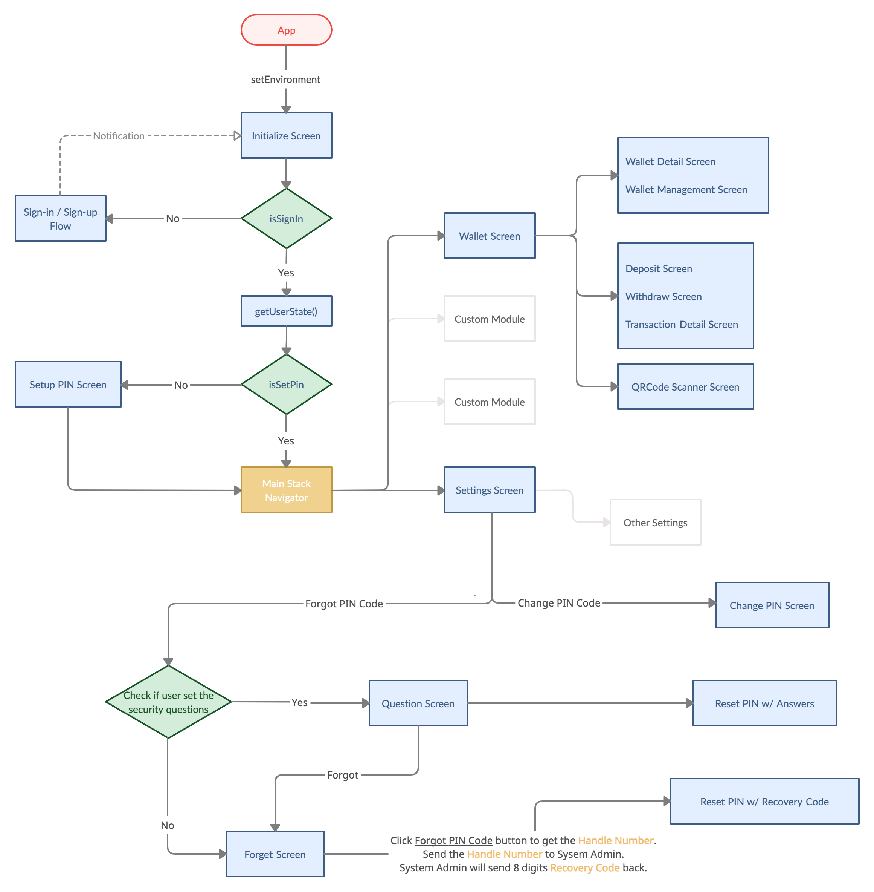
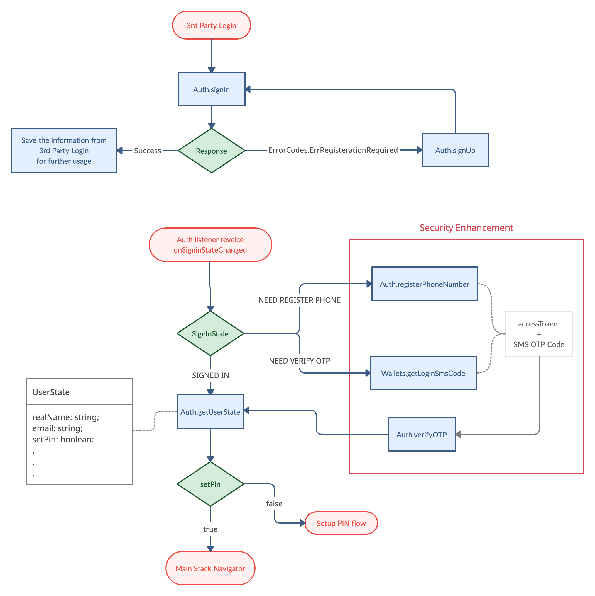

# CYBAVO Wallet APP SDK (for React Native) - Guideline

> Welcome to CYBAVO Wallet APP SDK (for React Native) - Guideline

The **CYBAVO Wallet APP SDK** provides a thorough solution for building Institutional-grade security wallets.  
It provides both high-level and low-level APIs for nearly all **CYBAVO Wallet APP** features, backed by **CYBAVO** private key protection technology.

- Category
  - [SDK Guideline](#sdk-guideline)
  - [Auth](#auth)
  - [PIN Code](#pin-code)
  - Wallets ➜ [wallets.md](wallets.md)
  - Transaction ➜ [transaction.md](transaction.md)
  - Biometrics & SMS ➜ [bio_n_sms.md](bio_n_sms.md)
  - [Push Notification](#push-notification)
  - [Others](#others)
  - Advanced
    - NFT ➜ [NFT.md](NFT.md)
    - WalletConnect ➜ [wallet_connect.md](wallet_connect.md)
    - Private Chain ➜ [private_chain.md](private_chain.md)

## SDK Guideline

### Prerequisite

Please contact **CYBAVO** to get your `endPoint` and `apiCode`.

### Installation

[](https://npmjs.com/package/@cybavo/react-native-wallet-service)

```shell
npm install @cybavo/react-native-wallet-service --save
react-native link @cybavo/react-native-wallet-service
```

```shell
yarn add @cybavo/react-native-wallet-service
react-native link @cybavo/react-native-wallet-service
```
#### Android

- Add the CYBAVO maven repository to the repositories section in your `android/build.gradle` file: 
    ```gradle
    repositories {
        maven {
            Properties properties = new Properties()
            properties.load(project.rootProject.file('local.properties').newDataInputStream()) // load local.properties

            url properties.getProperty('cybavo.maven.url')
            credentials {
                username = properties.getProperty('cybavo.maven.username')
                password = properties.getProperty('cybavo.maven.password')
            }
        }
    }
    ```
- Add `android/local.properties` to config Maven repository URL / credentials provided by CYBAVO
   ```properties
   cybavo.maven.url=$MAVEN_REPO_URL
   cybavo.maven.username=$MAVEN_REPO_USRENAME
   cybavo.maven.password=$MAVEN_REPO_PASSWORD
   ```
#### iOS
- CocoaPods `1.1.0+` is required to build `CYBAVOWallet 1.2.0+`  
- Add as follows at the top of `ios/Podfile`:

    ```sh
    source 'https://github.com/CocoaPods/Specs.git'
    source 'https://bitbucket.org/cybavo/Specs_512.git'
    ```

- Then run:  

    ```shell
    pod install
    ```


### Initialization

- Initialize Wallet SDK before using it.

  ```ts
  import { WalletSdk } from '@cybavo/react-native-wallet-service';

  WalletSdk.init({
      endpoint: endpoint,
      apiCode: apiCode,
      apnsSandbox: apnsSandbox, // for iOS
    });
  ```

- See this : [Sandbox Environment](#sandbox-environment)

### APP Flowchart



### First-time login tasks


[↑ go to the top ↑](#cybavo-wallet-app-sdk-for-andorid---guideline)

---

# Auth

## Sign-in / Sign-up Flowchart



## Third-Party login

  Supported services : Apple / Google / Facebook / LINE / Twitter / WeChat

## Sign-in flow

- 3rd party login ➡️ `Auth.signIn` ➡️ get success ➡️ wait for `onSignInStateChanged` update
  
- 3rd party login ➡️ `Auth.signIn` ➡️ get `ErrorCodes.ErrRegistrationRequired` ➡️ Sign-up flow

```ts
/// Sign in with Wallet SDK Auth 
///
/// @param token Token String from different 3rd party SDK
///     1. Apple - appleAuthRequestResponse.identityToken
///     2. Google - user.idToken
///     3. Facebook - accessToken.toString()
///     4. LINE - LoginResult.accessToken.idToken
///     5. Twitter - identity token
///     6. WeChat - identity token
///
/// @param identityProvider String of provider
///     1. Apple - "Apple"
///     2. Google - "Google"
///     3. Facebook - "Facebook"
///     4. LINE - "LINE"
///     5. Twitter - "Twitter"
///     6. WeChat - "WeChat"
///
/// @return Promise<SignInResult>
///         resolve: ➡️ ready to getUserState()
///         reject: if (error.code == ErrorCodes.ErrRegistrationRequired) ➡️ go to the Sign-up flow
///
function signIn(
          token: string,
          identityProvider: string
      ): Promise<SignInResult>;
```

## Sign-up flow

- `Auth.signUp` ➡️ get success ➡️ `Auth.signIn`

```ts
/// sign-up with Wallet SDK Auth
/// @param token: refer to signIn()
/// @param identityProvider: refer to signIn()
/// @return Promise<SignUpResult>
///         resolve: ➡️ ready to signIn()
///         reject: handle according ErrorCodes
///
function signUp(
          token: string,
          identityProvider: string,
          extras: object
      ): Promise<SignUpResult>;
```

## Sign-out

```ts
function signOut(): Promise<null>;
```

## Model : SignInState

```ts
enum SignInState {

    SIGNED_IN = 0, // User signed in

    SIGNED_OUT = 1, // User signed out

    ...

    NEED_VERIFY_OTP = 5, // User has signed in but need verify otp(sms code)

    NEED_REGISTER_PHONE = 6, // User has signed in but need register phone
}
```

- Listen `SignInState`

  1. Add the listener through `Auth.addListener` with eventType `Auth.Events.onSignInStateChanged` to handle according to signInState. 

  ```ts
  Auth.addListener(Auth.Events.onSignInStateChanged, signInState => {});
  ```

- If you activate the Security Enhancement in the console.  

    

  You might get `NEED_REGISTER_PHONE` or `NEED_VERIFY_OTP` as your `SignInState`.  
  ➡️ Do `registerPhoneNumber` and `verifyOtp` before the next step.

- RegisterPhoneNumber

  ```ts
  /// register phone number
  /// @param countryCode: country code, ex. 886
  /// @param phone: phone number, ex. 900123456
  /// @return Promise<RegisterPhoneNumberResult>
  ///         resolve: ➡️ get actionToken
  ///
  function registerPhoneNumber(
          countryCode: string,
          phone: string,
          duration: number,
      ): Promise<RegisterPhoneNumberResult>;
  ```

- VerifyOTP

  ```ts
  /// verify OTP
  /// @param actionToken: actionToken returned by registerPhoneNumber / getSmsCode
  /// @param code: SMS code that registered phone received
  /// @return Promise<VerifyOtpResult>
  ///
  function verifyOtp(
          actionToken: string,
          code: string
      ): Promise<VerifyOtpResult>;
  ```

- call `getSignInState` anytime when you need current `SignInState`

  ```ts
  function getSignInState(): Promise<SignInState>;
  ```

## Model : UserState

```ts
type UserState = {

    realName: string; /* Real name of user */

    email: string; /* Email of user */

    setPin: boolean; /* User has finished PIN setup */

    setSecurityQuestions: boolean; /* User has setup BackupChallenges */

    ...
}
```

- Once you signed in, you should get the current `UserState` to check the variable `setPin`.

  `if (setPin == false)` ➡️ go to **_Setup PIN Code_** in the next section

- call `getUserState` to get the current `UserState`

  ```ts
  function getUserState(): Promise<GetUserStateResult>;
  ```

[↑ go to the top ↑](#cybavo-wallet-app-sdk-for-andorid---guideline)

---

# PIN Code

PIN code is one of the most important components for user security.  
Ensure your users setPin right after sign-in success.

## NumericPinCodeInputView

- Use `NumericPinCodeInputView` to input PIN code, see [this](NumericPinCodeInputView.md)
- Feel free to customize your own input view.

## Setup PIN Code / Change PIN Code

- Setup PIN code is mandatory for further API calls. Make sure your user setup PIN code successfully before creating wallets.

```ts
/// setup PIN code
/// @param pinSecret: PIN secret retrieved via PinCodeInputView
///        If the type is number or PinSecretBearer means pass pinSecret, string means pass plaintext
/// @return Promise<ChangePinCodeResult>
///
function setupPinCode(pinSecret: number | PinSecretBearer | string): Promise<SetupPinCodeResult>;

function changePinCode(
          newPinSecret: number | PinSecretBearer | string,
          currentPinSecret: number | PinSecretBearer | string
      ): Promise<ChangePinCodeResult>;
```

## Reset PIN code - with Security Question
- There are 2 ways to reset PIN code, one is by answering security questions

  1. Before that, the user has to set the answers of security questions.
  ```ts
  function setupBackupChallenge(
          pinSecret: number | PinSecretBearer | string,
          challenge1: BackupChallenge,
          challenge2: BackupChallenge,
          challenge3: BackupChallenge
      ): Promise<SetupBackupChallengeResult>;
  ```
  2. Get the security question for user to answer
  ```ts
  function getRestoreQuestions(): Promise<GetRestoreQuestionsResult>;
  ```
  3. Verify user input answer (just check if the answers are correct)
  ```ts
  function verifyRestoreQuestions(
          challenge1: BackupChallenge,
          challenge2: BackupChallenge,
          challenge3: BackupChallenge
      ): Promise<VerifyRestoreQuestionsResult>;
  ```
  4. Reset PIN code by security questions and answers
  ```ts
  function restorePinCode(
          newPinSecret: number | PinSecretBearer | string,
          challenge1: BackupChallenge,
          challenge2: BackupChallenge,
          challenge3: BackupChallenge
      ): Promise<RestorePinCodeResult>;
  ```

## Reset PIN code - with Admin System

- If the user forgot both the PIN code and the answers, there's another way to reset the PIN code.

  1. First, call API `forgotPinCode` to get the **_Handle Number_**.
  ```ts
  function forgotPinCode(): Promise<ForgotPinCodeResult>;
  ```

  2. Second, contact the system administrator and get an 8 digits **_Recovery Code_**.
  3. Verify the recovery code  (just check if the recovery code is correct)
  ```ts
  function verifyRecoveryCode(
          recoveryCode: string
      ): Promise<VerifyRecoveryCodeResult>;
  ```
  4. Reset PIN code by the recovery code.

  ```ts
  function recoverPinCode(
          newPinSecret: number | PinSecretBearer | string,
          recoveryCode: string
      ): Promise<RecoverPinCodeResult>;
  ```

## Notice

- Old version `String pinCode` is deprecated, use `PinSecret` instead.

  `PinSecret` advantages:
    1. Much more secure
    2. Compatible with NumericPinCodeInputView
    3. Certainly release the PIN code with API  

- `PinSecret` will be cleared after Wallet and Auth APIs are executed. If you intendly want to keep the `PinSecret`, pass `{ pinSecret: pinSecret, retain: true }` everytime as parameter.

> **⚠️ WARNING** : When creating multiple wallets for the user. If you call APIs constantly.  
> You will receive the error `ErrorCodes.ErrInvalidPinSecret` caused by `PinSecret` being cleared.

[↑ go to the top ↑](#cybavo-wallet-app-sdk-for-android---guideline)

---

# Push Notification
> Wallet SDK support 2 ways to integrate Push Notification: Amazon Pinpoint and Google Firebase 
## Amazon Pinpoint
- For admin panel configuration, please refre to "Amazon Pinpoint" section in CYBAVO Wallet SDK Admin Panel User Manual.
## Google Firebase
> After user signin, register your FCM instance ID via `setPushDeviceToken`.
- For admin panel configuration, please refre to "Google Firebase" section in CYBAVO Wallet SDK Admin Panel User Manual.
- After signin, call `setPushDeviceToken`
  ```ts
  import iid from '@react-native-firebase/iid';

  const token = await iid().getToken();
  const resp = await Auth.setPushDeviceToken(token);
  ```
- Receive and handle the notification 
  ```ts
  import messaging from '@react-native-firebase/messaging';
  
  messaging().onMessage(remoteMessage => {
    const dataJson = remoteMessage.data;
    const notificationJson = remoteMessage.notification;
    if (dataJson && dataJson.type === '1') {
      // onReceiveTransactionPush
    } else if (notificationJson && notificationJson.title) {
      // onReceiveNotificationPush
    }
  });

  messaging().setBackgroundMessageHandler(async remoteMessage => {
      // handle in background
  });
  ```

## Notification Types

There are 2 types of push notification: Transacion and Announcement.

- Transaction
  
  ```javascript
    {
        "currency": "194",
        "token_address": "",
        "timestamp": "1590376175",
        "fee": "",
        "from_address": "eeeeeeeee111",
        "amount": "0.0010",
        "wallet_id": "2795810471",
        "abi_method": "",
        "to_address": "eeeeeeeee111",
        "type": "1", // 1 means type Transaction
        "txid": "c90e839583f0fda14a1e055065f130883e5d2c597907de223f355b115b410da4",
        "out": "true", // true is Withdraw, false is Deposit
        "description": "d", 
        "abi_arguments": ""
    }
    ```

  - The keys of Transaction `remoteMessage` are listed below
    Key    | Description  | Type  
      :------------|:------------|:-------
      type    | notification type    |  string 
      wallet_id    | Wallet ID    |  string 
      currency    | Currency     |  string 
      token_address  | Token address | string
      out  | Transaction direction<br>("true": out, "false": in)| string
      amount  | Transaction amount | string
      fee  | Transaction fee | string
      from_address  | Transaction from address | string
      to_address  | Transaction to address | string
      timestamp  | Transaction timestamp | string
      txid  | Transaction TXID | string
      description  | Transaction description | string

  - Notification display example:

    - Withdraw (currencySymbol was from API getWallets)

      ```
      Transaction Sent: Amount {{amount}} {{currencySymbol}} to {{fromAddress}}
      ```

    - Deposit (NFT wallet, i.e. wallet mapping to a Currency which tokenVersion is 721 or 1155)
    
      ```
      Transaction Received: Token {{amount}}({{currencySymbol}}) received from {{fromAddress}}
      ```

- Announcement

  ```javascript
  {
      "body": "All CYBAVO Wallet users will be charged 0.1% platform fee for BTC transaction during withdraw since 2021/9/10",
      "sound": "default",
      "title": "Important information",
      "category": "myCategory"
  }
  ```

[↑ go to the top ↑](#cybavo-wallet-app-sdk-for-andorid---guideline)

---

# Others

## Error Handling - WalletSdk.ErrorCodes

> **⚠️ WARNING** : Please properly handle the Error we provided in the API response.

```ts
namespace WalletSdk {

  namespace ErrorCodes { … } // some error codes we defined
  ...
}
```
- Usage
```ts
 try {

   const resp = await Auth.signUp(idToken, identityProvider, extras); 

 } catch (error) {
      if (ErrorCodes.ErrRegistrationRequired === error.code) {
        // registration required
      } else{
        // sign in failed
      }
 }
```

## Sandbox Environment

- You will only get the `endPoint` & `apiCode` for testing in the beginning.
- We will provide the production `endPoint` & `apiCode` when you are ready.
Feel free to play around with the WalletSDK in the sandbox environment.

[↑ go to the top ↑](#cybavo-wallet-app-sdk-for-andorid---guideline)
