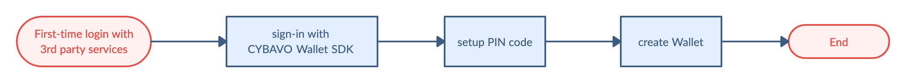

# CYBAVO Wallet APP SDK (for React Native) - Guideline

> Welcome to CYBAVO Wallet APP SDK (for React Native) - Guideline

The **CYBAVO Wallet APP SDK** provides a thorough solution for building Institutional-grade security wallets.  
It provides both high-level and low-level APIs for nearly all **CYBAVO Wallet APP** features, backed by **CYBAVO** private key protection technology.

- Category
  - [SDK Guideline](#sdk-guideline)
  - [Auth](#auth)
  - [PIN Code](#pin-code)
  - Wallets ➜ [wallets.md](wallets.md)
  - Transaction ➜ [transaction.md](transaction.md)
  - Security Enhancement ➜ [bio_n_sms.md](bio_n_sms.md)
  - [Push Notification](#push-notification)
  - [Others](#others)
  - Advanced
    - NFT ➜ [NFT.md](NFT.md)
    - WalletConnect ➜ [wallet_connect.md](wallet_connect.md)
    - CYBAVO Private Chain ➜ [private_chain.md](private_chain.md)
    - KYC with Sumsub ➜ [kyc_sumsub.md](kyc_sumsub.md)

## SDK Guideline

### Prerequisite

Please contact **CYBAVO** to get your `endPoint` and `apiCode`.

### Installation
[](https://badge.fury.io/js/@cybavo%2Freact-native-wallet-service)  

**Using yarn**  
```
$ yarn add @cybavo/react-native-wallet-service
```

**Using npm**  
```
$ npm install @cybavo/react-native-wallet-service --save
```

### Link native dependencies

From react-native 0.60 autolinking will take care of the link step.  
```
$ react-native link @cybavo/react-native-wallet-service
```

#### Android

- Add the CYBAVO maven repository to the repositories section in your `android/build.gradle` file: 
    ```gradle
    repositories {
        maven {
            Properties properties = new Properties()
            properties.load(project.rootProject.file('local.properties').newDataInputStream()) // load local.properties

            url properties.getProperty('cybavo.maven.url')
            credentials {
                username = properties.getProperty('cybavo.maven.username')
                password = properties.getProperty('cybavo.maven.password')
            }
        }
    }
    ```
- Add `android/local.properties` to config Maven repository URL / credentials provided by CYBAVO
   ```properties
   cybavo.maven.url=$MAVEN_REPO_URL
   cybavo.maven.username=$MAVEN_REPO_USRENAME
   cybavo.maven.password=$MAVEN_REPO_PASSWORD
   ```
#### iOS
- CocoaPods `1.9.3+` is required to build `CYBAVOWallet 1.2.451+`   
- Suggest using Xcode 14 
- Add as follows at the top of `ios/Podfile`:

    ```sh
    source 'https://github.com/CocoaPods/Specs.git'
    source 'https://bitbucket.org/cybavo/Specs_512.git'

    post_install do |installer|
      installer.pods_project.build_configurations.each do |config|
        config.build_settings["EXCLUDED_ARCHS[sdk=iphonesimulator*]"] = "arm64"
      end
      installer.pods_project.targets.each do |target|
        target.build_configurations.each do |config|
          config.build_settings['BUILD_LIBRARY_FOR_DISTRIBUTION'] = 'YES'
        end
      end
    end
    ```

- Then run:  

    ```shell
    $ pod install
    ```


### Initialization

- Initialize Wallet SDK before using it.

  ```javascript
  import { WalletSdk } from '@cybavo/react-native-wallet-service';

  WalletSdk.init({
      endpoint: endpoint,
      apiCode: apiCode,
      apnsSandbox: apnsSandbox, // for iOS
    });
  ```

- See this : [Sandbox Environment](#sandbox-environment)

### APP Flowchart


### First-time login tasks



[↑ go to the top ↑](#cybavo-wallet-app-sdk-for-andorid---guideline)

---

# Auth

## Sign-in / Sign-up Flowchart


## Third-Party Login

  Supported services : Apple / Google / Facebook / LINE / Twitter / WeChat

## Sign-in Flow

- 3rd party login ➡️ `Auth.signIn` ➡️ get success ➡️ wait for `onSignInStateChanged` update
  
- 3rd party login ➡️ `Auth.signIn` ➡️ get `ErrorCodes.ErrRegistrationRequired` ➡️ Sign-up flow

```ts
/// Sign in with Wallet SDK Auth 
///
/// @param token Token String from different 3rd party SDK
///     1. Apple - appleAuthRequestResponse.identityToken
///     2. Google - user.idToken
///     3. Facebook - accessToken.toString()
///     4. LINE - LoginResult.accessToken.idToken
///     5. Twitter - identity token
///     6. WeChat - identity token
///
/// @param identityProvider String of provider
///     1. Apple - "Apple"
///     2. Google - "Google"
///     3. Facebook - "Facebook"
///     4. LINE - "LINE"
///     5. Twitter - "Twitter"
///     6. WeChat - "WeChat"
///
/// @param extras Extra attributes for specific provider, pass null if unspecified.
///     1. id_token_secret (string) - Secret for Twitter
/// @return Promise<SignInResult>
///         resolve: ➡️ Ready to getUserState()
///         reject: if (error.code == ErrorCodes.ErrRegistrationRequired) ➡️ go to the Sign-up flow
///
function signIn(
            token: string,
            identityProvider: string,
            extras: object
        ): Promise<SignInResult>;
```

## Sign-up Flow

- `Auth.signUp` ➡️ get success ➡️ `Auth.signIn`

```ts
/// sign-up with Wallet SDK Auth
/// @param token: Refer to signIn()
/// @param identityProvider: Refer to signIn()
/// @param extras Extra attributes for specific provider, pass null if unspecified.
///     1. id_token_secret (string) - Secret for Twitter
///     2. user_name (string) - User name, required for Apple auth
/// @return Promise<SignUpResult>
///         resolve: ➡️ Ready to signIn()
///         reject: Handle according ErrorCodes
///
function signUp(
            token: string,
            identityProvider: string,
            extras: object
        ): Promise<SignUpResult>;
```

## Sign-out

```ts
function signOut(): Promise<null>;
```

## Model : SignInState

```ts
enum SignInState {

    SIGNED_IN = 0, // User signed in

    SIGNED_OUT = 1, // User signed out

    ...

    NEED_VERIFY_OTP = 5, // User has signed in but need verify otp(sms code)

    NEED_REGISTER_PHONE = 6, // User has signed in but need register phone
}
```

- Listen `SignInState`

  1. Add the listener through `Auth.addListener` with eventType `Auth.Events.onSignInStateChanged` to handle according to signInState. 

  ```javascript
  Auth.addListener(Auth.Events.onSignInStateChanged, signInState => {});
  ```
- For Security Enhancement in the [flowchart](#sign-in--sign-up-flowchart), `NEED_VERIFY_OTP` and `NEED_REGISTER_PHONE` SignInState, please see [Security Enhancement](bio_n_sms.md)

- Call `getSignInState` whenever you need current `SignInState`.

  ```ts
  function getSignInState(): Promise<SignInState>;
  ```

## Model : UserState

```ts
type UserState = {

    realName: string; /* Real name of user */

    email: string; /* Email of user */

    setPin: boolean; /* User has finished PIN setup */

    setSecurityQuestions: boolean; /* User has setup BackupChallenges */

    ...
}
```

- Once you signed in, you should get the current `UserState` to check the variable `setPin`.

  `if (setPin == false)` ➡️ go to **_Setup PIN Code_** in the next section

- Call `getUserState` to get the current `UserState`

  ```ts
  function getUserState(): Promise<GetUserStateResult>;
  ```

## Account deletion
For account deletion, Wallet SDK provides `revokeUser()` API and the detailed flow is described as below.
1. Check `UserState.setPin` 

    - If it's true, ask user to input PIN and call `revokeUser(pinSecret)`.
    - If it's false, just call `revokeUser()`.

2. (Suggest) Lead user back to sign in page without calling `signOut()` and sign out 3rd party SSO.  
⚠️ After `revokeUser()`, `signOut()` will trigger `onSignInStateChanged` with state `SESSION_EXPIRED`.  

3. On the admin panel, the user will be mark as disabled with extra info: unregistered by user, then the administrator can remove PII (real name, email and phone) of the user.  

4. This account still can be enabled by administrator if needed. Before being enabled, if the user trying to sign in with revoked account, `signIn()` API will return `ErrUserRevoked` error.  
[↑ go to the top ↑](#cybavo-wallet-app-sdk-for-andorid---guideline)

---

# PIN Code

PIN code is one of the most important components for user security.  
Ensure your users setPin right after sign-in success.

## NumericPinCodeInputView

- Use `NumericPinCodeInputView` to input PIN code, see [this](NumericPinCodeInputView.md)
- Feel free to customize your own input view.

## Setup PIN Code / Change PIN Code

- Setup PIN code is mandatory for further API calls. Make sure your user setup PIN code successfully before creating wallets.

```ts
/// setup PIN code
/// @param pinSecret: PIN secret retrieved via PinCodeInputView
///        If the type is number or PinSecretBearer means pass pinSecret, string means pass plaintext
/// @return Promise<ChangePinCodeResult>
///
function setupPinCode(pinSecret: number | PinSecretBearer | string): Promise<SetupPinCodeResult>;

function changePinCode(
            newPinSecret: number | PinSecretBearer | string,
            currentPinSecret: number | PinSecretBearer | string
        ): Promise<ChangePinCodeResult>;
```

## Reset PIN code - with Security Question
- There are 2 ways to reset PIN code, one is by answering security questions

  1. Before that, the user has to set the answers of security questions.  
  ⚠️ Please note that the account must have at least a wallet, otherwise, the API will return `ErrNoWalletToBackup` error.
  ```ts
  function setupBackupChallenge(
            pinSecret: number | PinSecretBearer | string,
            challenge1: BackupChallenge,
            challenge2: BackupChallenge,
            challenge3: BackupChallenge
        ): Promise<SetupBackupChallengeResult>;
  ```
  2. Get the security question for user to answer
  ```ts
  function getRestoreQuestions(): Promise<GetRestoreQuestionsResult>;
  ```
  3. Verify user input answer (just check if the answers are correct)
  ```ts
  function verifyRestoreQuestions(
            challenge1: BackupChallenge,
            challenge2: BackupChallenge,
            challenge3: BackupChallenge
          ): Promise<VerifyRestoreQuestionsResult>;
  ```
  4. Reset PIN code by security questions and answers
  ```ts
  function restorePinCode(
            newPinSecret: number | PinSecretBearer | string,
            challenge1: BackupChallenge,
            challenge2: BackupChallenge,
            challenge3: BackupChallenge
          ): Promise<RestorePinCodeResult>;
  ```

## Reset PIN code - with Admin System

- If the user forgot both the PIN code and the answers, there's another way to reset the PIN code.

  1. First, call API `forgotPinCode` to get the **_Handle Number_**.
  ```ts
  function forgotPinCode(): Promise<ForgotPinCodeResult>;
  ```

  2. Second, contact the system administrator and get an 8 digits **_Recovery Code_**.
  3. Verify the recovery code  (just check if the recovery code is correct)
  ```ts
  function verifyRecoveryCode(
            recoveryCode: string
          ): Promise<VerifyRecoveryCodeResult>;
  ```
  4. Reset PIN code by the recovery code.

  ```ts
  function recoverPinCode(
            newPinSecret: number | PinSecretBearer | string,
            recoveryCode: string
          ): Promise<RecoverPinCodeResult>;
  ```

## Notice

- Old version `String pinCode` is deprecated, use `PinSecret` instead.

  `PinSecret` advantages:
    1. Much more secure
    2. Compatible with NumericPinCodeInputView
    3. Certainly release the PIN code with API  

- `PinSecret` will be cleared after Wallet and Auth APIs are executed. If you intendly want to keep the `PinSecret`, pass `{ pinSecret: pinSecret, retain: true }` everytime as parameter.

> **⚠️ WARNING** : When creating multiple wallets for the user. If you call APIs constantly.  
> You will receive the error `ErrorCodes.ErrInvalidPinSecret` caused by `PinSecret` being cleared.

[↑ go to the top ↑](#cybavo-wallet-app-sdk-for-android---guideline)

---

# Push Notification
> Wallet SDK support 2 ways to integrate Push Notification: Amazon Pinpoint and Google Firebase 
## Amazon Pinpoint
- For admin panel configuration, please refre to "Amazon Pinpoint" section in CYBAVO Wallet SDK Admin Panel User Manual.
## Google Firebase
> After user signin, register your FCM instance ID via `setPushDeviceToken`.
- For admin panel configuration, please refre to "Google Firebase" section in CYBAVO Wallet SDK Admin Panel User Manual.
- After signin, call `setPushDeviceToken`
  ```javascript
  import iid from '@react-native-firebase/iid';

  const token = await iid().getToken();
  const resp = await Auth.setPushDeviceToken(token);
  ```
- Receive and handle the notification 
  ```javascript
  import messaging from '@react-native-firebase/messaging';
  
  messaging().onMessage(remoteMessage => {
    const dataJson = remoteMessage.data;
    const notificationJson = remoteMessage.notification;
    if (dataJson && dataJson.type === '1') {
      // onReceiveTransactionPush
    } else if (notificationJson && notificationJson.title) {
      // onReceiveNotificationPush
    }
  });

  messaging().setBackgroundMessageHandler(async remoteMessage => {
      // handle in background
  });
  ```

## Notification Types

There are 2 types of push notification: Transacion and Announcement.

- Transaction
  
  ```javascript
    {
        "currency": "194",
        "token_address": "",
        "timestamp": "1590376175",
        "fee": "",
        "from_address": "eeeeeeeee111",
        "amount": "0.0010",
        "wallet_id": "2795810471",
        "abi_method": "",
        "to_address": "eeeeeeeee111",
        "type": "1", // 1 means type Transaction
        "txid": "c90e839583f0fda14a1e055065f130883e5d2c597907de223f355b115b410da4",
        "out": "true", // true is Withdraw, false is Deposit
        "description": "d", 
        "abi_arguments": ""
    }
    ```

  - The keys of Transaction `remoteMessage` are listed below
    Key    | Description  | Type  
      :------------|:------------|:-------
      type    | notification type    |  string 
      wallet_id    | Wallet ID    |  string 
      currency    | Currency     |  string 
      token_address  | Token address | string
      out  | Transaction direction<br>("true": out, "false": in)| string
      amount  | Transaction amount | string
      fee  | Transaction fee | string
      from_address  | Transaction from address | string
      to_address  | Transaction to address | string
      timestamp  | Transaction timestamp | string
      txid  | Transaction TXID | string
      description  | Transaction description | string

  - Notification display example:

    - Withdraw (currencySymbol was from API getWallets)

      ```
      Transaction Sent: Amount {{amount}} {{currencySymbol}} to {{fromAddress}}
      ```

    - Deposit (NFT wallet, i.e. wallet mapping to a Currency which tokenVersion is 721 or 1155)
    
      ```
      Transaction Received: Token {{amount}}({{currencySymbol}}) received from {{fromAddress}}
      ```

- Announcement

  ```javascript
  {
      "body": "All CYBAVO Wallet users will be charged 0.1% platform fee for BTC transaction during withdraw since 2021/9/10",
      "sound": "default",
      "title": "Important information",
      "category": "myCategory"
  }
  ```

[↑ go to the top ↑](#cybavo-wallet-app-sdk-for-andorid---guideline)

---

# Others

## Error Handling - WalletSdk.ErrorCodes

> **⚠️ WARNING** : Please properly handle the Error we provided in the API response.

```ts
namespace WalletSdk {

  namespace ErrorCodes { … } // some error codes we defined
  ...
}
```
- Usage
```javascript
 try {

   const resp = await Auth.signUp(idToken, identityProvider, extras); 

 } catch (error) {
      if (ErrorCodes.ErrRegistrationRequired === error.code) {
        // registration required
      } else{
        // sign in failed
      }
 }
```

## Sandbox Environment

- You will only get the `endPoint` & `apiCode` for testing in the beginning.
- We will provide the production `endPoint` & `apiCode` when you are ready.
Feel free to play around with the WalletSDK in the sandbox environment.

[↑ go to the top ↑](#cybavo-wallet-app-sdk-for-andorid---guideline)
