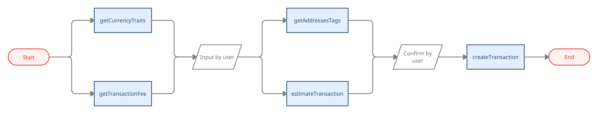
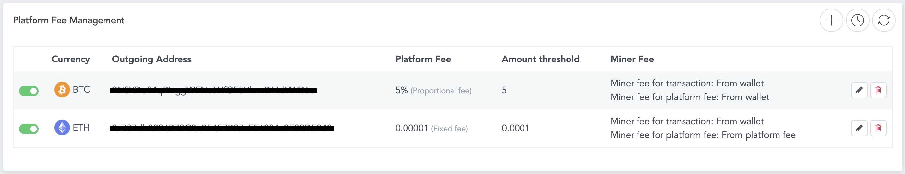
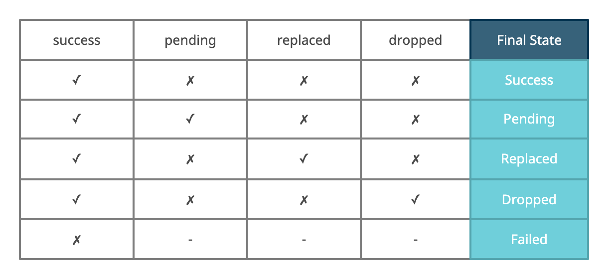

# Transaction

- Bookmarks
  - [Deposit](#deposit)
  - [Withdraw](#withdraw)
  - [Transaction Detail](#transaction-detail)
  - [Transaction Replacement](#transaction-replacement)
  - [Interact with Smart Contract](#interact-with-smart-contract)
  - [Specific Usage](#specific-usage)
    - [Get Action Token for Sign Message](#get-action-token-for-sign-message)
    - [Solana ATA](#solana-ata)


## Deposit

- Select a wallet address, create a new one if needed.
- Generate QR code
- Present the QR code for deposit.

## Withdraw



### getTransactionFee

- To get transaction fees of the selected currency,  
you will get three levels { high, medium, low } of fees for the user to select.
- `tokenAddress` is for private chain usage. For public chain, `tokenAddress` should always be ''
- For example:
  - ETH transaction use ETH as transaction fee ➜ pass `currency: 60, tokenAddress: ''`
  - ERC20 transaction use ETH as transaction fee ➜ pass `currency: 60, tokenAddress: ''`

```ts
/// Get transaction transactionFee of specified currency
/// @param currency Currency to query
/// @param tokenAddress fee of private to public transaction
/// @return Promise<GetTransactionFeeResult>
///
function getTransactionFee(
          currency: number,
          tokenAddress: string
       ): Promise<GetTransactionFeeResult>;
```

### getCurrencyTraits

- To get currency traits when you are ready to withdraw.

```ts
/// Get currency traits for withdraw restriction
/// @param currency query currency
/// @param tokenAddress query tokenAddress
/// @param tokenVersion query tokenVersion
/// @param walletAddress query walletAddress
/// @return Promise<GetCurrencyTraitsResult>
///
function getCurrencyTraits(
          currency: number,
          tokenAddress: string,
          tokenVersion: number,
          walletAddress: string
       ): Promise<GetCurrencyTraitsResult>;
```

- Response: `GetCurrencyTraitsResult`

    ```ts
    type GetCurrencyTraitsResult = {
        /* EPI-777: withdraw must be multiples of granularity. */
        ranularity: string; 
        /* The minimum balance after transaction (ALGO, DOT, KSM). */
        existentialDeposit: string; 
        /* The minimum balance after transaction (XLM, FLOW) */
        minimumAccountBalance: string; 
    }
    ```

  - About `granularity`, see [EIP-777](https://eips.ethereum.org/EIPS/eip-777) ➜ Search for granularity section
  - About `existentialDeposit`, see [this](https://support.polkadot.network/support/solutions/articles/65000168651-what-is-the-existential-deposit-)

  - About `minimumAccountBalance`, see [this](https://developers.stellar.org/docs/glossary/minimum-balance/)

### estimateTransaction

- Estimate the transaction fees to present for the user.

```ts
/// Estimate platform fee / chain fee for given transaction information
/// @param currency Currency of desired new wallet
/// @param tokenAddress Token address for tokens, i.e. an ERC-20 token wallet maps to an Ethereum wallet
/// @param amount Amount to transfer
/// @param transactionFee Transaction transactionFee to pay
/// @param walletId Wallet ID to estimated transaction
/// @param toAddress To Address
/// @return Promise<EstimateTransactionResult>
///
function estimateTransaction(
          currency: number,
          tokenAddress: string,
          amount: string,
          transactionFee: string,
          walletId?: number,
          toAddress?: string,
       ): Promise<EstimateTransactionResult>;
```

- Response: `EstimateTransactionResult`

    ```ts
    type EstimateTransactionResult = {
        /* Estimated total amount to transaction. */
        tranasctionAmout: string;
        /* Estimated platform fee of transaction. */
        platformFee: string;
        /* Estimated blockchain fee of transaction. */
        blockchainFee: string;
        /* Minimum transfer amount for private chain. */
        withdrawMin: string; 
    }
    ```

  - Administrators can add `platformFee` on admin panel
  

### getAddressesTags

- To get an AML tag for the address.
- Be sure to provide warnings for the user if the address is in the blacklist.

```ts
/// Get AML tag for address
/// @param currency query currency
/// @param addresses query address
/// @return Promise<GetAddressesTagsResult>
///
function getAddressesTags(
          currency: number,
          addresses: Array<{string}>,
       ): Promise<GetAddressesTagsResult>;
```

### createTransaction

- This method will create and broadcast a transaction to blockchain.
- Fulfill the requirement of different types of currencies in the extras field.
- Please use the function with `PinSecret` version, the others are planning to deprecate.
- If you are making SMS transaction, refer to `createTransactionSms`
- If you are making Biometrics transaction, refer to `createTransactionBio`

```ts
/// Create a transaction from specified wallet to specified address
/// @param fromWalletId ID of wallet to withdraw from
/// @param toAddress Target address to send
/// @param amount Amount to transfer, token ID for ERC-721, BSC-721
/// @param transactionFee Transaction transactionFee to pay
/// @param description Description of the transaction
/// @param pinSecret: PIN secret retrieved via {PinCodeInputView}
/// @param extraAttributes Extra attributes for specific currencies, pass null if unspecified.
///      - Supported extras:
///         1. memo (string) - Memo for XRP, XLM, EOS, BNB
///         2. eos_transaction_type (EosResourceTransactionType) - Resource transaction type for EOS, such as buy RAM, delegate CPU
///         3. num_bytes (number) - Bytes of RAM/NET for EOS RAM delegation/undelegation transactions. The minimal amounts are 1024 bytes
///         4. input_data (string) - Hex string of input data. Must also set gas_limit when have this attributes
///         5. gas_limit (number) - Must specify this if there were input_data
///         6. skip_email_notification (boolean) -Determined whether or not to skip sending notification mail after create a transaction
///         7. token_id (string) - token ID for ERC-1155
///         8. kind (string) - kind for private chain, code: private to private; out: private to public
///         9. to_address_tag (Array<string>) -AML tag, get from getAddressesTags() API
///        10. custom_nonce (number) - Specific nonce
///        11. custom_gas_limit (number) - Specific gas limit
///        12. sol_token_id (string) - token ID of SOL NFT, if get from getSolNftTokens() API, the token ID would be TokenMeta.tokenAddress
///        13. force_send (boolean) - For SOL transaction, true means create ATA account for receiver
///      - Note:
///         - When eos_transaction_type is EosResourceTransactionType.SELL_RAM, EosResourceTransactionType.UNDELEGATE_CPU or EosResourceTransactionType.UNDELEGATE_NET, the receiver should be address of Wallet fromWalletId
///  @return Promise<CreateTransactionResult>
///
function createTransaction(
          fromWalletId: number,
          toAddress: string,
          amount: string,
          transactionFee: string,
          description: string,
          pinSecret?: number | PinSecretBearer | string,
          extraAttributes?: object
      ): Promise<CreateTransactionResult>;
```

## Transaction Detail

- There are two APIs for retriving transaction histories: `getHistory()` and `getUserHistory()`.

### getHistory

- You can use `getHistory()` to get transaction histories of a certern wallet.

```ts
/// Get transaction history from
/// @param currency Currency of the address
/// @param tokenAddress Token Contract Address of the address
/// @param walletAddress Wallet address
/// @param start Query start offset
/// @param count Query count returned
/// @param crosschain For private chain transaction history filtering. 0: history for private chain transfer; 1: history for crossing private and public chain
/// @param Filter parameters:
///     - direction {Transaction.Direction} - Direction of transaction
///     - pending {boolean} - Pending state of transactions
///     - success {boolean} - Success state of transactions
///     - start_time {number} - Start of time period to query, in Unix timestamp
///     - end_time {number} - End of time period to query, in Unix timestamp
///       - ex: {"direction": Direction.OUT, "pending": true, "start_time": 1632387959}
/// @return Promise<GetHistoryResult>
///
function getHistory(
          currency: number,
          tokenAddress: string,
          walletAddress: string,
          start: number,
          count: number,
          filters?: object
       ): Promise<GetHistoryResult>;
```

- Paging query: you can utilize `start` and `count` to fulfill paging query.  
  - For example:
    - Pass `start: transactions.count, count: 10` to get 10 more records when it reaches your load more condition until there's no more transactions.
    - Has more: `result.start` + `result.transactions.length` < `result.total`
- Response: list of `Transaction`

  ```ts
  type Transaction = {
      /* transaction ID. */
      txid: string;

      pending: boolean;

      success: boolean;
      /* Is transaction dropped by the blockchain. */
      dropped: boolean;
      /* Is transaction replaced by another transaction. */
      replaced: boolean;
  
      ...
  }
  ```

    

- If the Tx's final state is `Success` or `Pending`, you could call `getTransactionInfo` to check the information about this Tx on the blockchain.

### getUserHistory
- ⚠️ `getUserHistory()` and `Transaction.Type` are only available on the SDK version which listed below or later.  
  - React Native - `@cybavo/react-native-wallet-service@1.2.276`
  - Android SDK - `com.cybavo.wallet:wallet-sdk-lib:1.2.4579`
  - iOS SDK - `CYBAVOWallet (1.2.490)`
- You can also use `getUserHistory()` to retrive all transaction histories of the user.
```ts
/// Get transaction history of the user
/// @param start Query start offset
/// @param count Query count returned
/// @param crosschain For private chain transaction history filtering. 0: history for private chain transfer; 1: history for crossing private and public chain
/// @param Filter parameters:
///     - type {Transaction.Type}, {Transaction.Type[]} - Transaction type
///     - pending {boolean} - Pending state of transactions
///     - success {boolean} - Success state of transactions
///     - start_time {number} - Start of time period to query, in Unix timestamp
///     - end_time {number} - End of time period to query, in Unix timestamp
///     - currency: {number} - Currency of the transaction
///     - token_address: {string} - Token contract address of the transaction
/// @return Promise<GetHistoryResult>
///
function getUserHistory(
          start: number,
          count: number,
          filters?: object
       ): Promise<GetHistoryResult>;
```

- Since the result may include transactions from public chain, private chain and different currency. For the returned `Transaction`, there are three fields you can refer to.

```ts
type Transaction = {
    /* Currency of the transaction. */
    currency: number;
    /* Token contract address of the transaction. */
    tokenAddress: string;
    /**
        Type of the transaction.
        Only available in the result of getUserHistory()
        Please refer to Transaction.Type for the definition.
    */
    type: Trnasaction.Type;
    ...
}
```
### Enum - Transaction.Type

- Enum Constant Summary

| Enum Constant  | Value | Description |
| ----  | ----  | ---- |
|	Unknown	|	0	| 	Default value when no data available.	|
|	MainDeposit	|	1	| Deposit on public chain.		| 
|	MainWithdraw	|	2	| Withdraw on public chain.		| 
|	PrivDeposit	|	3	| Deposit on private chain, including inner transfer and deposit to private chain (mint).		| 
|	PrivWithdraw	|	4	| Withdraw on private chain, including inner transfer and withdraw to public chain (burn).		| 
|	PrivOuterDeposit	|	5	| When deposit from public chain to private chain, the history of public chain.		| 
|	PrivOuterWithdraw	|	6	| When withdraw from private chain to public chain, the history of private chain.		| 
|	PrivProductDeposit	|	7	| Deposit financial product.		| 
|	PrivProductWithdraw	|	8	| Withdraw, earlyWithdraw financial product.		| 
|	PrivProductReward	|	9	| WithdrawReward financial product.		| 
### getTransactionInfo

- Check the information about the Tx on the blockchain.

```ts
/// Get transaction result for given txid.
/// @param currency currency to get transaction result
/// @param txid txid of transaction
/// @return Promise<GetTransactionInfoResult>
///
function getTransactionInfo(
          currency: number,
          txid: string
       ): Promise<GetTransactionInfoResult>;


/// the batch version of getTransactionInfo
function getTransactionsInfo(
          currency: number,
          txid: string[]
       ): Promise<GetTransactionsInfoResult>;
```

## Transaction Replacement

> ⚠️ Warning: Cancel / Accelerate transactions will incur a higher Tx fee for replacing the original Tx.

- If a user wants to Cancel / Accelerate a `Pending` Tx on blockchain.
The user needs to create another Tx with higher Tx fee and the same nonce to replace the original one.
- You can achive Tx replacement by `cancelTransaction` and `increaseTransactionFee` API.
- Condition: `replaceable == true`

  ```ts
  type Transaction = {

      txid: string;
      /* Is transaction replaceable. */
      replaceable: boolean;
      /* Is transaction replaced by another transaction. */
      replaced: boolean; 
      /* TXID of replacement of this transaction if replaced == true */
      replaceTxid: string; 
      /* Nonce of transaction, only valid on ETH, same nonce means replacements. */
      nonce: number; 
      ...
  }
  ```
  
  - Steps:
    1. Call `getTransactionFee` to get the current Tx fee.
    2. Decide a new Tx fee
        - If (Tx fee > original Tx fee) ➜ use the new Tx fee
        - If (Tx fee <= original Tx fee) ➜ decide a higher Tx fee by your rules
            - Suggestion: In our experience, (original Tx fee) * 1.1 might be a easy way to calculate a new price for doing this operation.
    3. Call `cancelTransaction` for canceling transactions.
    4. Call `increaseTransactionFee` for accelerating transactions.

### Transaction Replacement History

- In the result of `getHistory`, you will need to determine different states for a transaction.
- How to determine a transaction is replaced or not:
    1. Filter `platformFee == false` ➜ reduce the transactions which are platform fees.
    2. Filter `nonce != 0` ➜ reduce normal transactions
    3. Mapping transactions with the same nonce
    4. In a set of transactions:
        - The Tx fee lower one ➜ The original order
        - `if (Tx1.amount == Tx2.amount)` ➜ It's Accelerate transaction operation
        - `if (Tx.amount == 0)` ➜ It's Cancel transaction operation
        - `if (Tx1.replaced == false && Tx2.replaced == false)` ➜ It's operating
        - `if (Original-Tx.replaced == true)` ➜ Cancel / Accelerate success
        - `if (Replacement-Tx.replaced == true)` ➜ Cancel / Accelerate failed

## Interact with Smart Contract

Wallet SDK provides APIs to call [ABI](https://docs.soliditylang.org/en/develop/abi-spec.html) functions for general read and write operation.   
- For read operation, like `balanceOf`, use `callAbiFunctionRead()`. The parameter is depends on the ABI function required.  

  For example, here's the json of the ABI function we want to call:
    ```javascript
    //Part of ABI_JSON
    {
        "constant": true,
        "inputs": [
          {
            "name": "_owner",
            "type": "address"
          },
          {
            "name": "_testInt",
            "type": "uint256"
          },
          {
            "name": "_testStr",
            "type": "string"
          }
        ],
        "name": "balanceOfCB",
        "outputs": [
          {
            "name": "balance",
            "type": "uint256"
          }
        ],
        "payable": false,
        "stateMutability": "view",
        "type": "function"
      }
    ``` 
    According to its definition, we would compose an API call like this:
    ```javascript
    try {
      const result = await Wallets.callAbiFunctionRead(
        walletId,
        'balanceOfCB',// name, function name of ABI
        '0xef3aa4115b071a9a7cd43f1896e3129f296c5a5f',// contractAddress, contract address of ABI
        abiJson,// abiJson, ABI contract json
        ['0x281F397c5a5a6E9BE42255b01EfDf8b42F0Cd179', 123, 'test']// args, argument array of ABI function
      );
      console.log('callAbiFunctionRead success', result.output);
    } catch (error) {
      console.warn('callAbiFunctionRead failed', error);
    }
    ```
    Aside from `walletId`, all the parameters are varied according to the ABI function.  
    
    See [this](https://github.com/CYBAVO/react-native_wallet_sdk_sample/blob/master/screens/WithdrawScreen.js#L213-L229) for complete example.  
- For write operaion, like `transferFrom`, use `callAbiFunctionTransaction()`. The parameter is also depends on the ABI function required.  

  For example, here's the json of the ABI function we want to call:
    ```javascript
    //Part of ABI_JSON
    {
        "constant": false,
        "inputs": [
          {
            "name": "_to",
            "type": "address"
          },
          {
            "name": "_value",
            "type": "uint256"
          },
          {
            "name": "_testInt",
            "type": "uint256"
          },
          {
            "name": "_testStr",
            "type": "string"
          }
        ],
        "name": "transferCB",
        "outputs": [
          {
            "name": "success",
            "type": "bool"
          }
        ],
        "payable": false,
        "stateMutability": "nonpayable",
        "type": "function"
      }
    ```
    According to its definition, we would compose an API call like this:
    ```javascript
    try {
      const result = await Wallets.callAbiFunctionTransaction(
        walletId,
        'transferCB',// name, function name of ABI
        '0xef3aa4115b071a9a7cd43f1896e3129f296c5a5f',// contractAddress, contract address of ABI
        abiJson,// abiJson, ABI contract json
        ['0x490d510c1A8b74749949cFE5cA06D0C6BD7119E2', 1, 100, 'unittest'],// args, argument array of ABI function
        transactionFee.amount,// transactionFee, see getTransactionFee() and amount property of Fee type
        pinSecret
      );

      console.log(
        'callAbiFunctionTransaction success',
        result.txid,
        result.signedTx
      );
    } catch (error) {
      console.warn('callAbiFunctionTransaction failed', error);
    }
    ```
    Different from `callAbiFunctionRead()`, `callAbiFunctionTransaction()` requires 2 more parameters: `transactionFee` and `PinSecret` for transaction.  
    
    The parameter `name`, `contractAddress`, `abiJson` and `args` are varied according to the ABI function.  
    
    See [this](https://github.com/CYBAVO/react-native_wallet_sdk_sample/blob/master/screens/WithdrawScreen.js#L187-L209) for complete example.  
    
    See [Withdraw to Public Chain](https://github.com/CYBAVO/CYBAVO_WALLET_RN_SAMPLE/blob/master/docs/private_chain.md#2-withdraw-to-public-chain) for another specific usage in private chain.

## Specific Usage
There are specific API usages for some scenarios which related to transaction, you can find them in this section.
### Get Action Token for Sign Message
In below two cases, `signMessage()` and `walletConnectSignMessage()` can also be used to sign a raw transaction: 
- Solana Sign Message
- Legacy Sign Message for EVM Compatible Currency  

In order to help the caller be more cautious before signing, it required to get an action token then pass to sign message API to verify.  
- The sample code snippet for `signMessage()`:
```js
/**
 * 1. Get action token for signMessage(), 
 * the "message" of getSignMessageActionToken() and signMessage() should be the same.
 */
Wallets.getSignMessageActionToken(message)
    .then(r => {
      _signMessage(message, pinSecret, wallet, {
        // Put "legacy" true means legacy sign.
        legacy: true,
        // 2. Put it in extras and pass to signMessage().
        confirmed_action_token: r.actionToken,
      });
    })
    .catch(error => {
      console.warn('getSignMessageActionToken failed', error);
    });

const _signMessage = (message, pinSecret, wallet, extras) => {
    Wallets.signMessage(wallet.walletId, pinSecret, message, extras)
      .then(r => {
        console.log('signedMessage', r.signedMessage);
      })
      .catch(error => {
        console.warn('getSignMessageActionToken failed', error);
      });
};
```
- The sample code snippet for `walletConnectSignMessage()`, it is very similar to `signMessage()`:
```js
/**
 * 1. Get action token for walletConnectSignMessage(), 
 * the "message" of getSignMessageActionToken() and walletConnectSignMessage() should be the same.
 */
Wallets.getSignMessageActionToken(message)
    .then(r => {
      _signMessage(message, pinSecret, wallet, {
        // Put "legacy" true means legacy sign.
        legacy: true,
        // 2. Put it in extras and pass to walletConnectSignMessage().
        confirmed_action_token: r.actionToken,
      });
    })
    .catch(error => {
      console.warn('getSignMessageActionToken failed', error);
    });

const _signMessage = (message, pinSecret, wallet, extras) => {
    Wallets.walletConnectSignMessage(wallet.walletId, pinSecret, message, extras)
      .then(r => {
        console.log('signedMessage', r.signedMessage);
      })
      .catch(error => {
        console.warn('getSignMessageActionToken failed', error);
      });
};
```
### Solana ATA
You can create Solana ATA (associated token account) through `createTransaction()` with extras or `setSolTokenAccountTransaction()`.
- Call `createTransaction()` with `force_send` in extras:
```js
let extras = {};
// For SOL transaction, "force_send" true means create ATA account for receiver.
if (wallet.currency === Coin.SOL && wallet.tokenAddress) {
  extras.force_send = true;
}

try{
  result = await Wallets.createTransaction(
        wallet.walletId,
        receiver,
        amount,
        transactionFee.amount,
        description,
        pinSecret,
        extras
      );
} catch (error){
  console.warn('createTransaction failed', error);
}
```
- Call `setSolTokenAccountTransaction()` directly:
```java
/**
* Note 1: The SOL token wallet must have SOL for transaction fee, otherwise, the API will return empty TXID.
* Note 2: If the SOL token wallet have created token account, the API will also return empty TXID.
* */
Wallets.setSolTokenAccountTransaction(wallet.walletId, pinSecret)
    .then(r => {
      console.log('TXID:', r.txid);
    })
    .catch(error => {
      console.warn('setSolTokenAccountTransaction failed', error);
    });
```