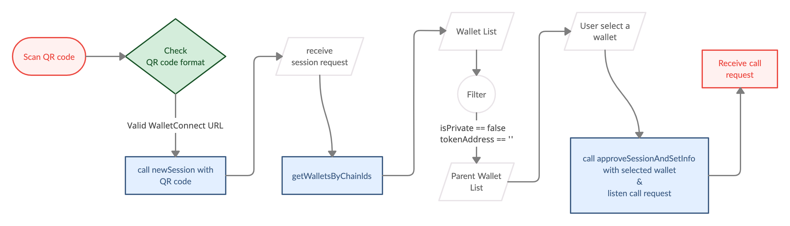
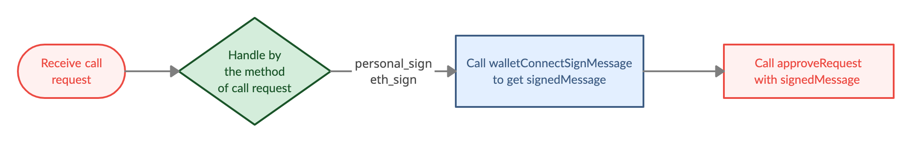
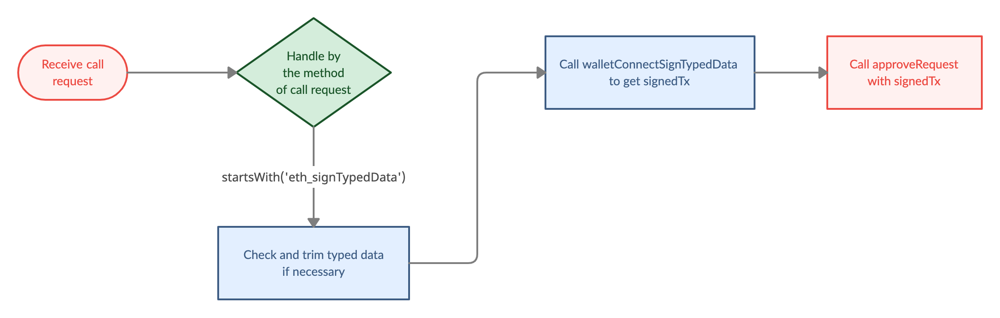
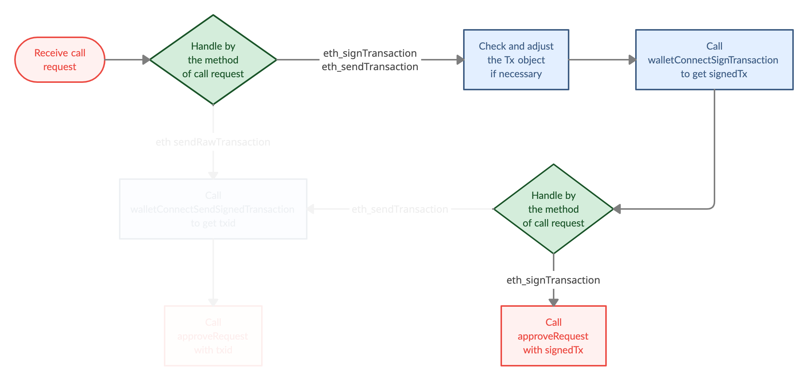
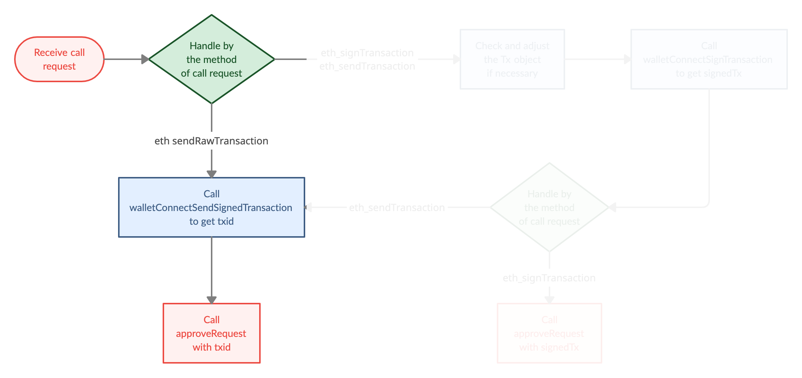
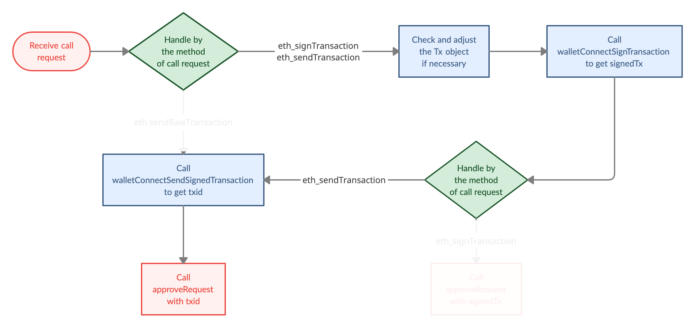

# WalletConnect

> WalletConnect is an open protocol which makes Dapps able to interact with wallets on different platforms. 
>
> Wallet SDK has integrated [WalletConnect v1.0](https://docs.walletconnect.org/) to support wallet apps connecting with Dapps, also provides corresponding APIs which help you get the results to return to Dapp.  
>
> In later sections, we'll illustrate how to establish wallet client and use those APIs to respond to [session request](https://docs.walletconnect.com/tech-spec#session-request) and JSON-RPC call requests which are defined in [JSON-RPC API Methods](https://docs.walletconnect.com/json-rpc-api-methods/ethereum).  
>
> For further technical specification, see [this](https://docs.walletconnect.org/tech-spec).

- Bookmark:
  - [Session Request](#session-request)
  - [JSON-RPC Call Requests](#json-rpc-call-requests)
  - [API History](#api-history)
  - [Cancel a Transaction](#cancel-a-transaction)

## [Session Request](https://docs.walletconnect.com/tech-spec#session-request)



1. Scan a WalletConnect QR code from Dapp, if it's a valid [WalletConnect URI](https://docs.walletconnect.com/tech-spec#requesting-connection), establish a new session with it.
    ```javascript
    import { WalletConnectSdk } from "@cybavo/react-native-wallet-service";
    const { WalletConnectManager} = WalletConnectSdk;
    // Establish session, then the callback will receive session request 
    let connectorWrapper = WalletConnectManager.newSession(
            walletConnectUri,
            walletAddress,
            walletId,
            walletClientMeta,
            (error, payload) => {
                sessionRequestCallback(connectorWrapper.getConnector().peerId, error, payload);
            }
          );
    ``` 
2. After receive session request, call `getWalletsByChainIds([-1])` to get all wallets.
3. Guide the user to choose a parent wallet.
    ```javascript
    // sessionRequestCallback is called in newSession's callback
    let chainId = -1;
    let sessionRequestCallback = (peerId, error, payload) => {
            Wallets.getWalletsByChainIds([chainId])
                .then(result => {
                    let wallets = result.wallets.filter(
                        w => !w.isPrivate && !w.tokenAddress)
                    );
                    //Display a wallet picker with wallets
                })
                .catch(error => {});
        }
    ```
4. Approve session request with selected wallet and listen upcoming call request.
    ```javascript
    let respForDapp = {
            accounts: [wallet.address],
            chainId: wallet.chainId,
        };
    //approve session, then pass the listeners to receive call request and disconnect event
    WalletConnectManager.approveSessionAndSetInfo(
        peerId,
        respForDapp,
        wallet.address,
        wallet.walletId,
        wallet.chainId,
        (error: any, payload: any) => {
                callRequestListener(peerId, error, payload);
        },
        disconnectListener
    );
    let disconnectListener = (error: any, payload: any) => {};
    ```

## [JSON-RPC Call Requests](https://docs.walletconnect.com/json-rpc-api-methods/ethereum)
> When receiving a call request, identify by `method` and handle it correspondingly.
```javascript
// callRequestListener is called in approveSessionAndSetInfo's callback
let callRequestListener = (peerId, error, payload) => {
    switch (payload.method) {
        case 'eth_sendTransaction':
        case 'eth_signTransaction':
            // handle transaction flow
        case 'eth_sign':
        case 'personal_sign':
            // handle sign message flow
        case 'eth_sendRawTransaction':
            // handle send transaction flow
        default:
            if (payload.method.startsWith('eth_signTypedData')) {
                // handle sign typed data flow
            }else{
                // rejectRequest
            }
    }
};
```
- ### [personal_sign](https://docs.walletconnect.com/json-rpc-api-methods/ethereum#personal_sign)
    
  - Use `walletConnectSignMessage` to sign a message. ➜ Approve request with `signedMessage`
  - Suggestion: set `extras['is_hex'] = true` to avoid encode / decode issues which lead to invalid signatures.
  - For extras `legacy` and `confirmed_action_token`, please check [Get Action Token for Sign Message](transaction.md#get-action-token-for-sign-message) for more detail.

    ```javascript
    // If legacy is true, confirmed_action_token is required for EVM compatible currency
    let extras = { eip155: eip155, is_hex: isHex, legacy: legacySign, confirmed_action_token: actionToken };
    let message = payload.params[0];
    let result = await Wallets.walletConnectSignMessage(
            walletId,
            message,
            pinSecret,
            extras
        );
    let response = { result: result.signedMessage, id: payload.id };
    await WalletConnectManager.approveRequest(peerId, response)
    ```
    ```ts
    /// Sign message by wallet private key(eth_sign, personal_sign) via WalletConnect
    ///
    /// - This call will be logged as ApiHistoryItem with API name: eth_sign note: Only support ETH & TRX. Result is same as following links:
    /// - ETH: https://github.com/MetaMask/eth-sig-util/blob/v4.0.0/src/personal-sign.ts#L27-L45
    /// - TRX: https://github.com/TRON-US/tronweb/blob/461934e246707bca41529ab82ebe76cf894ab460/src/lib/trx.js#L712-L731
    ///
    /// @param walletId: ID of wallet
    /// @param message to sign
    /// @param PIN secret retrieved via PinCodeInputView
    /// @param extras Extra attributes for specific currencies, pass null if unspecified.
    ///       - Supported extras:
    ///           - eip155 (boolean) = true - Use EIP 155 format to sign message
    ///           - is_hex (boolean) = true - Send Hex as message
    ///           - legacy (boolean) = true - Use legacy sign and suggest send hex as message(is_hex set true), please also check confirmed_action_token for EVM compatible currency
    ///           - confirmed_action_token (string) - It's required for these 2 cases:
    ///             - SOL
    ///             - EVM compatible currency and legacy is true
    ///             Get the action token from getSignMessageActionToken(), otherwise, the API will return Error.Code.ErrActionTokenInvalid error codemessage(is_hex set true)
    /// @return Promise<SignedMessageResult>
    ///
    function walletConnectSignMessage(
                walletId: number,
                message: string,
                pinSecret: number | PinSecretBearer | string,
                extras: object
            ): Promise<SignedMessageResult>;
    ```
  - Use different functions for biometrics & SMS Verification: see [this](bio_n_sms.md#biometrics--sms-verification-for-transaction-and-sign-operation)

- ### [eth_sign](https://docs.walletconnect.com/json-rpc-api-methods/ethereum#eth_sign)

  - As above, **_personal_sign_**.
  - The only difference is the order of message in the payload `params`
  ```javascript
  let message = payload.params[1];
  ```

- ### [eth_signTypedData](https://docs.walletconnect.com/json-rpc-api-methods/ethereum#eth_signtypeddata)
  
  1. Check and trim typed data if necessary. For typed data definition, see [this](https://github.com/ethereum/EIPs/blob/master/EIPS/eip-712.md#specification-of-the-eth_signtypeddata-json-rpc).
  2. Use `walletConnectSignTypedData` to sign a typed data. ➜ Approve request with `signedTx`
    ```javascript
    let message = payload.params[1];
         let result = await Wallets.walletConnectSignTypedData(
           walletId,
           message,
           pinSecret
         );
    let response = { result: '0x' + result.signedTx, id: payload.id };
    await WalletConnectManager.approveRequest(peerId, response);
    ```
    ```ts
    /// Sign typed data(eth_signTypedData) via WalletConnect, this call will be logged as ApiHistoryItem with API
    /// - API eth_signTypedData: https://docs.walletconnect.org/json-rpc-api-methods/ethereum#eth_signtypeddata
    ///
    /// @param walletId wallet ID
    /// @param typedData typed data json string
    /// @param pinSecret PIN secret retrieved via PinCodeInputView
    /// @return Promise<SignedRawTxResult>
    ///
    function walletConnectSignTypedData(
                walletId: number,
                typedData: string,
                pinSecret: number | PinSecretBearer | string
            ): Promise<SignedRawTxResult>;
    ```

    - Use different functions for biometrics & SMS Verification: see [this](bio_n_sms.md#biometrics--sms-verification-for-transaction-and-sign-operation)

- ### [eth_signTransaction](https://docs.walletconnect.com/json-rpc-api-methods/ethereum#eth_signtransaction)
  

    1. Basically, Wallet SDK will check and adjust the Tx object for you.
    - You can use `getTransactionFee` and `getEstimateGas` to get `transactionFee` and `customGasLimit` then pass as parameter while calling `walletConnectSignTransaction`.  
    - You can print log in `onLog` to check the adjusted Tx object.
    2. Use `walletConnectSignTransaction` to sign a transaction. ➜ Approve request with `signedTx`
        ```javascript
        let tx = payload.params[0];
        let result = await Wallets.walletConnectSignTransaction(
            walletId,
            tx,
            transactionFee,
            pinSecret,
            true, //use autoNonce, Wallet SDK will fill the nonce 
            value => {
                console.debug('onLog', value);
            },
            gasLimit
        );
        let response = { result: result.signedTx, id: payload.id };
        await WalletConnectManager.approveRequest(peerId, response);
        ```
        ```ts
        /// Signs a transaction(eth_signTransaction) via WalletConnect, this call will be logged as ApiHistoryItem with API name:
        /// - eth_signTransaction - https://docs.walletconnect.org/json-rpc-api-methods/ethereum#eth_signtransaction
        ///
        /// @param walletId wallet ID
        /// @param transactionFee this value will be transferred to hex and replace tx.gasPrice
        /// @param pinSecret User Pin code, if the type is number or PinSecretBearer means pass pinSecret, string means pass plaintext
        /// @param autoNonce if true, auto fill tx.nonce with wallet's current pending nonce
        /// @param onLog receive log callback
        /// @param customGasLimit this value will be transferred to hex and replace tx.gas
        /// @return Promise<SignedRawTxResult>
        ///
        function walletConnectSignTransaction(
                    walletId: number,
                    tx: object | string,
                    transactionFee: string,
                    pinSecret: number | PinSecretBearer | string,
                    autoNonce: boolean,
                    onLog: (log: string) => void,
                    customGasLimit: string,
                ): Promise<SignedRawTxResult>;
        ```

- ### [eth_sendRawTransaction](https://docs.walletconnect.com/json-rpc-api-methods/ethereum#eth_sendrawtransaction)
  

    - Use `walletConnectSendSignedTransaction` to broadcast and get the `txid`. ➜ Approve request with `txid`
        - During some transactions, you may receive new currencies / tokens which don't exist in the currency list, like swapping a new type of token.
        - Call `walletConnectSync()` to add currencies and wallets which are created by `walletConnectSendSignedTransaction`.
        - Call `getWallets()` to get the new wallet list
    ```javascript
    let signedTx = params[0];
    let sendResult = await Wallets.walletConnectSendSignedTransaction(
                walletId,
                signedTx
              );
    // return TXID as approve response to the Dapp
    let response = { result: sendResult.txid, id: payload.id };
    await WalletConnectManager.approveRequest(peerId, response);
    ```
    ```ts
    /// Create transaction by signed transaction(eth_sendTransaction) via WalletConnect,
    ///  this call will be logged as ApiHistoryItem with API name: eth_sendRawTransaction
    ///
    /// @param walletId: ID of wallet
    /// @param signedTx signed transaction
    /// @return Promise<SendSignedTxResult>
    ///
    function walletConnectSendSignedTransaction(
                walletId: number,
                signedTx: string
            ): Promise<SendSignedTxResult>;
    ```
- ### [eth_sendTransaction](https://docs.walletconnect.com/json-rpc-api-methods/ethereum#eth_sendtransaction)
  

    1. Use `walletConnectSignTransaction` to get the `signedTx`.  
    See **_eth_signTransaction_**.  
    2. Use `walletConnectSendSignedTransaction` to get the `txid`. ➜ Approve request with `txid`.  
    See **_eth_sendRawTransaction_**.  

        ```javascript
        let tx = payload.params[0];
        // 1. sign transaction
        let result = await Wallets.walletConnectSignTransaction(
            walletId,
            tx,
            transactionFee,
            pinSecret,
            true, //use autoNonce, Wallet SDK will fill the nonce 
            value => {
                console.debug('onLog', value);
            },
            gasLimit
        );
        // 2. send signed transaction
        let sendResult = await Wallets.walletConnectSendSignedTransaction(
                        walletId,
                        result.signedTx
                    );
        // return TXID as approve response to the Dapp
        let response = { result: sendResult.txid, id: payload.id };
        await WalletConnectManager.approveRequest(peerId, response);
        ```


## API History

- Call `getWalletConnectApiHistory` to get WalletConnect API history.

    ```ts
    /// Get WalletConnect API history from
    /// 1. walletConnectSignTypedData(number, string, number | PinSecretBearer | string)
    /// 2. walletConnectSignTransaction(number, string, number | PinSecretBearer | string)
    /// 3. walletConnectSignMessage(number, string, number | PinSecretBearer | string, object)
    /// 4. walletConnectSendSignedTransaction(number, string)
    ///
    /// @param walletId wallet ID
    /// @param start Query start offset
    /// @param count Query count returned
    /// @param filters Filter parameters:
    ///     - api_name (string) - API name
    ///     - start_time (number) - Start of time period to query, in Unix timestamp
    ///     - end_time (number) - End of time period to query, in Unix timestamp
    /// @return Promise<GetApiHistoryResult>
    ///
    function getWalletConnectApiHistory(
                walletId: number,
                start: number,
                count: number,
                filters?: object
            ): Promise<GetApiHistoryResult>;
    ```
- WalletSDK also provides `getWalletConnectSignedTx` and `getWalletConnectUnsignedData` for further needs.

    ```ts
    /// Get signed TX for walletConnectSendSignedTransaction()
    ///
    /// @param walletId wallet ID
    /// @param accessId accessId from API history, result of getWalletConnectApiHistory()
    /// @return Promise<GetWalletConnectSignedTxResult>
    ///
    function getWalletConnectSignedTx(
        walletId: number,
        accessId: string,
    ): Promise<GetWalletConnectSignedTxResult>;

    /// Get unsigned data for walletConnectSignTypedData() and walletConnectSignTransaction()
    /// 
    /// @param walletId wallet ID
    /// @param accessId accessId from API history, result of getWalletConnectApiHistory()
    /// @return Promise<GetWalletConnectUnsignedDataResult>
    ///
    function getWalletConnectUnsignedData(
        walletId: number,
        accessId: string,
    ): Promise<GetWalletConnectUnsignedDataResult>;
    ```

## Cancel a Transaction

- In list of `ApiHistoryItem`

    ```ts
    type ApiHistoryItem = {

        apiName: string; // API Name

        accessId: string; // access ID for eth_sendRawTransaction

        status: number; // ApiHistoryItem status { WAITING, FAILED, DONE, DROPPED }

        nonce?: number; // Used nonce

        gasPrice: string; // Gas price

        gasLimit: string; // Gas limit

        ...
    }
    ```

- How to determine if a transaction can be canceled or not?
    1. `apiName == 'eth_sendRawTransaction'`
    2. `accessId != ''`
    3. `status == Wallets.ApiHistoryItem.Status.WAITING`

- How to cancel a transaction?
    1. Decide a new transaction fee.
    2. Call `cancelWalletConnectTransaction` to cancel a WalletConnect Transaction

- How to decide the new transaction fee?
    1. Call `getTransactionFee` to get the current Tx fee.
    2. Decide a new Tx fee
        - if (Tx fee > original Tx fee) ➜ Use the new Tx fee
        - if (Tx fee <= original Tx fee) ➜ Decide a higher Tx fee by your rules
            - Suggestion: in our experience, (original Tx fee) * 1.1 might be an easy way to calculate a new price for doing this operation.
    3. Same as [Transaction_Replacement](transaction.md#transaction-replacement)

- How to see the cancel history?
    1. In list of `ApiHistoryItem`
        - Filter `apiName == 'eth_sendRawTransaction'` ➜ original Tx operation
        - Filter `apiName == 'eth_cancelTransaction'` ➜ cancel Tx operation
        - Use `nonce` to map same pair of operations
    2. In same pair of operations:
        - When cancel operation's `status == Wallets.ApiHistoryItem.Status.DONE` means cancel operation success.
        - When origin Tx operation's `status == Wallets.ApiHistoryItem.Status.DONE` means cancel operation failed. The original Tx was succeeded.
    3. Refer to [Transaction Replacement History](transaction.md#transaction-replacement-history)
