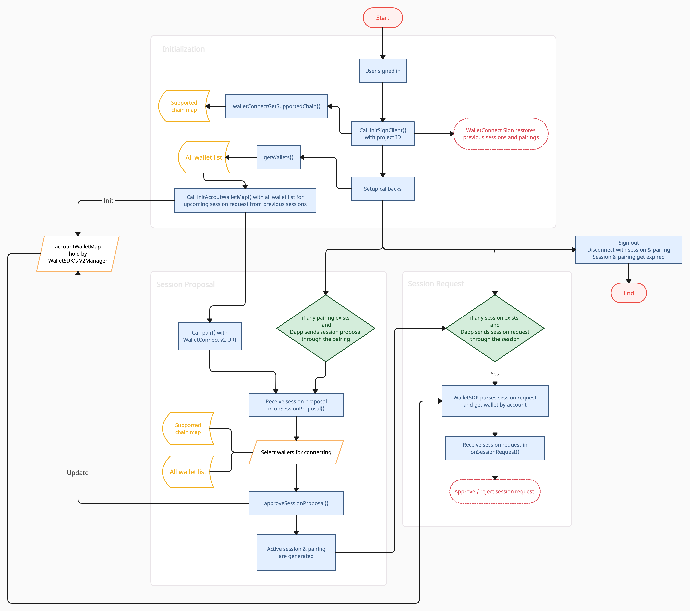

# WalletConnect

>&emsp;WalletConnect is the decentralized Web3 messaging layer and a standard to connect blockchain wallets to Dapps. They have developed different groups of API for different uses. Sign API is the one that will be covered in this document.
>
> &emsp;WalletConnect Sign is a remote protocol designed for secure peer-to-peer communication between Dapps (web3 applications) and wallets. WalletSDK has integrated [WalletConnect Sign v2.0](https://docs.walletconnect.com/2.0/javascript/guides/react-native) to support wallet apps connecting with Dapps, and provided corresponding APIs which help you to get the results to return to Dapp.  
>
> &emsp;In later sections, we'll illustrate how to establish the WalletConnect Sign client and how to use APIs to respond to session proposals and the JSON-RPC session requests we support.  


- Bookmark:
  - [Prequest](#prequest)
  - [Troubleshooting](#troubleshooting)
  - [Overview](#overview)
  - [SignClient Initialization](#signclient-initialization)
  - [Multi-Chain Support](#multi-chain-support)
  - [Session Proposal](#session-proposal-1)
  - [Pairings and Sessions](#pairings-and-sessions)
  - [Sessions Request](#session-request-1)
    - [Sign Message](#sign-message)
        - [personal_sign](#personal_sign)
        - [eth_sign](#eth_sign)
        - [solana_signMessage](#solana_signmessage)
    - [eth_signTypedData](#eth_signtypeddata)
    - [eth_signTransaction](#eth_signtransaction)
    - [eth_sendRawTransaction](#eth_sendrawtransaction)
    - [solana_signTransaction]()
  - [API History](#api-history)
  - [Cancel a Transaction](#cancel-a-transaction)

## Prequest
- [React Native](https://www.npmjs.com/package/react-native) 0.64+ is required for running [@walletconnect/sign-client](https://www.npmjs.com/package/@walletconnect/sign-client) on Android Hermes. 
- WalletSDK minimum version:
    - React Native - `@cybavo/react-native-wallet-service@1.2.300`
    - Android - `com.cybavo.wallet:wallet-sdk-lib:1.2.4940`
    - iOS - `CYBAVOWallet (1.2.505)`
-  (Optional) Install `@walletconnect/utils` to use utils, e.g. `parseUri`.   
    ```
    yarn add @walletconnect/utils
    ```
- Get project ID from [WalletConnect Cloud](https://cloud.walletconnect.com/).  This is required for using Walletconnect v2.0.

    
## Troubleshooting
&emsp;Here we list the issue that might occur during development and the solution for reference.    
- [atob in base64: "Can't find variable" or "doesn't exist"](https://github.com/ethers-io/ethers.js/issues/3460#issuecomment-1288202217)    
Insert below code snippet into the `node_modules/@ethersproject/base64/lib/browser-base64.js` file.
    ```js
    var Buffer = require('buffer/').Buffer;
    function atob(str) {
        return Buffer.from(str, 'base64').toString('binary');
    }
    function btoa(str) {
        return Buffer.from(str, 'binary').toString('base64');
    }
    ```
    

## Overview
&emsp;WalletConnect v2.0 has introduced concepts and usages that are [different from WalletConnect v1.0](https://docs.walletconnect.com/2.0/advanced/migrating-from-v1.0), which include initialization, session lifetime, pairing and multi-chain support. 

&emsp;The flowchart and the following description may give you an idea about when the app receives session proposals and session requests.  



#### Initialization
1. Initialize [SignClient](https://github.com/WalletConnect/walletconnect-monorepo/tree/v2.0/packages/sign-client) when the app starts. You can wait until the user is signed in.   
    - Once SignClient has been initialized, the [pairings and sessions](https://docs.walletconnect.com/2.0/advanced/migrating-from-v1.0#pairings--sessions) generated previously would be restored automatically. A Dapp can send session proposals to a wallet app through pairing, and send session requests, e.g. eth_sign, to a wallet app through session.
2. Setup callbacks such as `onSessionProposal()` and `onSessionRequest()` in order to receive session proposals and session requests.
3. Call `getWallets()` and `walletconnectGetSupportedChain()` to retrieve wallet list and supported chain map for later steps.
4. Call `initAccountWalletMap()` with wallet list. This move would help walletSDK find the specific wallet for you when receiving a session proposal.
#### Session Proposal
5. Get a [WalletConnect v2.0 URI](https://docs.walletconnect.com/2.0/specs/clients/core/pairing/pairing-uri) from a Dapp and call `pair()` with it.
6. Receive session proposal in `onSessionProposal()`.
    - Provide multi-select UI for users to select wallets according to required chains which are listed in the proposal and the supported chain map retrieved earlier.
7. Call `approveSessionProposal()` with selected wallets.
    - Active session and pairing are generated after the session proposal is approved successfully.
    - WalletSDK would update the `accountWalletMap` with selected wallets at this step.
#### Session Request
8. When a session request is coming, WalletSDK would parse it first then trigger `onSessonRequest()` with the request, wallet address and the wallet. The wallet could be null if WalletSDK cannot find one in the `accountWalletMap`.
    - With the request and the wallet, the next step is to handle the request according to the method.
9. Call `approveSessionRequest()` with a result or reject the request by `rejectSessionRequest()`.
#### Disconnect
10. Disconnect all the sessions and pairings whenever user is not signed-in, e.g. sign out or session expired. 
    
## [SignClient Initialization](https://docs.walletconnect.com/2.0/javascript/sign/wallet-usage#initializing-the-client)

&emsp;SignClient is the client of WalletConnect Sign, whereas `V2Manager` wrapped SignClien, [Core](https://docs.walletconnect.com/2.0/javascript/guides/shared-core), [Web3Wallet](https://docs.walletconnect.com/2.0/javascript/web3wallet/wallet-usage) and provided related APIs for easier uses. After performed `initSignClient()`, `V2Manager` would hold the initialized SignClient, Core and Web3Wallet instance which can be accessed by `V2Manager.signClient`, `V2Manager.core` and `V2Manager.web3Wallet`.


```js
import { WalletConnectSdk } from '@cybavo/react-native-wallet-service';
const { V2Manager, WalletConnectHelper } = WalletConnectSdk;

try {
      if (V2Manager.signClient) {
        // Initialized already.
        return;
      }
      let clientMeta = {
        description: 'Test Wallet',
        url: '#',
        icons: ['https://walletconnect.com/walletconnect-logo.png'],
        name: 'Test Wallet',
      };
      /** 1. Initialize SignClient, Core and Web3Wallet. */
      let opts = { projectId: "<YOUR_PROJECT_ID>", logger: 'debug' };
      await V2Manager.initSignClient(opts, clientMeta);
      /** 2. Setup callbacks. */
      V2Manager.onSessionProposal = proposal => {
        // Handle session proposal.
      };
      V2Manager.onSessionRequest = (requestEvent, address, wallet) => {
        // Handle session request.
      };
      V2Manager.onSessionDelete = data => {
        // Triggered when session is deleted.
      };
      V2Manager.onSessionUpdate = { topic, namespaces } => {
        // Handle new namespace.
      };
      // To receive Dapp's ping.
      V2Manager.onSessionPin = data => {};
      // To receive session event emitted by Dapp.
      V2Manager.onSessionEvent = data => {};
} catch (error) {
    console.log(error);
}
```
- Initialize `accountWalletMap` with wallets:
```js
V2Manager.initAccountWalletMap(wallets);
```
## Multi-Chain Support
&emsp;WalletConnect v2.0 uses [namespace](https://docs.walletconnect.com/2.0/advanced/glossary#namespaces), chain and account to specify the group of chain, chain and an address on a certain chain. You can find corresponding fields on Wallet and Currency.
  ```ts
  type Wallet = {

    /** Wallet Address */
    address: string;

    /** CAIP-2 chain ID of supported chain for WalletConnect */
    caip2ChainId: string; // e.g. 'eip155:1' for Ethereum Mainnet

    /** Name of supported chain for WalletConnect */
    chainName: string;
    
    ...
  }
  ```
  ```ts
  type Currency = {

    /** CAIP-2 chain ID of supported chain for WalletConnect */
    caip2ChainId: string; // e.g. 'eip155:1' for Ethereum Mainnet

    /** Name of supported chain for WalletConnect */
    chainName: string;
    
    ...
  }
  ```
&emsp;⚠️ WalletSDK supports `eip155` and `solana` for now, which means `caip2ChainId` and `chainName` are only available for EVM compatible and Solana wallets and currencies.

## [Session Proposal](https://docs.walletconnect.com/2.0/javascript/sign/wallet-usage#pairing-with-uri)


1. &emsp;Scan a WalletConnect QR code from Dapp, if it's a valid [WalletConnect v2.0 URI](https://docs.walletconnect.com/2.0/specs/clients/core/pairing/pairing-uri), call `pair()` with it.
    ```javascript
    import { parseUri } from '@walletconnect/utils';
    import { WalletConnectSdk } from "@cybavo/react-native-wallet-service";
    const { WalletConnectManager, V2Manager} = WalletConnectSdk;
    
    let version;
    try{
        const result = parseUri(str); 
        version = result.version;
    } catch (error){
        console.log(error);
    }

    if (version == 1){
        // Go v1.0 flow
    } else if(version == 2){
        try {
            await V2Manager.pair(uri);
        } catch (error) {
            console.log(error);
        }
    }
    ``` 
2. &emsp;Next, you may receive a session proposal in `onSessionProposal()`. Each namespace in proposal's requiredNamespaces contains the list of chains, methods and events that are required from the Dapp.    
&emsp;For example, user choose "Ethereum Goerli", "Polygon Mumbai" and "Solana Devnet" to connect, the received proposal lists 2 namespaces under `requiredNamespaces`: `eip155` and `solana`, and the selected chains are listed in each namespace's `chains`: `"eip155:5"`, `"eip155:80001"` and `"solana:8E9rvCKLFQia2Y35HXjjpWzj8weVo44K"`.

<details open>
  <summary>Example Session Proposal</summary>
  

  ```js
  {
    "id": 1672214749761550,
    "params": {
        "id": 1672214749761550,
        "pairingTopic": "dbeb4fb2ce673c7ba4319897a3ac9a9a9134b2b4373918eed3bd9362fcc1f02e",
        "expiry": 1672215058,
        "requiredNamespaces": {
            "eip155": {
                "methods": [
                    "eth_sendTransaction",
                    "eth_signTransaction",
                    "eth_sign",
                    "personal_sign",
                    "eth_signTypedData"
                ],
                "chains": [
                    "eip155:5",// Ethereum Goerli
                    "eip155:80001"// Polygon Mumbai
                ],
                "events": [
                    "chainChanged",
                    "accountsChanged"
                ]
            },
            "solana": {
                "methods": [
                    "solana_signTransaction",
                    "solana_signMessage"
                ],
                "chains": [
                    "solana:8E9rvCKLFQia2Y35HXjjpWzj8weVo44K" // Solana Devnet
                ],
                "events": []
            }
        },
        "relays": [
            {
                "protocol": "irn"
            }
        ],
        "proposer": {
            "publicKey": "7d5864d1141f1c18e5b953bd5387c38e82bac5ae92b9dbc8fbf6bcf59d129d1c",
            "metadata": {
                "description": "React App for WalletConnect",
                "url": "https://react-app.walletconnect.com",
                "icons": [
                    "https://avatars.githubusercontent.com/u/37784886"
                ],
                "name": "React App"
            }
        }
    }
}
  ```
</details>


&emsp; To approve the proposal, the response needs to contain `accounts` -- the list of CAIP-2 chain ID with wallet address -- for every required chain. Otherwise, an exception may be thrown during `approveSessionProposal()`. For detailed validation cases please check [this](https://docs.walletconnect.com/2.0/specs/clients/sign/session-namespaces#controller-side-validation-of-incoming-proposal-namespaces-wallet).

&emsp; In the example below, the user selected 2 "Ethereum Goerli", 1 "Polygon Mumbai" and 2 "Solana Devnet" wallets.
<details open>
  <summary>Example Session Proposal Approval Response</summary>
  

  ```js
  {
    "id": 1672214749761550,
    "relayProtocol": "irn",
    "namespaces": {
        "eip155": {
            "accounts": [
                "eip155:5:0x430dF37e50275290EE3c35524aFa26EfcCcb7A61",
                "eip155:5:0xb9C52884871D703a113bB8D377EB138e4085D494",
                "eip155:80001:0x430dF37e50275290EE3c35524aFa26EfcCcb7A61"
            ],
            "methods": [
                "eth_sendTransaction",
                "eth_signTransaction",
                "eth_sign",
                "personal_sign",
                "eth_signTypedData"
            ],
            "events": [
                "chainChanged",
                "accountsChanged"
            ]
        },
        "solana": {
            "accounts": [
                "solana:8E9rvCKLFQia2Y35HXjjpWzj8weVo44K:CEmbV43bmBMVTqAxJbNuDxzE8MxsUYRkYdN9umByBvu2",
                "solana:8E9rvCKLFQia2Y35HXjjpWzj8weVo44K:GKoP9vNDaxKTRjxaj24C1HL9qbDzjyYhNX1C2K1avSHH"
            ],
            "methods": [
                "solana_signTransaction",
                "solana_signMessage"
            ],
            "events": []
        }
    }
}
  ```
</details>

3. &emsp; You may want to classify available wallets according to the session proposal, `getNamespaceWithChainWalletsMap()` is available to do the hassle.    
&emsp; It returns `proposal.requiredNamespaces` part with `chainWalletsMap` in each namespace, then you can display available wallets by each required chain according to `chainWalletsMap`. 
    ```js
    V2Manager.onSessionProposal = proposal => {
            // Wallets can be all wallet list or retrieved from getWalletsByCaip2ChainIds()
            let ns = WalletConnectHelper.getNamespaceWithChainWalletsMap(proposal, wallets);
            // Display wallet selection UI according to chainWalletsMap
        };
    ```
    ⚠️ If there is no available wallet for a chain, the value of returned `chainWalletsMap[chain]` would be an empty array, and the UI should let the user know this proposal is unable to be approved.
    <details open>
    <summary>Example Result of getNamespaceWithChainWalletsMap()</summary>
    

    ```js
    {
        "eip155": {
            "methods": [
                "eth_sendTransaction",
                "eth_signTransaction",
                "eth_sign",
                "personal_sign",
                "eth_signTypedData"
            ],
            // The map of required chain and available wallets. 
            "chainWalletsMap": {
                "eip155:5": [goerliWallet1, goerliWallet2],
                "eip155:80001": [polygonWallet1, polygonWallet2]
            },
            "events": [
                "chainChanged",
                "accountsChanged"
            ]
        },
        "solana": {
            "methods": [
                "solana_signTransaction",
                "solana_signMessage"
            ],
            // The map of required chain and available wallets.
            "chainWalletsMap": {
                "solana:8E9rvCKLFQia2Y35HXjjpWzj8weVo44K": [solanaWallet1, solanaWallet2]
            },
            "events": []
        }
    }
    ```
    </details>

    &emsp;You can also use the result of `walletConnectGetSupportedChain()` to check if the chain is supported.

    ```js
    try {
        let result = await Wallets.walletConnectGetSupportedChain();
        let chainInfo = result.chainMap[chain];
        let isSupported = chainInfo != null;
    } catch (error) {
        console.warn('Wallets.walletConnectGetSupportedChain failed', error);
    }
    ```
4. Approve session proposal with proposal and selected `chainWalletsMap`.
    ```javascript
    let chainWalletMap = {
        "eip155:5": [goerliWallet1, goerliWallet2],
        "eip155:80001": [polygonWallet1],
        "solana:8E9rvCKLFQia2Y35HXjjpWzj8weVo44K": [solanaWallet1, solanaWallet2]
    };

    try {
        await V2Manager.approveSessionProposal(proposal, chainWalletMap, log => {
            console.log(log);
        });
    } catch (error) {
        console.log(error);
    }
    ```
    
## [Pairings and Sessions](https://docs.walletconnect.com/2.0/advanced/migrating-from-v1.0#pairings--sessions)
 &emsp; WalletConnect Sign provides APIs to access current active sessions and pairings. [Session's default lifetime is 7 days](https://docs.walletconnect.com/2.0/advanced/migrating-from-v1.0#session-lifetime), it contains all the information about the session proposal approval, including namespace, accounts, etc. Whereas [pairing's default lifetime is 30 days](https://docs.walletconnect.com/2.0/specs/clients/core/pairing#pairing-lifecycle), it contains basic information, e.g. peerMetaData.    
&emsp; Accessing them directly through SignClient:
```js
if(!V2Manager.signClient){
    // Haven't initSignClient() yet.
    return;
}
let sessions = V2Manager.signClient.session.values;
let pairings = V2Manager.signClient.pairings.values;
```
&emsp; Disconnect them simply by passing the `topic` of it to `disconnect()` or calling `disconnectAllSessionPairing()`:

```js
V2Manager.disconnect(topic);
V2Manager.disconnectAllSessionPairing();
```
&emsp; Following are examples of sessions and pairings.
<details>
  <summary>Click for signClient.session.values</summary>
  

  ```js
 [
    {
        "relay": {
            "protocol": "irn"
        },
        "namespaces": {
            "eip155": {
                "accounts": [
                    "eip155:42:0x21089F66beF8675FBDB9C8DdCbF9A4E35a232653",
                    "eip155:42:0x12F9895b4f44dc9Ff7bF0b08127442eD7D8EF0a3"
                ],
                "methods": [
                    "eth_sendTransaction",
                    "eth_signTransaction",
                    "eth_sign",
                    "personal_sign",
                    "eth_signTypedData"
                ],
                "events": [
                    "chainChanged",
                    "accountsChanged"
                ]
            }
        },
        "requiredNamespaces": {
            "eip155": {
                "methods": [
                    "eth_sendTransaction",
                    "eth_signTransaction",
                    "eth_sign",
                    "personal_sign",
                    "eth_signTypedData"
                ],
                "chains": [
                    "eip155:42"
                ],
                "events": [
                    "chainChanged",
                    "accountsChanged"
                ],
                "rpcMap": {
                    "1": "https://api.mycryptoapi.com/eth",
                    "5": "https://rpc.goerli.mudit.blog",
                    "10": "https://mainnet.optimism.io",
                    "42": "https://kovan.poa.network",
                    "69": "https://kovan.optimism.io",
                    "100": "https://dai.poa.network",
                    "137": "https://rpc-mainnet.matic.network",
                    "420": "https://goerli.optimism.io",
                    "42161": "https://arb1.arbitrum.io/rpc",
                    "42220": "https://forno.celo.org",
                    "44787": "https://alfajores-forno.celo-testnet.org",
                    "80001": "https://rpc-mumbai.matic.today",
                    "421611": "https://rinkeby.arbitrum.io/rpc"
                }
            }
        },
        "controller": "ff5907665c42598e697e36e01cfd9bc75e483e709bd810d5bb0461ecc353037e",
        "expiry": 1673438516,
        "topic": "198bf2ced8d0427536f2ab4e439b8b3e0028634bff8f6b8768248ab20a8fb12f",
        "acknowledged": true,
        "self": {
            "publicKey": "ff5907665c42598e697e36e01cfd9bc75e483e709bd810d5bb0461ecc353037e",
            "metadata": {
                "name": "React Wallet",
                "description": "React Wallet for WalletConnect",
                "url": "https://walletconnect.com/",
                "icons": [
                    "https://avatars.githubusercontent.com/u/37784886"
                ]
            }
        },
        "peer": {
            "publicKey": "bb221ad7790a3f0a8c2d29743986fa8719ab44c1883da46e954f84f729f8383e",
            "metadata": {
                "description": "React App for WalletConnect",
                "url": "https://react-dapp-v2-with-ethers.vercel.app",
                "icons": [
                    "https://avatars.githubusercontent.com/u/37784886"
                ],
                "name": "React App with ethers"
            }
        }
    },
    {
        "relay": {
            "protocol": "irn"
        },
        "namespaces": {
            "eip155": {
                "accounts": [
                    "eip155:5:0x21089F66beF8675FBDB9C8DdCbF9A4E35a232653",
                    "eip155:5:0x12F9895b4f44dc9Ff7bF0b08127442eD7D8EF0a3"
                ],
                "methods": [
                    "eth_sendTransaction",
                    "eth_signTransaction",
                    "eth_sign",
                    "personal_sign",
                    "eth_signTypedData"
                ],
                "events": [
                    "chainChanged",
                    "accountsChanged"
                ]
            },
            "solana": {
                "accounts": [
                    "solana:8E9rvCKLFQia2Y35HXjjpWzj8weVo44K:J36CDJmRUSrqm5HpcJbL43e5dbWKii8jmMKZH6XAY7PC",
                    "solana:8E9rvCKLFQia2Y35HXjjpWzj8weVo44K:8NXEWQXyXG7rqcfdbbrX8YuEqmtjZTXZoYQrgnDkQZfr"
                ],
                "methods": [
                    "solana_signTransaction",
                    "solana_signMessage"
                ],
                "events": []
            }
        },
        "requiredNamespaces": {
            "eip155": {
                "methods": [
                    "eth_sendTransaction",
                    "eth_signTransaction",
                    "eth_sign",
                    "personal_sign",
                    "eth_signTypedData"
                ],
                "chains": [
                    "eip155:5"
                ],
                "events": [
                    "chainChanged",
                    "accountsChanged"
                ]
            },
            "solana": {
                "methods": [
                    "solana_signTransaction",
                    "solana_signMessage"
                ],
                "chains": [
                    "solana:8E9rvCKLFQia2Y35HXjjpWzj8weVo44K"
                ],
                "events": []
            }
        },
        "controller": "2f75b7bb25f2fcec9b2af08e8dfa37981f6cfd96bd87ee502165871c5f497e52",
        "expiry": 1673438623,
        "topic": "813f0c147fd9673b22103dabeaf2aae44d45f9a49e15b3f0e070f9b0834ab480",
        "acknowledged": true,
        "self": {
            "publicKey": "2f75b7bb25f2fcec9b2af08e8dfa37981f6cfd96bd87ee502165871c5f497e52",
            "metadata": {
                "name": "React Wallet",
                "description": "React Wallet for WalletConnect",
                "url": "https://walletconnect.com/",
                "icons": [
                    "https://avatars.githubusercontent.com/u/37784886"
                ]
            }
        },
        "peer": {
            "publicKey": "0adc8f8650dde962a9f2ab4e9071c983f0bbe384f85353dbb32b0737eef23028",
            "metadata": {
                "description": "React App for WalletConnect",
                "url": "https://react-app.walletconnect.com",
                "icons": [
                    "https://avatars.githubusercontent.com/u/37784886"
                ],
                "name": "React App"
            }
        }
    }
]
  ```
</details>
<details>
  <summary>Click for signClient.pairing.values</summary>
  

  ```js
 [
    {
        "topic": "8025edbd5dededfefe490ecd1bde4da0f13b69ea79be4d44455c294d8e54150c",
        "relay": {
            "protocol": "irn"
        },
        "expiry": 1675424522,
        "active": true,
        "peerMetadata": {
            "description": "React App for WalletConnect",
            "url": "https://react-app.walletconnect.com",
            "icons": [
                "https://avatars.githubusercontent.com/u/37784886"
            ],
            "name": "React App"
        }
    },
    {
        "topic": "7d8c24f52671f1fd1d0061add2d2ba6bb1487fde11ad520f293fe93b6940c31e",
        "relay": {
            "protocol": "irn"
        },
        "expiry": 1672832880,
        "active": false
    },
    {
        "topic": "813a48ee95ac30a10db70f8673fe4fc46640c957191ebb6f88362ff38c55cdb0",
        "relay": {
            "protocol": "irn"
        },
        "expiry": 1675424679,
        "active": true,
        "peerMetadata": {
            "description": "React App for WalletConnect",
            "url": "https://react-app.walletconnect.com",
            "icons": [
                "https://avatars.githubusercontent.com/u/37784886"
            ],
            "name": "React App"
        }
    }
]
  ```
</details>
<p>

## Session Request

 &emsp; Here is the general flow for handling session request. As we mentioned in [overview](#session-request), when a session request is coming, WalletSDK would parse it first then trigger `onSessonRequest()` with the request, wallet address and the wallet.    
&emsp; If the wallet is null, you can use `findWalletByAccount()` to try again, and continue the flow if a wallet is found. If not, reject the request.
```javascript
V2Manager.onSessionRequest = (requestEvent, address, wallet) => {
    const { topic, params } = requestEvent;
    const { request } = params;
    const requestSession = V2Manager.signClient.session.get(topic);

    // 1. Wallet not found handling.
    if (!wallet){
        wallet = V2Manager.findWalletByAccount(params.chainId, address, allWallets)
    }
    if (!wallet){
        try {
            await V2Manager.rejectSessionRequest(requestEvent, log => {
                console.log(log);
            });
        } catch (error) {
            console.log(error);
        }
        return;
    }
    // 2. Handle request by method name.
    switch (request.method) {
        case 'eth_sendTransaction':
        case 'eth_signTransaction':
            // eip155 transaction flow
            break;
        case 'eth_sign':
        case 'personal_sign':
            // eip155 sign message flow
            break;
        case 'eth_sendRawTransaction':
            // eip155 send transaction flow
            break;
        case 'solana_signMessage':
            // solana sign message flow
            break;
        case 'solana_signTransaction':
            // solana sign transaction flow
            break;
        default:
            if (payload.method.startsWith('eth_signTypedData')) {
                // Handle sign typed data flow
            }else{
                // Reject request
            }
    }
};
```
### Sign Message

&emsp; For [personal_sign](https://docs.walletconnect.com/2.0/advanced/rpc-reference/ethereum-rpc#personal_sign), [eth_sign](https://docs.walletconnect.com/2.0/advanced/rpc-reference/ethereum-rpc#eth_sign) and [solana_signMessage](https://docs.walletconnect.com/2.0/advanced/rpc-reference/solana-rpc#solana_signmessage), use `walletConnectSignMessage()` to sign a message, and approve the request with `signedMessage`. However, the parameters are slightly different among those methods. Please check the following examples and usages.   
 ```ts
    /// Sign message by wallet private key for WalletConnect, this call will be logged as ApiHistoryItem with API name.
    /// Supported namespaces are eip155 and solana.
    /// @param walletId: ID of wallet
    /// @param message to sign
    /// @param PIN secret retrieved via PinCodeInputView
    /// @param extras Extra attributes for specific currencies, pass null if unspecified.
    ///       - Supported extras:
    ///           - eip155 (boolean) = true - Use EIP 155 format to sign message
    ///           - is_hex (boolean) = true - Send Hex as message
    ///           - legacy (boolean) = true - Use legacy sign. It's suggested that sending hex as message(is_hex set true) when using legacy sign. Please also check confirmed_action_token for EVM compatible currency.
    ///           - confirmed_action_token (string) - It's required for these 2 cases:
    ///             - SOL
    ///             - EVM compatible currency and legacy is true
    ///             Get the action token from getSignMessageActionToken(), otherwise, the API will return Error.Code.ErrActionTokenInvalid error codemessage(is_hex set true)
    /// @return Promise<SignedMessageResult>
    ///
    function walletConnectSignMessage(
                walletId: number,
                message: string,
                pinSecret: number | PinSecretBearer | string,
                extras: object
            ): Promise<SignedMessageResult>;
```

- ### [personal_sign](https://docs.walletconnect.com/2.0/advanced/rpc-reference/ethereum-rpc#personal_sign)
    <details>
        <summary>Click for personal_sign Request</summary>

    ```json
    {
        "id": 1672223269502696,
        "topic": "8df572b8c9d9406a72696ce52ff503946870649936970a9e9b7328fa4b27f68f",
        "params": {
            "request": {
                "method": "personal_sign",
                "params": [
                    "0x4d7920656d61696c206973206a6f686e40646f652e636f6d202d2031363732323233323639343935",
                    "0xb9C52884871D703a113bB8D377EB138e4085D494"
                ]
            },
            "chainId": "eip155:5"
        }
    }
    ```
    </details>

  - It is suggested that set `extras['is_hex'] = true` and pass the message in hex to avoid encode / decode issues which lead to invalid signatures.
  - For extras `legacy` and `confirmed_action_token`, please check [Get Action Token for Sign Message](transaction.md#get-action-token-for-sign-message) for more detail.
  - This call will be logged as ApiHistoryItem with API name: `eth_sign`.

    ```javascript
    const { topic, params } = requestEvent;
    const { request } = params;
    // If legacy is true, confirmed_action_token is required for EVM compatible currency
    let extras = { eip155: eip155, is_hex: isHex, legacy: legacySign, confirmed_action_token: actionToken };
    let message = request.params[0];
    try {
      let result = await Wallets.walletConnectSignMessage(
                            walletId,
                            message,
                            pinSecret,
                            extras
                        );
      await V2Manager.approveSessionRequest(requestEvent, result.signedMessage, log => {
        console.log(log);
      });
    } catch (error) {
      console.log(error);
    }
    ```
   

- ### [eth_sign](https://docs.walletconnect.com/2.0/advanced/rpc-reference/ethereum-rpc#eth_sign)

  - As above -- [personal_sign](#personal_sign).
  - The only difference is the order of message in the requestEvent `params`.
    ```javascript
    let message = requestEvent.params.request.params[1];
    ```
- ### [solana_signMessage](https://docs.walletconnect.com/2.0/advanced/rpc-reference/solana-rpc#solana_signmessage)

    <details>
    <summary>Click for solana_signMessage Request</summary>
    

    ```json
    {
        "id": 1672231051067105,
        "topic": "c7fe2e6f5e3fa9ddbc12cb0d266c0e48e4ee6eeca4d78867f5e8140c94c33f6c",
        "params": {
            "request": {
                "method": "solana_signMessage",
                "params": {
                    "pubkey": "CEmbV43bmBMVTqAxJbNuDxzE8MxsUYRkYdN9umByBvu2",
                    "message": "X3CUgCGzyn43DTAbUKnTMDzcGWMooJT2hPSZinjfN1QUgVNYYfeoJ5zg6i4MYLZ4DrqSAccEQPd"
                }
            },
            "chainId": "solana:8E9rvCKLFQia2Y35HXjjpWzj8weVo44K"
        }
    }
    ```
    </details>

   - `confirmed_action_token` is the only extra attribute needed for solana_signMessage.
   - This call will be logged as ApiHistoryItem with API name: `solana_sign`.

    ```javascript
        const { topic, params } = requestEvent;
        const { request } = params;
        let message = request.params.message;
        try {
            /**
             * 1. Get action token for signMessage(), 
             * the "message" of getSignMessageActionToken() and signMessage() should be the same.
             */
            let { actionToken } = await Wallets.getSignMessageActionToken(message);
            /* 2. Put actionToken in extras as confirmed_action_token, it is required for SOL. */
            let extras = { confirmed_action_token: actionToken };
            let result = await Wallets.walletConnectSignMessage(
                    walletId,
                    message,
                    pinSecret,
                    extras
                );
            await V2Manager.approveSessionRequest(requestEvent, { signature: result.signedMessage }, log => {
                console.log(log);
            });
        } catch (error) {
            console.log(error);
        }
    ```

- ### [eth_signTypedData](https://docs.walletconnect.com/2.0/advanced/rpc-reference/ethereum-rpc#eth_signtypeddata)
  

  <details>
    <summary>Click for eth_signTypedData Request</summary>
    

    ```json
    {
      "id": 1672227194833117,
      "topic": "8df572b8c9d9406a72696ce52ff503946870649936970a9e9b7328fa4b27f68f",
      "params": {
          "request": {
              "method": "eth_signTypedData",
              "params": [
                  "0x430dF37e50275290EE3c35524aFa26EfcCcb7A61",
                  "{\"types\":{\"EIP712Domain\":[{\"name\":\"name\",\"type\":\"string\"},{\"name\":\"version\",\"type\":\"string\"},{\"name\":\"chainId\",\"type\":\"uint256\"},{\"name\":\"verifyingContract\",\"type\":\"address\"}],\"Person\":[{\"name\":\"name\",\"type\":\"string\"},{\"name\":\"wallet\",\"type\":\"address\"}],\"Mail\":[{\"name\":\"from\",\"type\":\"Person\"},{\"name\":\"to\",\"type\":\"Person\"},{\"name\":\"contents\",\"type\":\"string\"}]},\"primaryType\":\"Mail\",\"domain\":{\"name\":\"Ether Mail\",\"version\":\"1\",\"chainId\":1,\"verifyingContract\":\"0xCcCCccccCCCCcCCCCCCcCcCccCcCCCcCcccccccC\"},\"message\":{\"from\":{\"name\":\"Cow\",\"wallet\":\"0xCD2a3d9F938E13CD947Ec05AbC7FE734Df8DD826\"},\"to\":{\"name\":\"Bob\",\"wallet\":\"0xbBbBBBBbbBBBbbbBbbBbbbbBBbBbbbbBbBbbBBbB\"},\"contents\":\"Hello, Bob!\"}}"
              ]
          },
          "chainId": "eip155:44787"
      }
  }
    ```
    </details>

  1. Check and trim typed data if necessary. See [this](https://github.com/ethereum/EIPs/blob/master/EIPS/eip-712.md#specification-of-the-eth_signtypeddata-json-rpc) for typed data definition.
  2. Use `walletConnectSignTypedData()` to sign a typed data, and approve the request with `signedTx`.
    ```javascript
    const { topic, params } = requestEvent;
    const { request } = params;
    let message = request.params[1];
    try {
        let result = await Wallets.walletConnectSignTypedData(
                            walletId,
                            message,
                            pinSecret
                         );
        await V2Manager.approveSessionRequest(requestEvent, '0x' + result.signedTx, log => {
            console.log(log);
        });
    } catch (error) {
      console.log(error);
    }
    ```
    ```ts
    /// Sign typed data(eth_signTypedData) for WalletConnect.
    /// This call will be logged as ApiHistoryItem with API name: eth_signTypedData.
    /// @param walletId wallet ID
    /// @param typedData typed data json string
    /// @param pinSecret PIN secret retrieved via PinCodeInputView
    /// @return Promise<SignedRawTxResult>
    ///
    function walletConnectSignTypedData(
                walletId: number,
                typedData: string,
                pinSecret: number | PinSecretBearer | string
            ): Promise<SignedRawTxResult>;
    ```

    - Use different functions for biometrics & SMS Verification: see [this](bio_n_sms.md#biometrics--sms-verification-for-transaction-and-sign-operation)

- ### [eth_signTransaction](https://docs.walletconnect.com/2.0/advanced/rpc-reference/ethereum-rpc#eth_signtransaction)
  

    <details>
        <summary>Click for eth_signTransaction Request</summary>
        

    ```js
    {
        "id": 1672229012350497,
        "topic": "34ab31b24c6b35611bd246cc533a7a84cd3ee73a52654e7557b819ed07e94c26",
        "params": {
            "request": {
                "method": "eth_signTransaction",
                "params": [
                    // Before triggering onSessionRequest(), WalletSDK will unify the hex value of nonce and gas, e.g. transform "0x00" to "0x0".
                    {
                        "from": "0x430dF37e50275290EE3c35524aFa26EfcCcb7A61",
                        "to": "0x430dF37e50275290EE3c35524aFa26EfcCcb7A61",
                        "data": "0x",
                        "nonce": "0x0", 
                        "gasPrice": "0x026cadf4",
                        "gas": "0x5208", // Before triggering onSessionRequest(), if the key is gasLimit, WalletSDK will change it to gas.
                        "value": "0x0" 
                    }
                ]
            },
            "chainId": "eip155:5"
        }
    }
    ```
    </details>

    1. Use `walletConnectSignTransaction()` to sign a transaction, and approve the request with `signedTx`.
        - You can use `getTransactionFee()` and `getEstimateGas()` to get `transactionFee` and `customGasLimit` then pass them as parameters while calling `walletConnectSignTransaction()`. 
    2. `walletConnectSignTransaction()` will also check and adjust the Tx object for you. You can print log in `onLog` to check the adjusted Tx object. 
        - You can print log in `onLog` to check the adjusted Tx object.
        ```javascript
        const { topic, params } = requestEvent;
        const { request } = params;
        let tx = request.params[0];
        try {
            let result = await Wallets.walletConnectSignTransaction(
                walletId,
                tx,
                transactionFee,
                pinSecret,
                true, // Use autoNonce, WalletSDK will fill the nonce. 
                value => {
                    console.debug('onLog', value);
                },
                gasLimit
            );
            await V2Manager.approveSessionRequest(requestEvent, '0x' + result.signedTx, log => {
                console.log(log);
            });
        } catch (error) {
            console.log(error);
        }
        ```
        ```ts
        /// Signs a transaction(eth_signTransaction) for WalletConnect.
        /// This call will be logged as ApiHistoryItem with API name: eth_signTransaction.
        /// @param walletId Wallet ID
        /// @param tx Transaction object or json string
        /// @param transactionFee This value will be transferred to hex and replace tx.gasPrice
        /// @param pinSecret User Pin code, if the type is number or PinSecretBearer means pass pinSecret, string means pass plaintext
        /// @param autoNonce If true, auto fill tx.nonce with wallet's current pending nonce
        /// @param onLog Callback to receive log
        /// @param customGasLimit This value will be transferred to hex and replace tx.gas
        /// @return Promise<SignedRawTxResult>
        ///
        function walletConnectSignTransaction(
                    walletId: number,
                    tx: object | string,
                    transactionFee: string,
                    pinSecret: number | PinSecretBearer | string,
                    autoNonce: boolean,
                    onLog: (log: string) => void,
                    customGasLimit: string,
                ): Promise<SignedRawTxResult>;
        ```

- ### [eth_sendRawTransaction](https://docs.walletconnect.com/2.0/advanced/rpc-reference/ethereum-rpc#eth_sendrawtransaction)
  

    - Use `walletConnectSendSignedTransaction()` to broadcast and get the `txid`, and approve the request with `txid`.
        - For some transactions, you may receive new currencies / tokens which don't exist in the currency list, like swapping a new type of token.
        - Call `walletConnectSync()` to add currencies and wallets which are created by `walletConnectSendSignedTransaction()`.
        - Call `getWallets()` to get the new wallet list.
    ```javascript
    const { topic, params } = requestEvent;
    const { request } = params;

    let signedTx = request.params[0];
    try {
        let sendResult = await Wallets.walletConnectSendSignedTransaction(
                walletId,
                signedTx
              );
        // Return TXID as approve response to the Dapp.
        await V2Manager.approveSessionRequest(requestEvent, sendResult.txid, log => {
            console.log(log);
        });
    } catch (error) {
        console.log(error);
    }
    ```
    ```ts
    /// Create transaction by signed transaction(eth_sendTransaction) for WalletConnect,
    /// This call will be logged as ApiHistoryItem with API name: eth_sendRawTransaction
    ///
    /// @param walletId: ID of wallet
    /// @param signedTx signed transaction
    /// @return Promise<SendSignedTxResult>
    ///
    function walletConnectSendSignedTransaction(
                walletId: number,
                signedTx: string
            ): Promise<SendSignedTxResult>;
    ```
- ### [eth_sendTransaction](https://docs.walletconnect.com/2.0/advanced/rpc-reference/ethereum-rpc#eth_sendtransaction)
  
    <details>
    <summary>Click for eth_sendTransaction Request</summary>

    ```js
    {
        "id": 1672230293725650,
        "topic": "34ab31b24c6b35611bd246cc533a7a84cd3ee73a52654e7557b819ed07e94c26",
        "params": {
            // Before triggering onSessionRequest(), WalletSDK will unify the hex value of nonce and gas, e.g. transform "0x00" to "0x0".
            "request": {
                "method": "eth_sendTransaction",
                "params": [
                    {
                        "from": "0x430dF37e50275290EE3c35524aFa26EfcCcb7A61",
                        "to": "0x430dF37e50275290EE3c35524aFa26EfcCcb7A61",
                        "data": "0x",
                        "nonce": "0x0",
                        "gasPrice": "0x02999f58",
                        "gas": "0x5208", // Before triggering onSessionRequest(), if the key is gasLimit, WalletSDK will change it to gas.
                        "value": "0x0"
                    }
                ]
            },
            "chainId": "eip155:5"
        }
    }
    ```
    </details>

    1. Use `walletConnectSignTransaction()` to get the `signedTx`. This part is same as [eth_signTransaction](#eth_signtransaction).  
    2. Use `walletConnectSendSignedTransaction()` to get the `txid`, and approve the request with `txid`. This part is same as [eth_sendRawTransaction](#eth_sendrawtransaction).  

        ```javascript
        const { topic, params } = requestEvent;
        const { request } = params;

        let tx = request.params[0];
        try {
            // 1. Sign transaction
            let result = await Wallets.walletConnectSignTransaction(
                walletId,
                tx,
                transactionFee,
                pinSecret,
                true, // Use autoNonce, WalletSDK will fill the nonce. 
                value => {
                    console.debug('onLog', value);
                },
                gasLimit
            );
            // 2. Send signed transaction.
            let sendResult = await Wallets.walletConnectSendSignedTransaction(
                            walletId,
                            result.signedTx
                    );
            // Return TXID as approve response to the Dapp.
            await V2Manager.approveSessionRequest(requestEvent, sendResult.txid, log => {
                console.log(log);
            });
        } catch (error) {
            console.log(error);
        }
        ```

- ### [solana_signTransaction](https://docs.walletconnect.com/2.0/advanced/rpc-reference/solana-rpc#solana_signtransaction)
  

    <details>
        <summary>Click for solana_signTransaction Request</summary>
        
    ```json
    {
        "id": 1672231449119771,
        "topic": "c7fe2e6f5e3fa9ddbc12cb0d266c0e48e4ee6eeca4d78867f5e8140c94c33f6c",
        "params": {
            "request": {
                "method": "solana_signTransaction",
                "params": {
                    "feePayer": "CEmbV43bmBMVTqAxJbNuDxzE8MxsUYRkYdN9umByBvu2",
                    "recentBlockhash": "9er153tkRhsuoA2nMEbpbVF1akjK3yKKKKxyPGsTSTfH",
                    "instructions": [
                        {
                            "programId": "11111111111111111111111111111111",
                            "data": [
                                2,
                                0,
                                0,
                                0,
                                1,
                                0,
                                0,
                                0,
                                0,
                                0,
                                0,
                                0
                            ],
                            "keys": [
                                {
                                    "isSigner": true,
                                    "isWritable": true,
                                    "pubkey": "CEmbV43bmBMVTqAxJbNuDxzE8MxsUYRkYdN9umByBvu2"
                                },
                                {
                                    "isSigner": false,
                                    "isWritable": true,
                                    "pubkey": "FRyMd4MGc2FXgpueDnPL25WzMYyvyrugFJgCDc4ZFGNA"
                                }
                            ]
                        }
                    ]
                }
            },
            "chainId": "solana:8E9rvCKLFQia2Y35HXjjpWzj8weVo44K"
        }
    }
    ```
    </details>

    - Use `walletConnectSignTransactionCommon()` to sign a transaction, and approve the request with `signatures[wallet.address]`.
    - This call will be logged as ApiHistoryItem with API name: `solana_signTransaction`.
        ```javascript
        const { topic, params } = requestEvent;
        const { request } = params;
        let tx = request.params;
        try {
            let result = await Wallets.walletConnectSignTransactionCommon(
                walletId,
                tx,
                pinSecret,
            );
            await V2Manager.approveSessionRequest(
                requestEvent, 
                { signature: result.signatures[wallet.address] }, 
                log => {
                    console.log(log);
                }
            );
        } catch (error) {
            console.log(error);
        }
        ```
        ```ts
        /// Sign a transaction for WalletConnect, this call will be logged as ApiHistoryItem with API name.
        /// @param walletId wallet ID
        /// @param tx Transaction object or json string
        /// @param pinSecret User Pin code, if the type is number or PinSecretBearer means pass pinSecret, string means pass plaintext
        /// @return Promise<SignedRawTxResult>
        ///
        function walletConnectSignTransactionCommon(
                    walletId: number,
                    tx: object | string,
                    pinSecret: number | PinSecretBearer | string,
                ): Promise<SignedRawTxResult>;
        ```

## API History

- Call `getWalletConnectApiHistory()` to get WalletConnect API history.

    ```ts
    /// Get WalletConnect API history from
    /// 1. walletConnectSignTypedData(number, string, number | PinSecretBearer | string)
    /// 2. walletConnectSignTransaction(number,  object | string, number | PinSecretBearer | string)
    /// 3. walletConnectSignTransactionCommon(number, object | string, number | PinSecretBearer | string)
    /// 4. walletConnectSignMessage(number, string, number | PinSecretBearer | string, object)
    /// 5. walletConnectSendSignedTransaction(number, string)
    ///
    /// @param walletId wallet ID
    /// @param start Query start offset
    /// @param count Query count returned
    /// @param filters Filter parameters:
    ///     - api_name (string) - API name
    ///     - start_time (number) - Start of time period to query, in Unix timestamp
    ///     - end_time (number) - End of time period to query, in Unix timestamp
    /// @return Promise<GetApiHistoryResult>
    ///
    function getWalletConnectApiHistory(
                walletId: number,
                start: number,
                count: number,
                filters?: object
            ): Promise<GetApiHistoryResult>;
    ```
- WalletSDK also provides `getWalletConnectSignedTx()` and `getWalletConnectUnsignedData()` for further needs.

    ```ts
    /// Get signed TX for walletConnectSendSignedTransaction()
    ///
    /// @param walletId wallet ID
    /// @param accessId accessId from API history, result of getWalletConnectApiHistory()
    /// @return Promise<GetWalletConnectSignedTxResult>
    ///
    function getWalletConnectSignedTx(
        walletId: number,
        accessId: string,
    ): Promise<GetWalletConnectSignedTxResult>;

    /// Get unsigned data for walletConnectSignTypedData() and walletConnectSignTransaction()
    /// 
    /// @param walletId wallet ID
    /// @param accessId accessId from API history, result of getWalletConnectApiHistory()
    /// @return Promise<GetWalletConnectUnsignedDataResult>
    ///
    function getWalletConnectUnsignedData(
        walletId: number,
        accessId: string,
    ): Promise<GetWalletConnectUnsignedDataResult>;
    ```

## Cancel a Transaction

```ts
type ApiHistoryItem = {

    apiName: string; // API Name

    accessId: string; // Access ID for eth_sendRawTransaction

    status: number; // ApiHistoryItem status { WAITING, FAILED, DONE, DROPPED }

    nonce?: number; // Used nonce

    gasPrice: string; // Gas price

    gasLimit: string; // Gas limit

    ...
}
    ```

- How to determine if a transaction can be canceled or not?
    1. `apiName == 'eth_sendRawTransaction'`
    2. `accessId != ''`
    3. `status == Wallets.ApiHistoryItem.Status.WAITING`

- How to cancel a transaction?
    1. Decide a new transaction fee.
    2. Call `cancelWalletConnectTransaction()` to cancel a WalletConnect transaction.

- How to decide the new transaction fee?
    1. Call `getTransactionFee()` to get the current Tx fee.
    2. Decide a new Tx fee
        - if (Tx fee > original Tx fee) ➜ Use the new Tx fee.
        - if (Tx fee <= original Tx fee) ➜ Decide a higher Tx fee by your rules.
            - Suggestion: in our experience, (original Tx fee) * 1.1 might be an easy way to calculate a new price for doing this operation.
    3. Same as [Transaction Replacement](transaction.md#transaction-replacement)

- How to search the cancel history?
    1. In a list of `ApiHistoryItem`
        - Filter `apiName == 'eth_sendRawTransaction'` ➜ original Tx operation.
        - Filter `apiName == 'eth_cancelTransaction'` ➜ cancel Tx operation.
        - Use `nonce` to map the same pair of operations.
    2. In the same pair of operations:
        - When the cancel operation's `status == Wallets.ApiHistoryItem.Status.DONE`, it means the cancel operation success.
        - When origin Tx operation's `status == Wallets.ApiHistoryItem.Status.DONE`, it means the cancel operation failed, and the original Tx is succeeded.
    3. Refer to [Transaction Replacement History](transaction.md#transaction-replacement-history)
