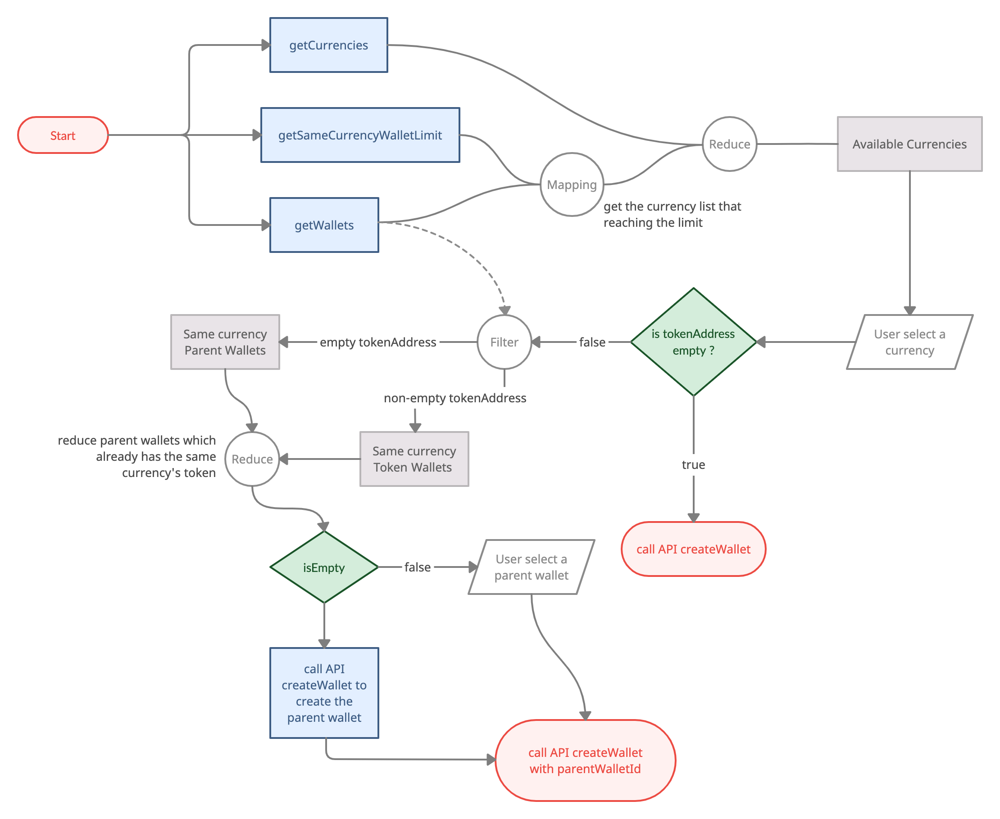
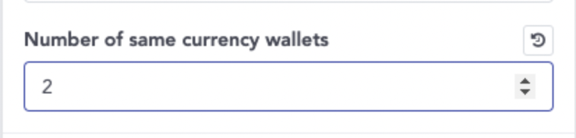

# Wallets

- Bookmarks
  - [Wallet Information](#wallet-information)
  - [Wallet Management](#wallet-management)
  - [Others](#others)

## Wallet Information


### getCurrencies

- Use case 1: when `getWallets`, filter supported currencies for display
- Use case 2: before `createWallet`, call `getCurrencies` + `getSameCurrencyWalletLimit` to decide whether the user can create a new wallet or not.
- For `Currency.currency`, please refer to [Currency Definition](https://github.com/CYBAVO/SOFA_MOCK_SERVER#currency-definition)

```ts
/// Get supported currency list
/// @return Promise<GetCurrenciesResult>
///
function getCurrencies(): Promise<GetCurrenciesResult>;
```

### getWallets

```ts
/// Get wallet list of signed in user
/// @return Promise<GetWalletsResult>
///
function getWallets(): Promise<GetWalletsResult>;
```

- Response: list of `Wallet`

  ```ts
  type Wallet = {

    walletId: number; // Wallet ID

    type: Wallet.Type;; // REGULAR, MAPPED_WALLET, RELAYER_WALLET

    address: string; // Wallet Address

    tokenAddress: string; // Contract ddress for tokens (ex. ERC-20)

    name: string; // Name of wallet

    currency: number; // Wallet currency ID, refer to Wallets.getCurrencies() API

    currencySymbol: string; // Wallet simple currency name.

    isPrivate: boolean; // Is private chain (CPSC)

    ...
  }
  ```

  - Classify:
    - `tokenAddress == ''` ➜ it is a normal wallet
    - `tokenAddress != ''` ➜ it is a mapped wallet
      - `Currency.tokenVersion == 721 || 1155` ➜ it is an NFT wallet
    - `isPrivate == true` ➜ it is on private chain (CPSC), see [Private Chain](private_chain.md)

### getCurrencyPrices

```ts
/// Get Currency price
/// @param wallets: array of com.cybavo.wallet.service.wallet.Wallet
/// @param exchangeCurrencys: currencies which need to get price. ex usd, twd
/// @param approximateRates: rate reference. When the price is 0, it can be calculated by other exchange currency's price multiply the rate. ex ["TWD", ["USD", 29.45]]
/// @return Promise<GetCurrenciesResult>
///
function getCurrencyPrices(wallets: Array<{
          /** currency, refer to [[getCurrencies]] API */
          currency: number;
          /** token contract address, refer to [[getCurrencies]] API */
          tokenAddress: string;
         }>, 
         exchangeCurrencies: Array<{string}>, approximateRates: object): Promise<GetCurrenciesResult>;
```

### getBalances

```ts
/// Get number balances on a batch of addresses
/// @param addresses: Map of addresses to query. ex: {Wallet.walletId: Wallet}
/// @return Promise<GetBalancesResult>
///         resolve: ➡️ Contains Map of Balances. ex: {Wallet.walletId: Balance}
///
function getBalances(addresses: Array<{
          /** currency, refer to [[getCurrencies]] API */
          currency: number;
          /** token contract address, refer to [[getCurrencies]] API */
          tokenAddress: string;
          /** wallet address */
          address: string;
        }>): Promise<GetBalancesResult>;
```

- Response: `Balance`

  ```ts
  type Balance = {

      balance: string; /** Balance */

      tokenBalance: string; /** Balance of token */

      availableBalance: string | null; /** Available balance */

      tokens: Array<string>; /** Non-Fungible Token IDs for ERC-721*/

      tokenIdAmount: Array<TokenIdAmount> /** Non-Fungible Token ID and amounts for ERC-1155 */

      ...
  }
  ```

  - `Balance` is for the parent wallet (`tokenAddress` is ""). ex: ETH wallet
  - `tokenBalance` is for mapped wallet (`tokenAddress` has value). ex: ERC-20 wallet
  - `availableBalance` provides how much available balance do you have,

    For example :
    1. When you have 1 ETH and you do the tx with 0.2 ETH to send out.
    2. The balance will still be 1 ETH until the tx was packed up on blockchain, but the available balance will reduce to 0.8 ETH.
    3. That is the customer can only operate the remaining 0.8 ETH.

  - If ERC-721 (NFT), use `tokens`
  - If ERC-1155 (NFT), use `tokenIdAmounts`

### getWallet with ID

- Used for single wallet refreshing when receiving push-notification


```ts
/// 
/// Get single wallet information
/// @param walletId Wallet ID to query
/// @return Promise<GetWalletResult>
/// 
function getWallet(walletId: number): Promise<GetWalletResult>;
```

## Wallet Management

### Create Wallet Flowchart



### createWallet

- make sure to follow the flowchart above to create a wallet
  - `getCurrencies` provides supported currencies
  - `getSameCurrencyWalletLimit` provides the limit wallet count of the same currency
  - `getWallets` provides current user's wallets
  - `tokenAddress != ''` means the currency needs a parent wallet
  - `tokenAddress == ''` means the currency don't need a parent wallet
  - A mapped wallet has same wallet address with its parent wallet.  
  If a wallet address has been used for create a mapped wallet, you cannot create 2 or more mapped wallet with same `currency` and `tokenAddress` to this wallet address. You have to choose another parent wallet.
  - If you're creating a mapped wallet and there is no parent wallet available. You need to create a parent wallet for it.

- For `currency`, please refer to [Currency Definition](https://github.com/CYBAVO/SOFA_MOCK_SERVER#currency-definition)

```ts
/// Create a new wallet
/// @param currency: Currency of desired new wallet. ex: 60 for ETH
/// @param tokenAddress: Token address for tokens, i.e. an ERC-20 token wallet maps to an Ethereum wallet
/// @param parentWalletId: Parent wallet for tokens, i.e. an ERC-20 token wallet maps to an Ethereum wallet
/// @param name: Name of the new wallet
/// @param pinSecret: PIN Secret retrieved via PinCodeInputView
/// @param extraAttributes: Extra attributes for specific currencies, pass null if unspecified.
///             Supported extras: account_name (String) - Account name for EOS
/// @return Promise<CreateWalletResult>
///         resolve: ➡️ Contains walletId
///
function createWallet(
          currency: number,
          tokenAddress: string,
          parentWalletId: number,
          name: string,
          pinSecret: number | PinSecretBearer | string,
          extraAttributes: object
      ): Promise<CreateWalletResult>;
```

### getSameCurrencyWalletLimit

- Administrators can configure this value on admin panel.

 

- Before `createWallet`, call `getCurrencies` + `getSameCurrencyWalletLimit` to decide whether the user can create a new wallet or not.

```ts
/// Get wallet count limit per currency
/// @return Promise<GetSameCurrencyWalletLimitResult>
///         resolve: ➡️ Contains wallet count limit of the same currency
///
function getSameCurrencyWalletLimit(): Promise<GetSameCurrencyWalletLimitResult>;
```

### renameWallet

```ts
/// Rename an existing wallet
/// @param walletId: Wallet ID to rename
/// @param name: New name of the wallet
/// @return Promise<RenameWalletResult>
///
function renameWallet(
          walletId: number,
          name: string
       ): Promise<RenameWalletResult>;
```

## Others

### queryCoinType

- Use case:  
    When scanning a wallet address with QR code, use this API to get which currency type it is.

```ts
/// Get coin type with address
/// @param address: wallet address string
/// @return Promise<QueryCoinTypeResult>
///
function queryCoinType(
          address: string,
       ): Promise<QueryCoinTypeResult>;
```

### getMarketInfos

```ts
/// Get current top currency infos
/// @return Promise<GetMarketInfosResult>
///
function getMarketInfos(): Promise<GetMarketInfosResult>;
```
